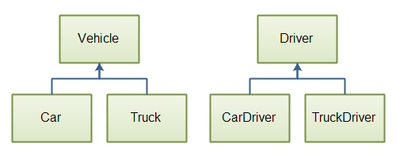

# java interview questions spreadsheet 2019-12-22-1502

## Java CORE

### How does multiple inheritance work in Java?

|Junior|Mid|Senior|
|------|---|------|
|x|x|x|

`Reference:`
https://www.interviewsansar.com/2017/06/29/implement-multiple-inheritance-in-java/

Multiple inheritance in Java programming is achieved or implemented using interfaces. Java does not support multiple inheritance using classes.
In simple term, a class can inherit only one class and multiple interfaces in a java programs. In java terminology, we can say that

`"A class can extend only one class but it can implement multiple interfaces."`

----

`Reference:`
https://www.geeksforgeeks.org/java-and-multiple-inheritance/

Multiple Inheritance is a feature of object oriented concept, where a class can inherit properties of more than one parent class. The problem occurs when there exist methods with same signature in both the super classes and subclass. On calling the method, the compiler cannot determine which class method to be called and even on calling which class method gets the priority.

**Why Java doesn’t support Multiple Inheritance?**

Consider the below Java code. It shows error.


```java
// First Parent class 
class Parent1 
{ 
    void fun() 
    { 
        System.out.println("Parent1"); 
    } 
} 
  
// Second Parent Class 
class Parent2 
{ 
    void fun() 
    { 
        System.out.println("Parent2"); 
    } 
} 
  
// Error : Test is inheriting from multiple 
// classes 
class Test extends Parent1, Parent2 
{ 
   public static void main(String args[]) 
   { 
       Test t = new Test(); 
       t.fun(); 
   } 
} 
```

```text
Output :
Compiler Error
```

From the code, we see that, on calling the method fun() using Test object will cause complications such as whether to call Parent1’s fun() or Parent2’s fun() method.

1. The Diamond Problem:

```text
          GrandParent
           /     \
          /       \
      Parent1      Parent2
          \       /
           \     /
             Test
```

2. Simplicity – Multiple inheritance is not supported by Java using classes , handling the complexity that causes due to multiple inheritance is very complex. It creates problem during various operations like casting, constructor chaining etc and the above all reason is that there are very few scenarios on which we actually need multiple inheritance, so better to omit it for keeping the things simple and straightforward.

**How are above problems handled for Default Methods and Interfaces ?**

Java 8 supports default methods where interfaces can provide default implementation of methods. And a class can implement two or more interfaces. In case both the implemented interfaces contain default methods with same method signature, the implementing class should explicitly specify which default method is to be used or it should override the default method.

```java
// A simple Java program to demonstrate multiple 
// inheritance through default methods. 
interface PI1 
{ 
    // default method 
    default void show() 
    { 
        System.out.println("Default PI1"); 
    } 
} 
  
interface PI2 
{ 
    // Default method 
    default void show() 
    { 
        System.out.println("Default PI2"); 
    } 
} 
  
// Implementation class code 
class TestClass implements PI1, PI2 
{ 
    // Overriding default show method 
    public void show() 
    { 
        // use super keyword to call the show 
        // method of PI1 interface 
        PI1.super.show(); 
  
        // use super keyword to call the show 
        // method of PI2 interface 
        PI2.super.show(); 
    } 
  
    public static void main(String args[]) 
    { 
        TestClass d = new TestClass(); 
        d.show(); 
    } 
} 
```

```text
Output:

Default PI1
Default PI2
```

If we remove implementation of default method from "TestClass", we get compiler error. See this for a sample run.

If there is a diamond through interfaces, then there is no issue if none of the middle interfaces provide implementation of root interface. If they provide implementation, then implementation can be accessed as above using super keyword.

```java
// A simple Java program to demonstrate how diamond 
// problem is handled in case of default methods 
  
interface GPI 
{ 
    // default method 
    default void show() 
    { 
        System.out.println("Default GPI"); 
    } 
} 
  
interface PI1 extends GPI { } 
  
interface PI2 extends GPI { } 
  
// Implementation class code 
class TestClass implements PI1, PI2 
{ 
    public static void main(String args[]) 
    { 
        TestClass d = new TestClass(); 
        d.show(); 
    } 
}
```

```text
Output:
Default GPI
```

This article is contributed by Vishal S. If you like GeeksforGeeks and would like to contribute, you can also write an article using contribute.geeksforgeeks.org or mail your article to contribute@geeksforgeeks.org. See your article appearing on the GeeksforGeeks main page and help other Geeks.

Please write comments if you find anything incorrect, or you want to share more information about the topic discussed above.

----

`Reference:`
https://www.journaldev.com/1775/multiple-inheritance-in-java

**Composition to the rescue**

So what to do if we want to utilize ClassA function methodA() and ClassB function methodB() in ClassC. The solution lies in using composition. Here is a refactored version of ClassC that is using composition to utilize both classes methods and also using doSomething() method from one of the objects.

`ClassC.java`

```java
package com.journaldev.inheritance;

public class ClassC{

	ClassA objA = new ClassA();
	ClassB objB = new ClassB();
	
	public void test(){
		objA.doSomething();
	}
	
	public void methodA(){
		objA.methodA();
	}
	
	public void methodB(){
		objB.methodB();
	}
}
```

**Composition vs Inheritance**

One of the best practices of Java programming is to `"favor composition over inheritance"`. We will look into some of the aspects favoring this approach.

Suppose we have a superclass and subclass as follows:

`ClassC.java`

```java
package com.journaldev.inheritance;

public class ClassC{

	public void methodC(){
	}
}
```

`ClassD.java`

```java
package com.journaldev.inheritance;

public class ClassD extends ClassC{

	public int test(){
		return 0;
	}
}
```

The above code compiles and works fine but what if ClassC implementation is changed like below:

`ClassC.java`

```java
package com.journaldev.inheritance;

public class ClassC{

	public void methodC(){
	}

	public void test(){
	}
}
```

Notice that `test()` method already exists in the subclass but the return type is different. Now the `ClassD` won’t compile and if you are using any IDE, it will suggest you change the return type in either superclass or subclass.

Now imagine the situation where we have multiple levels of class inheritance and superclass is not controlled by us. We will have no choice but to change our subclass method signature or its name to remove the compilation error. Also, we will have to make a change in all the places where our subclass method was getting invoked, so inheritance makes our code fragile.

The above problem will never occur with composition and that makes it more favorable over inheritance.

Another problem with inheritance is that we are exposing all the superclass methods to the client and if our superclass is not properly designed and there are security holes, then even though we take complete care in implementing our class, we get affected by the poor implementation of the superclass.
Composition helps us in providing controlled access to the superclass methods whereas inheritance doesn’t provide any control of the superclass methods, this is also one of the major advantages of composition over inheritance.

Another benefit with composition is that it provides flexibility in the invocation of methods. Our above implementation of ClassC is not optimal and provides compile-time binding with the method that will be invoked, with minimal change we can make the method invocation flexible and make it dynamic.

`ClassC.java`

```java
package com.journaldev.inheritance;

public class ClassC{

	SuperClass obj = null;

	public ClassC(SuperClass o){
		this.obj = o;
	}
	public void test(){
		obj.doSomething();
	}
	
	public static void main(String args[]){
		ClassC obj1 = new ClassC(new ClassA());
		ClassC obj2 = new ClassC(new ClassB());
		
		obj1.test();
		obj2.test();
	}
}
```

```text
Output of above program is:

doSomething implementation of A
doSomething implementation of B
```

This flexibility in method invocation is not available in inheritance and boosts the best practice to favor composition over inheritance.

Unit testing is easy in composition because we know what all methods we are using from superclass and we can mock it up for testing whereas in inheritance we depend heavily on superclass and don’t know what all methods of superclass will be used, so we need to test all the methods of superclass, that is an extra work and we need to do it unnecessarily because of inheritance.
That’s all for multiple inheritances in java and a brief look at composition.

### What is an interface?

`Reference:`
http://tutorials.jenkov.com/java/interfaces.html

Java includes a concept called interfaces. A Java interface is a bit like a class, except a Java interface can only contain method signatures and fields. An Java interface cannot contain an implementation of the methods, only the signature (name, parameters and exceptions) of the method.

You can use interfaces in Java as a way to achieve polymorphism. I will get back to polymorphism later in this text.

**Java Interface Example**

Here is a simple Java interface example:

```java
public interface MyInterface {

    public String hello = "Hello";

    public void sayHello();
}
```

As you can see, an interface is declared using the Java interface keyword. Just like with classes, a Java interface can be declared public or package scope (no access modifier).

The interface example above contains one variable and one method. The variable can be accessed directly from the interface, like this:

`System.out.println(MyInterface.hello);`

As you can see, accessing a variable from an interface is very similar to accessing a static variable in a class.

The method, however, needs to be implemented by some class before you can access it. The next section will explain how that is done.

**Implementing an Interface**

Before you can really use an interface, you must implement that interface in some Java class. Here is a class that implements the MyInterface interface shown above:

```java
public class MyInterfaceImpl implements MyInterface {

    public void sayHello() {
        System.out.println(MyInterface.hello);
    }
}
```

Notice the implements MyInterface part of the above class declaration. This signals to the Java compiler that the MyInterfaceImpl class implements the MyInterface interface.

A class that implements an interface must implement all the methods declared in the interface. The methods must have the exact same signature (name + parameters) as declared in the interface. The class does not need to implement (declare) the variables of an interface. Only the methods.

**Interface Instances**

Once a Java class implements an Java interface you can use an instance of that class as an instance of that interface. Here is an example:

```java
MyInterface myInterface = new MyInterfaceImpl();

myInterface.sayHello();
```

Notice how the variable is declared to be of the interface type MyInterface while the object created is of type MyInterfaceImpl. Java allows this because the class MyInterfaceImpl implements the MyInterface interface. You can then reference instances of the MyInterfaceImpl class as instances of the MyInterface interface.

You cannot create instances of a Java interface by itself. You must always create an instance of some class that implements the interface, and reference that instance as an instance of the interface.

**Implementing Multiple Interfaces**

A Java class can implement multiple Java interfaces. In that case the class must implement all the methods declared in all the interfaces implemented. Here is an example:

```java
public class MyInterfaceImpl
    implements MyInterface, MyOtherInterface {

    public void sayHello() {
        System.out.println("Hello");
    }

    public void sayGoodbye() {
        System.out.println("Goodbye");
    }
}
```

This class implements two interfaces called MyInterface and MyOtherInterface. You list the names of the interfaces to implement after the implements keyword, separated by a comma.

If the interfaces are not located in the same packages as the implementing class, you will also need to import the interfaces. Java interfaces are imported using the import instruction just like Java classes. For instance:

```java
import com.jenkov.package1.MyInterface;
import com.jenkov.package2.MyOtherInterface;

public class MyInterfaceImpl implements MyInterface, MyOtherInterface {
    ...
}
```

Here are the two Java interfaces implemented by the class above:

```java
public interface MyInterface {

    public void sayHello();
}
public interface MyOtherInterface {

    public void sayGoodbye();
}
```

As you can see, each interface contains one method. These methods are implemented by the class MyInterfaceImpl

**Overlapping Method Signatures**

If a Java class implements multiple Java interfaces, there is a risk that some of these interfaces may contain methods with the same signature (name + parameters). Since a Java class can only implement at method with a given signature once, this could potentially lead to some problems.

The Java specification does not give any solution to this problem. It is up to you to decide what to do in that situation.

**Which Java Types Can Implement Interfaces?**

The following Java types can implement interfaces:

- Java Class
- Java Abstract Class
- Java Nested Class
- Java Enum
- Java Dynamic Proxy

**Interface Variables**

A Java interface can contain both variables and constants. However, often it does not makes sense to place variables in an interface. In some cases it can make sense to define constants in an interface. Especially if those constants are to be used by the classes implementing the interface, e.g. in calculations, or as parameters to some of the methods in the interface. However, my advice to you is to avoid placing variables in Java interfaces if you can.

All variables in an interface are public, even if you leave out the public keyword in the variable declaration.

**Interface Methods**

A Java interface can contain one or more method declarations. As mentioned earlier, the interface cannot specify any implementation for these methods. It is up to the classes implementing the interface to specify an implementation.

All methods in an interface are public, even if you leave out the public keyword in the method declaration.

**Interface Default Methods**

Before Java 8 Java interfaces could not contain an implementation of the methods, but only contain the method signatures. However, this results in some problems when an API needs to add a method to one of its interfaces. If the API just adds the method to the desired interface, all classes that implements the interface must implement that new method. That is fine if all implementing classes are located within the API. But if some implementing classes are located in client code of the API (the code that uses the API), then that code breaks.

Let me illustrate this with an example. Look at this interface and imagine that it is part of e.g. an open source API which many applications are using internally:

```java
public interface ResourceLoader {

    Resource load(String resourcePath);

}
```

Now imagine that a project uses this API and has implemented the ResourceLoader interface like this:

```java
public class FileLoader implements ResourceLoader {

    public Resource load(String resourcePath) {
        // in here is the implementation +
        // a return statement.
    }
}
```

If the developer of the API wants to add one more method to the ResourceLoader interface, then the FileLoader class will be broken when that project upgrades to the new version of the API.

To alleviate this Java interface evolution problem, Java 8 has added the concept of interface default methods to Java interfaces. An interface default method can contain a default implementation of that method. Classes that implement the interface but which contain no implementation for the default interface will then automatically get the default method implementation.

You mark a method in an interface as a default method using the default keyword. Here is an example of adding a default method to the ResourceLoader interface:

```java
public interface ResourceLoader {

    Resource load(String resourcePath);

    default Resource load(Path resourcePath) {
        // provide default implementation to load
        // resource from a Path and return the content
        // in a Resource object.
    }

}
```

This example adds the default method load(Path). The example leaves out the actual implementation (inside the method body) because this is not really interesting. What matters is how you declare the interface default method.

A class can override the implementation of a default method simply by implementing that method explicitly, as is done normally when implementing a Java interface. Any implementation in a class takes precedence over interface default method implementations.

**Interface Static Methods**

A Java interface can have static methods. Static methods in a Java interface must have implementation. Here is an example of a static method in a Java interface:

```java
public interface MyInterface {

    public static void print(String text){
        System.out.print(text);
    }
}
```

Calling a static method in an interface looks and works just like calling a static method in a class. Here is an example of calling the static print() method from the above MyInterface interface:

```java
MyInterface.print("Hello static method!");
```

Static methods in interfaces can be useful when you have some utility methods you would like to make available, which fit naturally into an interface related to the same responsibility. For instance, a Vehicle interface could have a printVehicle(Vehicle v) static method.


**Interfaces and Inheritance**

It is possible for a Java interface to inherit from another Java interface, just like classes can inherit from other classes. You specify inheritance using the extends keyword. Here is a simple interface inheritance example:

```java
public interface MySuperInterface {

    public void saiHello();

}
```

```java
public interface MySubInterface extends MySuperInterface {

    public void sayGoodbye();
}
```

The interface MySubInterface extends the interface MySuperInterface. That means, that the MySubInterface inherits all field and methods from MySuperInterface. That then means, that if a class implements MySubInterface, that class has to implement all methods defined in both MySubInterface and MySuperInterface.

It is possible to define methods in a subinterface with the same signature (name + parameters) as methods defined in a superinterface, should you find that desirable in your design, somehow.

Unlike classes, interfaces can actually inherit from multiple superinterfaces. You specify that by listing the names of all interfaces to inherit from, separated by comma. A class implementing an interface which inherits from multiple interfaces must implement all methods from the interface and its superinterfaces.

Here is an example of a Java interface that inherits from multiple interfaces:

```java
public interface MySubInterface extends
    SuperInterface1, SuperInterface2 {

    public void sayItAll();
}
```

As when implementing multiple interfaces, there are no rules for how you handle the situation when multiple superinterfaces have methods with the same signature (name + parameters).

**Inheritance and Default Methods**

Interface default methods add a bit complexity to the rules of interface inheritance. While it is normally possible for a class to implement multiple interfaces even if the interfaces contain methods with the same signature, this is not possible if one or more of these methods are default methods. In other words, if two interfaces contain the same method signature (name + parameters) and one of the interfaces declare this method as a default method, a class cannot automatically implement both interfaces.

The situation is the same if an interface extends (inherits from) multiple interfaces, and one or more of these interfaces contain methods with the same signature, and one of the superinterfaces declare the overlapping method as a default method.

In both of the above situations the Java compiler requires that the class implementing the interface(s) explicitly implements the method which causes the problem. That way there is no doubt about which implementation the class will have. The implementation in the class takes precedence over any default implementations.

**Interfaces and Polymorphism**

Java interfaces are a way to achieve polymorphism. Polymorphism is a concept that takes some practice and thought to master. Basically, polymorphism means that an instance of an class (an object) can be used as if it were of different types. Here, a type means either a class or an interface.

Look at this simple class diagram:



*Two parallel class hierarchies used in the same application.*

Two parallel class hierarchies used in the same application.
The classes above are all parts of a model representing different types of vehicles and drivers, with fields and methods. That is the responsibility of these classes - to model these entities from real life.

Now imagine you needed to be able to store these objects in a database, and also serialize them to XML, JSON, or other formats. You want that implemented using a single method for each operation, available on each Car, Truck or Vehicle object. A store() method, a serializeToXML() method and a serializeToJSON() method.

Please forget for a while, that implementing this functionality as methods directly on the objects may lead to a messy class hierarchy. Just imagine that this is how you want the operations implemented.

Where in the above diagram would you put these three methods, so they are accessible on all classes?

One way to solve this problem would be to create a common superclass for the Vehicle and Driver class, which has the storage and serialization methods. However, this would result in a conceptual mess. The class hierarchy would no longer model vehicles and drivers, but also be tied to the storage and serialization mechanisms used in your application.

A better solution would be to create some interfaces with the storage and serialization methods on, and let the classes implement these interfaces. Here are examples of such interfaces:

```java
public interface Storable {

    public void store();
}
```

```java
public interface Serializable {
    public void serializeToXML(Writer writer);
    public void serializeToJSON(Writer writer);
}
```

When each class implements these two interfaces and their methods, you can access the methods of these interfaces by casting the objects to instances of the interface types. You don't need to know exactly what class a given object is of, as long as you know what interface it implements. Here is an example:

```java
Car car = new Car();

Storable storable = (Storable) car;
storable.store();

Serializable serializable = (Serializable) car;
serializable.serializeToXML (new FileWriter("car.xml"));
serializable.serializeToJSON(new FileWriter("car.json"));
```

As you can probably imagine by now, interfaces provide a cleaner way of implementing cross cutting functionality in classes than inheritance.

**Generic Interfaces**

A generic Java interface is an interface which can be typed - meaning it can be specialized to work with a specific type (e.g. interface or class) when used. Let me first create a simple Java interface that contains a single method:

```java
public interface MyProducer() {

    public Object produce();

}
```

This interface represents an interface which contains a single method called produce() which can produce a single object. Since the return value of produce() is Object, it can return any Java object.

Here is a class that implements the MyProducer interface:

```java
public class CarProducer implements MyProducer{
    public Object produce() {
        return new Car();
    }
}
```

The above class CarProducer implements the MyProducer interface. The implementation of the produce() method returns a new Car object every time it is called. Here is how it looks to use the CarProducer class:

```java
MyProducer carProducer = new CarProducer();

Car car = (Car) carProducer.produce();
```

Notice how the object returned from the carProducer.produce() method call has to be cast to a Car instance, because the produce() method return type is Object. Using Java Generics you can type the MyProducer interface so you can specify what type of object it produces when you use it. Here is first a generic version of the MyProducer interface:

```java
public interface MyProducer <T>{
    
    public T produce();
    
}
```

Now when I implement the MyProducer interface in the CarProducer class, I have to include the generic type declaration too, like this:

```java
public class CarProducer<T> implements MyProducer<T>{

    @Override
    public T produce() {
        return (T) new Car();
    }
}
```

Now, when creating a CarProducer I can specify its generic interface type, like this:

```java
MyProducer<Car> myCarProducer = new CarProducer<Car>();

Car produce = myCarProducer.produce();
```

As you can see, since the generic type for the CarProducer instance is set to Car, it is no longer necessary to cast the object returned from the produce() method, since the original method declaration in the MyProducer interface states, that this method returns the same type as is specified in the generic type when used.

But - now it is actually possible to specify another generic type for a CarProducer instance than the type it actually returns from it's produce() method implementation. If you scroll up, you can see that the CarProducer.produce() implementation returns a Car object no matter what generic type you specify for it when you create it. So, the following declaration is possible, but would return in a ClassCastException when executed:

```java
MyProducer<String> myStringProducer = new CarProducer<String>();

String produce1 = myStringProducer.produce();
```

Instead, you can lock down the generic type of the MyProducer interface already when you implement it, in the CarProducer class. Here is an example of specifying the generic type of a generic interface when implementing it:

```java
public class CarProducer implements MyProducer<Car>{

    @Override
    public Car produce() {
        return new Car();
    }
}
```

Now you cannot specify the generic type of the CarProducer when using it. It is already typed to Car. Here is how using the CarProducer looks:

```java
MyProducer<Car> myCarProducer = new CarProducer();

Car produce = myCarProducer.produce();
```


As you can see, it is still not necessary to cast the object returned by produce(), as the CarProducer implementation declares that to be a Car instance.

Java generics is covered in more detail in my [Java Generics Tutorial](http://tutorials.jenkov.com/java-generics/index.html).

**Functional Interfaces**

From Java 8 a new concept was introduced called functional interfaces. In short, a functional interface is an interface with a single, unimplemented method (non-default, non-static method). I have explained functional interfaces in my [Java functional interface tutorial](http://tutorials.jenkov.com/java-functional-programming/functional-interfaces.html), which is part of my [Java Functional Programming Tutorial.](http://tutorials.jenkov.com/java-functional-programming/index.html) .

Functional interfaces are often intended to be implemented by a [Java Lambda Expression](http://tutorials.jenkov.com/java/lambda-expressions.html).


