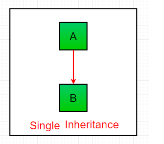

# java interview questions spreadsheet 2019-12-22-1502

# Java CORE

# How does multiple inheritance work in Java?

|Junior |Mid  |Senior |
|-------|-----|-------|
|   x   |  x  |   x   |

`Reference:`
https://www.interviewsansar.com/2017/06/29/implement-multiple-inheritance-in-java/

Multiple inheritance in Java programming is achieved or implemented using interfaces. Java does not support multiple inheritance using classes.
In simple term, a class can inherit only one class and multiple interfaces in a java programs. In java terminology, we can say that

`"A class can extend only one class but it can implement multiple interfaces."`

----

`Reference:`
https://www.geeksforgeeks.org/java-and-multiple-inheritance/

Multiple Inheritance is a feature of object oriented concept, where a class can inherit properties of more than one parent class. The problem occurs when there exist methods with same signature in both the super classes and subclass. On calling the method, the compiler cannot determine which class method to be called and even on calling which class method gets the priority.

**Why Java doesn’t support Multiple Inheritance?**

Consider the below Java code. It shows error.


```java
// First Parent class 
class Parent1 
{ 
    void fun() 
    { 
        System.out.println("Parent1"); 
    } 
} 
  
// Second Parent Class 
class Parent2 
{ 
    void fun() 
    { 
        System.out.println("Parent2"); 
    } 
} 
  
// Error : Test is inheriting from multiple 
// classes 
class Test extends Parent1, Parent2 
{ 
   public static void main(String args[]) 
   { 
       Test t = new Test(); 
       t.fun(); 
   } 
} 
```

```text
Output :
Compiler Error
```

From the code, we see that, on calling the method fun() using Test object will cause complications such as whether to call Parent1’s fun() or Parent2’s fun() method.

1. The Diamond Problem:

```text
          GrandParent
           /     \
          /       \
      Parent1      Parent2
          \       /
           \     /
             Test
```

2. Simplicity – Multiple inheritance is not supported by Java using classes , handling the complexity that causes due to multiple inheritance is very complex. It creates problem during various operations like casting, constructor chaining etc and the above all reason is that there are very few scenarios on which we actually need multiple inheritance, so better to omit it for keeping the things simple and straightforward.

**How are above problems handled for Default Methods and Interfaces ?**

Java 8 supports default methods where interfaces can provide default implementation of methods. And a class can implement two or more interfaces. In case both the implemented interfaces contain default methods with same method signature, the implementing class should explicitly specify which default method is to be used or it should override the default method.

```java
// A simple Java program to demonstrate multiple 
// inheritance through default methods. 
interface PI1 
{ 
    // default method 
    default void show() 
    { 
        System.out.println("Default PI1"); 
    } 
} 
  
interface PI2 
{ 
    // Default method 
    default void show() 
    { 
        System.out.println("Default PI2"); 
    } 
} 
  
// Implementation class code 
class TestClass implements PI1, PI2 
{ 
    // Overriding default show method 
    public void show() 
    { 
        // use super keyword to call the show 
        // method of PI1 interface 
        PI1.super.show(); 
  
        // use super keyword to call the show 
        // method of PI2 interface 
        PI2.super.show(); 
    } 
  
    public static void main(String args[]) 
    { 
        TestClass d = new TestClass(); 
        d.show(); 
    } 
} 
```

```text
Output:

Default PI1
Default PI2
```

If we remove implementation of default method from "TestClass", we get compiler error. See this for a sample run.

If there is a diamond through interfaces, then there is no issue if none of the middle interfaces provide implementation of root interface. If they provide implementation, then implementation can be accessed as above using super keyword.

```java
// A simple Java program to demonstrate how diamond 
// problem is handled in case of default methods 
  
interface GPI 
{ 
    // default method 
    default void show() 
    { 
        System.out.println("Default GPI"); 
    } 
} 
  
interface PI1 extends GPI { } 
  
interface PI2 extends GPI { } 
  
// Implementation class code 
class TestClass implements PI1, PI2 
{ 
    public static void main(String args[]) 
    { 
        TestClass d = new TestClass(); 
        d.show(); 
    } 
}
```

```text
Output:
Default GPI
```

This article is contributed by Vishal S. If you like GeeksforGeeks and would like to contribute, you can also write an article using contribute.geeksforgeeks.org or mail your article to contribute@geeksforgeeks.org. See your article appearing on the GeeksforGeeks main page and help other Geeks.

Please write comments if you find anything incorrect, or you want to share more information about the topic discussed above.

----

`Reference:`
https://www.journaldev.com/1775/multiple-inheritance-in-java

**Composition to the rescue**

So what to do if we want to utilize ClassA function methodA() and ClassB function methodB() in ClassC. The solution lies in using composition. Here is a refactored version of ClassC that is using composition to utilize both classes methods and also using doSomething() method from one of the objects.

`ClassC.java`

```java
package com.journaldev.inheritance;

public class ClassC{

	ClassA objA = new ClassA();
	ClassB objB = new ClassB();
	
	public void test(){
		objA.doSomething();
	}
	
	public void methodA(){
		objA.methodA();
	}
	
	public void methodB(){
		objB.methodB();
	}
}
```

**Composition vs Inheritance**

One of the best practices of Java programming is to `"favor composition over inheritance"`. We will look into some of the aspects favoring this approach.

Suppose we have a superclass and subclass as follows:

`ClassC.java`

```java
package com.journaldev.inheritance;

public class ClassC{

	public void methodC(){
	}
}
```

`ClassD.java`

```java
package com.journaldev.inheritance;

public class ClassD extends ClassC{

	public int test(){
		return 0;
	}
}
```

The above code compiles and works fine but what if ClassC implementation is changed like below:

`ClassC.java`

```java
package com.journaldev.inheritance;

public class ClassC{

	public void methodC(){
	}

	public void test(){
	}
}
```

Notice that `test()` method already exists in the subclass but the return type is different. Now the `ClassD` won’t compile and if you are using any IDE, it will suggest you change the return type in either superclass or subclass.

Now imagine the situation where we have multiple levels of class inheritance and superclass is not controlled by us. We will have no choice but to change our subclass method signature or its name to remove the compilation error. Also, we will have to make a change in all the places where our subclass method was getting invoked, so inheritance makes our code fragile.

The above problem will never occur with composition and that makes it more favorable over inheritance.

Another problem with inheritance is that we are exposing all the superclass methods to the client and if our superclass is not properly designed and there are security holes, then even though we take complete care in implementing our class, we get affected by the poor implementation of the superclass.
Composition helps us in providing controlled access to the superclass methods whereas inheritance doesn’t provide any control of the superclass methods, this is also one of the major advantages of composition over inheritance.

Another benefit with composition is that it provides flexibility in the invocation of methods. Our above implementation of ClassC is not optimal and provides compile-time binding with the method that will be invoked, with minimal change we can make the method invocation flexible and make it dynamic.

`ClassC.java`

```java
package com.journaldev.inheritance;

public class ClassC{

	SuperClass obj = null;

	public ClassC(SuperClass o){
		this.obj = o;
	}
	public void test(){
		obj.doSomething();
	}
	
	public static void main(String args[]){
		ClassC obj1 = new ClassC(new ClassA());
		ClassC obj2 = new ClassC(new ClassB());
		
		obj1.test();
		obj2.test();
	}
}
```

```text
Output of above program is:

doSomething implementation of A
doSomething implementation of B
```

This flexibility in method invocation is not available in inheritance and boosts the best practice to favor composition over inheritance.

Unit testing is easy in composition because we know what all methods we are using from superclass and we can mock it up for testing whereas in inheritance we depend heavily on superclass and don’t know what all methods of superclass will be used, so we need to test all the methods of superclass, that is an extra work and we need to do it unnecessarily because of inheritance.
That’s all for multiple inheritances in java and a brief look at composition.

# What is an interface?

|Junior |Mid  |Senior |
|-------|-----|-------|
|   x   |  x  |   x   |

`Reference:` https://blog.udemy.com/java-interface-example/

**What is a Java Interface?**

A Java interface is an abstract type used to designate a set of abstract methods for classes to implement. As mentioned before, when a class implements an interface, it must inherit all of the abstract methods declared within, as though signing into a contract and carrying out the agreement.

The most significant similarity between interfaces and classes is that they both contain methods. They are more different than they are the same, however: an interface lacks constructors, contains exclusively abstract methods (no method implementation), and exclusively final and static fields.

----

`Reference:`
http://tutorials.jenkov.com/java/interfaces.html

Java includes a concept called interfaces. A Java interface is a bit like a class, except a Java interface can only contain method signatures and fields. An Java interface cannot contain an implementation of the methods, only the signature (name, parameters and exceptions) of the method.

You can use interfaces in Java as a way to achieve polymorphism. I will get back to polymorphism later in this text.

**Java Interface Example**

Here is a simple Java interface example:

```java
public interface MyInterface {

    public String hello = "Hello";

    public void sayHello();
}
```

As you can see, an interface is declared using the Java interface keyword. Just like with classes, a Java interface can be declared public or package scope (no access modifier).

The interface example above contains one variable and one method. The variable can be accessed directly from the interface, like this:

`System.out.println(MyInterface.hello);`

As you can see, accessing a variable from an interface is very similar to accessing a static variable in a class.

The method, however, needs to be implemented by some class before you can access it. The next section will explain how that is done.

**Implementing an Interface**

Before you can really use an interface, you must implement that interface in some Java class. Here is a class that implements the MyInterface interface shown above:

```java
public class MyInterfaceImpl implements MyInterface {

    public void sayHello() {
        System.out.println(MyInterface.hello);
    }
}
```

Notice the implements MyInterface part of the above class declaration. This signals to the Java compiler that the MyInterfaceImpl class implements the MyInterface interface.

A class that implements an interface must implement all the methods declared in the interface. The methods must have the exact same signature (name + parameters) as declared in the interface. The class does not need to implement (declare) the variables of an interface. Only the methods.

**Interface Instances**

Once a Java class implements an Java interface you can use an instance of that class as an instance of that interface. Here is an example:

```java
MyInterface myInterface = new MyInterfaceImpl();

myInterface.sayHello();
```

Notice how the variable is declared to be of the interface type MyInterface while the object created is of type MyInterfaceImpl. Java allows this because the class MyInterfaceImpl implements the MyInterface interface. You can then reference instances of the MyInterfaceImpl class as instances of the MyInterface interface.

You cannot create instances of a Java interface by itself. You must always create an instance of some class that implements the interface, and reference that instance as an instance of the interface.

**Implementing Multiple Interfaces**

A Java class can implement multiple Java interfaces. In that case the class must implement all the methods declared in all the interfaces implemented. Here is an example:

```java
public class MyInterfaceImpl
    implements MyInterface, MyOtherInterface {

    public void sayHello() {
        System.out.println("Hello");
    }

    public void sayGoodbye() {
        System.out.println("Goodbye");
    }
}
```

This class implements two interfaces called MyInterface and MyOtherInterface. You list the names of the interfaces to implement after the implements keyword, separated by a comma.

If the interfaces are not located in the same packages as the implementing class, you will also need to import the interfaces. Java interfaces are imported using the import instruction just like Java classes. For instance:

```java
import com.jenkov.package1.MyInterface;
import com.jenkov.package2.MyOtherInterface;

public class MyInterfaceImpl implements MyInterface, MyOtherInterface {
    ...
}
```

Here are the two Java interfaces implemented by the class above:

```java
public interface MyInterface {

    public void sayHello();
}
public interface MyOtherInterface {

    public void sayGoodbye();
}
```

As you can see, each interface contains one method. These methods are implemented by the class MyInterfaceImpl

**Overlapping Method Signatures**

If a Java class implements multiple Java interfaces, there is a risk that some of these interfaces may contain methods with the same signature (name + parameters). Since a Java class can only implement at method with a given signature once, this could potentially lead to some problems.

The Java specification does not give any solution to this problem. It is up to you to decide what to do in that situation.

**Which Java Types Can Implement Interfaces?**

The following Java types can implement interfaces:

- Java Class
- Java Abstract Class
- Java Nested Class
- Java Enum
- Java Dynamic Proxy

**Interface Variables**

A Java interface can contain both variables and constants. However, often it does not makes sense to place variables in an interface. In some cases it can make sense to define constants in an interface. Especially if those constants are to be used by the classes implementing the interface, e.g. in calculations, or as parameters to some of the methods in the interface. However, my advice to you is to avoid placing variables in Java interfaces if you can.

All variables in an interface are public, even if you leave out the public keyword in the variable declaration.

**Interface Methods**

A Java interface can contain one or more method declarations. As mentioned earlier, the interface cannot specify any implementation for these methods. It is up to the classes implementing the interface to specify an implementation.

All methods in an interface are public, even if you leave out the public keyword in the method declaration.

**Interface Default Methods**

Before Java 8 Java interfaces could not contain an implementation of the methods, but only contain the method signatures. However, this results in some problems when an API needs to add a method to one of its interfaces. If the API just adds the method to the desired interface, all classes that implements the interface must implement that new method. That is fine if all implementing classes are located within the API. But if some implementing classes are located in client code of the API (the code that uses the API), then that code breaks.

Let me illustrate this with an example. Look at this interface and imagine that it is part of e.g. an open source API which many applications are using internally:

```java
public interface ResourceLoader {

    Resource load(String resourcePath);

}
```

Now imagine that a project uses this API and has implemented the ResourceLoader interface like this:

```java
public class FileLoader implements ResourceLoader {

    public Resource load(String resourcePath) {
        // in here is the implementation +
        // a return statement.
    }
}
```

If the developer of the API wants to add one more method to the ResourceLoader interface, then the FileLoader class will be broken when that project upgrades to the new version of the API.

To alleviate this Java interface evolution problem, Java 8 has added the concept of interface default methods to Java interfaces. An interface default method can contain a default implementation of that method. Classes that implement the interface but which contain no implementation for the default interface will then automatically get the default method implementation.

You mark a method in an interface as a default method using the default keyword. Here is an example of adding a default method to the ResourceLoader interface:

```java
public interface ResourceLoader {

    Resource load(String resourcePath);

    default Resource load(Path resourcePath) {
        // provide default implementation to load
        // resource from a Path and return the content
        // in a Resource object.
    }

}
```

This example adds the default method load(Path). The example leaves out the actual implementation (inside the method body) because this is not really interesting. What matters is how you declare the interface default method.

A class can override the implementation of a default method simply by implementing that method explicitly, as is done normally when implementing a Java interface. Any implementation in a class takes precedence over interface default method implementations.

**Interface Static Methods**

A Java interface can have static methods. Static methods in a Java interface must have implementation. Here is an example of a static method in a Java interface:

```java
public interface MyInterface {

    public static void print(String text){
        System.out.print(text);
    }
}
```

Calling a static method in an interface looks and works just like calling a static method in a class. Here is an example of calling the static print() method from the above MyInterface interface:

```java
MyInterface.print("Hello static method!");
```

Static methods in interfaces can be useful when you have some utility methods you would like to make available, which fit naturally into an interface related to the same responsibility. For instance, a Vehicle interface could have a printVehicle(Vehicle v) static method.


**Interfaces and Inheritance**

It is possible for a Java interface to inherit from another Java interface, just like classes can inherit from other classes. You specify inheritance using the extends keyword. Here is a simple interface inheritance example:

```java
public interface MySuperInterface {

    public void saiHello();

}
```

```java
public interface MySubInterface extends MySuperInterface {

    public void sayGoodbye();
}
```

The interface MySubInterface extends the interface MySuperInterface. That means, that the MySubInterface inherits all field and methods from MySuperInterface. That then means, that if a class implements MySubInterface, that class has to implement all methods defined in both MySubInterface and MySuperInterface.

It is possible to define methods in a subinterface with the same signature (name + parameters) as methods defined in a superinterface, should you find that desirable in your design, somehow.

Unlike classes, interfaces can actually inherit from multiple superinterfaces. You specify that by listing the names of all interfaces to inherit from, separated by comma. A class implementing an interface which inherits from multiple interfaces must implement all methods from the interface and its superinterfaces.

Here is an example of a Java interface that inherits from multiple interfaces:

```java
public interface MySubInterface extends
    SuperInterface1, SuperInterface2 {

    public void sayItAll();
}
```

As when implementing multiple interfaces, there are no rules for how you handle the situation when multiple superinterfaces have methods with the same signature (name + parameters).

**Inheritance and Default Methods**

Interface default methods add a bit complexity to the rules of interface inheritance. While it is normally possible for a class to implement multiple interfaces even if the interfaces contain methods with the same signature, this is not possible if one or more of these methods are default methods. In other words, if two interfaces contain the same method signature (name + parameters) and one of the interfaces declare this method as a default method, a class cannot automatically implement both interfaces.

The situation is the same if an interface extends (inherits from) multiple interfaces, and one or more of these interfaces contain methods with the same signature, and one of the superinterfaces declare the overlapping method as a default method.

In both of the above situations the Java compiler requires that the class implementing the interface(s) explicitly implements the method which causes the problem. That way there is no doubt about which implementation the class will have. The implementation in the class takes precedence over any default implementations.

**Interfaces and Polymorphism**

Java interfaces are a way to achieve polymorphism. Polymorphism is a concept that takes some practice and thought to master. Basically, polymorphism means that an instance of an class (an object) can be used as if it were of different types. Here, a type means either a class or an interface.

Look at this simple class diagram:


*Two parallel class hierarchies used in the same application.*

Two parallel class hierarchies used in the same application.
The classes above are all parts of a model representing different types of vehicles and drivers, with fields and methods. That is the responsibility of these classes - to model these entities from real life.

Now imagine you needed to be able to store these objects in a database, and also serialize them to XML, JSON, or other formats. You want that implemented using a single method for each operation, available on each Car, Truck or Vehicle object. A store() method, a serializeToXML() method and a serializeToJSON() method.

Please forget for a while, that implementing this functionality as methods directly on the objects may lead to a messy class hierarchy. Just imagine that this is how you want the operations implemented.

Where in the above diagram would you put these three methods, so they are accessible on all classes?

One way to solve this problem would be to create a common superclass for the Vehicle and Driver class, which has the storage and serialization methods. However, this would result in a conceptual mess. The class hierarchy would no longer model vehicles and drivers, but also be tied to the storage and serialization mechanisms used in your application.

A better solution would be to create some interfaces with the storage and serialization methods on, and let the classes implement these interfaces. Here are examples of such interfaces:

```java
public interface Storable {

    public void store();
}
```

```java
public interface Serializable {
    public void serializeToXML(Writer writer);
    public void serializeToJSON(Writer writer);
}
```

When each class implements these two interfaces and their methods, you can access the methods of these interfaces by casting the objects to instances of the interface types. You don't need to know exactly what class a given object is of, as long as you know what interface it implements. Here is an example:

```java
Car car = new Car();

Storable storable = (Storable) car;
storable.store();

Serializable serializable = (Serializable) car;
serializable.serializeToXML (new FileWriter("car.xml"));
serializable.serializeToJSON(new FileWriter("car.json"));
```

As you can probably imagine by now, interfaces provide a cleaner way of implementing cross cutting functionality in classes than inheritance.

**Generic Interfaces**

A generic Java interface is an interface which can be typed - meaning it can be specialized to work with a specific type (e.g. interface or class) when used. Let me first create a simple Java interface that contains a single method:

```java
public interface MyProducer() {

    public Object produce();

}
```

This interface represents an interface which contains a single method called produce() which can produce a single object. Since the return value of produce() is Object, it can return any Java object.

Here is a class that implements the MyProducer interface:

```java
public class CarProducer implements MyProducer{
    public Object produce() {
        return new Car();
    }
}
```

The above class CarProducer implements the MyProducer interface. The implementation of the produce() method returns a new Car object every time it is called. Here is how it looks to use the CarProducer class:

```java
MyProducer carProducer = new CarProducer();

Car car = (Car) carProducer.produce();
```

Notice how the object returned from the carProducer.produce() method call has to be cast to a Car instance, because the produce() method return type is Object. Using Java Generics you can type the MyProducer interface so you can specify what type of object it produces when you use it. Here is first a generic version of the MyProducer interface:

```java
public interface MyProducer <T>{
    
    public T produce();
    
}
```

Now when I implement the MyProducer interface in the CarProducer class, I have to include the generic type declaration too, like this:

```java
public class CarProducer<T> implements MyProducer<T>{

    @Override
    public T produce() {
        return (T) new Car();
    }
}
```

Now, when creating a CarProducer I can specify its generic interface type, like this:

```java
MyProducer<Car> myCarProducer = new CarProducer<Car>();

Car produce = myCarProducer.produce();
```

As you can see, since the generic type for the CarProducer instance is set to Car, it is no longer necessary to cast the object returned from the produce() method, since the original method declaration in the MyProducer interface states, that this method returns the same type as is specified in the generic type when used.

But - now it is actually possible to specify another generic type for a CarProducer instance than the type it actually returns from it's produce() method implementation. If you scroll up, you can see that the CarProducer.produce() implementation returns a Car object no matter what generic type you specify for it when you create it. So, the following declaration is possible, but would return in a ClassCastException when executed:

```java
MyProducer<String> myStringProducer = new CarProducer<String>();

String produce1 = myStringProducer.produce();
```

Instead, you can lock down the generic type of the MyProducer interface already when you implement it, in the CarProducer class. Here is an example of specifying the generic type of a generic interface when implementing it:

```java
public class CarProducer implements MyProducer<Car>{

    @Override
    public Car produce() {
        return new Car();
    }
}
```

Now you cannot specify the generic type of the CarProducer when using it. It is already typed to Car. Here is how using the CarProducer looks:

```java
MyProducer<Car> myCarProducer = new CarProducer();

Car produce = myCarProducer.produce();
```


As you can see, it is still not necessary to cast the object returned by produce(), as the CarProducer implementation declares that to be a Car instance.

Java generics is covered in more detail in my [Java Generics Tutorial](http://tutorials.jenkov.com/java-generics/index.html).

**Functional Interfaces**

From Java 8 a new concept was introduced called functional interfaces. In short, a functional interface is an interface with a single, unimplemented method (non-default, non-static method). I have explained functional interfaces in my [Java functional interface tutorial](http://tutorials.jenkov.com/java-functional-programming/functional-interfaces.html), which is part of my [Java Functional Programming Tutorial.](http://tutorials.jenkov.com/java-functional-programming/index.html) .

Functional interfaces are often intended to be implemented by a [Java Lambda Expression](http://tutorials.jenkov.com/java/lambda-expressions.html).

# What is an Abstract class?

|Junior |Mid  |Senior |
|-------|-----|-------|
|   x   |  x  |   x   |

`Reference:` https://www.techopedia.com/definition/24335/abstract-class-java

**Definition - What does Abstract Class mean?**

An abstract class, in the context of Java, is a superclass that cannot be instantiated and is used to state or define general characteristics. An object cannot be formed from a Java abstract class; trying to instantiate an abstract class only produces a compiler error. The abstract class is declared using the keyword abstract.

Subclasses extended from an abstract class have all the abstract class's attributes, in addition to attributes specific to each subclass. The abstract class states the class characteristics and methods for implementation, thus defining a whole interface.

----

`Reference:` https://www.javatpoint.com/abstract-class-in-java

**Points to Remember**

- An abstract class must be declared with an abstract keyword.
- It can have abstract and non-abstract methods.
- It cannot be instantiated.
- It can have constructors and static methods also.
- It can have final methods which will force the subclass not to change the body of the method.

**Understanding the real scenario of Abstract class**

In this example, Shape is the abstract class, and its implementation is provided by the Rectangle and Circle classes.

Mostly, we don't know about the implementation class (which is hidden to the end user), and an object of the implementation class is provided by the factory method.

A factory method is a method that returns the instance of the class. We will learn about the factory method later.

In this example, if you create the instance of Rectangle class, draw() method of Rectangle class will be invoked.


```java
abstract class Shape{  
abstract void draw();  
}  
//In real scenario, implementation is provided by others i.e. unknown by end user  
class Rectangle extends Shape{  
void draw(){System.out.println("drawing rectangle");}  
}  
class Circle1 extends Shape{  
void draw(){System.out.println("drawing circle");}  
}  
//In real scenario, method is called by programmer or user  
class TestAbstraction1{  
public static void main(String args[]){  
Shape s=new Circle1();//In a real scenario, object is provided through method, e.g., getShape() method  
s.draw();  
}  
}  
```

----
`Refernce:` https://docs.oracle.com/javase/tutorial/java/IandI/abstract.html

**Abstract Methods and Classes**

An abstract class is a class that is declared abstract—it may or may not include abstract methods. Abstract classes cannot be instantiated, but they can be subclassed.

An abstract method is a method that is declared without an implementation (without braces, and followed by a semicolon), like this:

```java
abstract void moveTo(double deltaX, double deltaY);
```

If a class includes abstract methods, then the class itself must be declared abstract, as in:

```java
public abstract class GraphicObject {
   // declare fields
   // declare nonabstract methods
   abstract void draw();
}
```

When an abstract class is subclassed, the subclass usually provides implementations for all of the abstract methods in its parent class. However, if it does not, then the subclass must also be declared abstract.

`Note: Methods in an interface (see the Interfaces section) that are not declared as default or static are implicitly abstract, so the abstract modifier is not used with interface methods. (It can be used, but it is unnecessary.)`

- Abstract Classes Compared to Interfaces

Abstract classes are similar to interfaces. You cannot instantiate them, and they may contain a mix of methods declared with or without an implementation. However, with abstract classes, you can declare fields that are not static and final, and define public, protected, and private concrete methods. With interfaces, all fields are automatically public, static, and final, and all methods that you declare or define (as default methods) are public. In addition, you can extend only one class, whether or not it is abstract, whereas you can implement any number of interfaces.

Which should you use, abstract classes or interfaces?

- Consider using abstract classes if any of these statements apply to your situation:

    - You want to share code among several closely related classes.

    - You expect that classes that extend your abstract class have many common methods or fields, or require access modifiers other than public (such as protected and private).

    - You want to declare non-static or non-final fields. This enables you to define methods that can access and modify the state of the object to which they belong.

- Consider using interfaces if any of these statements apply to your situation:

    - You expect that unrelated classes would implement your interface. For example, the interfaces Comparable and Cloneable are implemented by many unrelated classes.

    - You want to specify the behavior of a particular data type, but not concerned about who implements its behavior.
    
    - You want to take advantage of multiple inheritance of type.

An example of an abstract class in the JDK is AbstractMap, which is part of the Collections Framework. Its subclasses (which include HashMap, TreeMap, and ConcurrentHashMap) share many methods (including get, put, isEmpty, containsKey, and containsValue) that AbstractMap defines.

An example of a class in the JDK that implements several interfaces is HashMap, which implements the interfaces Serializable, Cloneable, and Map<K, V>. By reading this list of interfaces, you can infer that an instance of HashMap (regardless of the developer or company who implemented the class) can be cloned, is serializable (which means that it can be converted into a byte stream; see the section Serializable Objects), and has the functionality of a map. In addition, the Map<K, V> interface has been enhanced with many default methods such as merge and forEach that older classes that have implemented this interface do not have to define.

`Note that many software libraries use both abstract classes and interfaces; the HashMap class implements several interfaces and also extends the abstract class AbstractMap.`

# What is the difference between an interface and an abstract class?

|Junior |Mid  |Senior |
|-------|-----|-------|
|   x   |  x  |   x   |

Please see:
- What is an interface?
- What is an Abstract class?
    - Abstract Classes Compared to Interfaces

`Reference:` https://blog.udemy.com/difference-between-abstract-class-and-interface

- Abstract Classes

So what are abstract classes exactly? Let’s go over the basics. An abstract class is a class that you can’t instantiate. It will let other classes inherit from it, but it cannot be instantiated by itself. The only purpose of the abstract class is to let other sub classes inherit from it. It can be used to impose guidelines and hierarchies on sub classes.

- Interface

An interface is not a class, like the abstract class, but it is very similar to it. It contains methods without a signature (a body). An interface cannot do anything on its own. Think of it as an empty template that you can copy and fill. It, too, is used to impose guidelines and hierarchies and provide methods to sub classes. A class cannot inherit from more than one abstract class at one time in languages like Java and C. Because of the lack of support for multiple-inheritance, interfaces are used instead.

# Access modifiers

|Junior |Mid  |Senior |
|-------|-----|-------|
|   x   |  x  |   x   |

`Reference:` https://docs.oracle.com/javase/tutorial/java/javaOO/accesscontrol.html

**Controlling Access to Members of a Class** 

Access level modifiers determine whether other classes can use a particular field or invoke a particular method. There are two levels of access control:

At the top level—public, or package-private (no explicit modifier).
At the member level—public, private, protected, or package-private (no explicit modifier).
A class may be declared with the modifier public, in which case that class is visible to all classes everywhere. If a class has no modifier (the default, also known as package-private), it is visible only within its own package (packages are named groups of related classes — you will learn about them in a later lesson.)

At the member level, you can also use the public modifier or no modifier (package-private) just as with top-level classes, and with the same meaning. For members, there are two additional access modifiers: private and protected. The private modifier specifies that the member can only be accessed in its own class. The protected modifier specifies that the member can only be accessed within its own package (as with package-private) and, in addition, by a subclass of its class in another package.

The following table shows the access to members permitted by each modifier.

|Modifier   |Class|Package|Subclass|World|
|-----------|-----|-------|--------|-----|
|public     |Y    |Y      |Y       |Y    |
|protected  |Y    |Y      |Y       |N    |
|no modifier|Y    |Y      |N       |N    |
|private    |Y    |N      |N       |N    |

----

`Reference:` https://www.geeksforgeeks.org/access-modifiers-java/

**Default**: When no access modifier is specified for a class , method or data member – It is said to be having the default access modifier by default.

The data members, class or methods which are not declared using any access modifiers i.e. having default access modifier are accessible only within the same **package**.

----

`Reference:` https://www.javatpoint.com/access-modifiers

**Access Modifiers in Java**

There are two types of modifiers in Java: access modifiers and non-access modifiers.

The access modifiers in Java specifies the accessibility or scope of a field, method, constructor, or class. We can change the access level of fields, constructors, methods, and class by applying the access modifier on it.

There are four types of Java access modifiers:

- `Private`: The access level of a private modifier is only within the class. It cannot be accessed from outside the class.

- `Default`: The access level of a default modifier is only within the package. It cannot be accessed from outside the package. If you do not specify any access level, it will be the default.

- `Protected`: The access level of a protected modifier is within the package and outside the package through child class. If you do not make the child class, it cannot be accessed from outside the package.

- `Public`: The access level of a public modifier is everywhere. It can be accessed from within the class, outside the class, within the package and outside the package.

----

`Reference:` https://www.w3schools.com/java/java_modifiers.asp

We divide modifiers into two groups:

- Access Modifiers - controls the access level
- Non-Access Modifiers - do not control access level, but provides other functionality

**Non-Access Modifiers**

For classes, you can use either final or abstract:

|Modifier|Description|
|--------|-----------|
|final   |The class cannot be inherited by other classes|
|abstract|The class cannot be used to create objects (To access an abstract class, it must be inherited from another class.|

For attributes and methods, you can use the one of the following:

|Modifier|Description|
|--------|-----------|
|final|Attributes and methods cannot be overridden/modified|
|static|Attributes and methods belongs to the class, rather than an object|
|abstract|Can only be used in an abstract class, and can only be used on methods. The method does not have a body, for example abstract void run();. The body is provided by the subclass (inherited from).|
|transient|Attributes and methods are skipped when serializing the object containing them|
|synchronized|Methods can only be accessed by one thread at a time|
|volatile|The value of an attribute is not cached thread-locally, and is always read from the "main memory"|

# Inheritance

|Junior |Mid  |Senior |
|-------|-----|-------|
|   x   |  x  |   x   |

`Reference:` https://www.geeksforgeeks.org/inheritance-in-java/

Inheritance is an important pillar of OOP(Object Oriented Programming). It is the mechanism in java by which one class is allow to inherit the features(fields and methods) of another class.
Important terminology:

Super Class: The class whose features are inherited is known as super class(or a base class or a parent class).
Sub Class: The class that inherits the other class is known as sub class(or a derived class, extended class, or child class). The subclass can add its own fields and methods in addition to the superclass fields and methods.
Reusability: Inheritance supports the concept of “reusability”, i.e. when we want to create a new class and there is already a class that includes some of the code that we want, we can derive our new class from the existing class. By doing this, we are reusing the fields and methods of the existing class.

How to use inheritance in Java

The keyword used for inheritance is extends.
Syntax :

```java
class derived-class extends base-class  
{  
   //methods and fields  
}  
```

Example: In below example of inheritance, class Bicycle is a base class, class MountainBike is a derived class which extends Bicycle class and class Test is a driver class to run program.

```java
//Java program to illustrate the  
// concept of inheritance 
  
// base class 
class Bicycle  
{ 
    // the Bicycle class has two fields 
    public int gear; 
    public int speed; 
          
    // the Bicycle class has one constructor 
    public Bicycle(int gear, int speed) 
    { 
        this.gear = gear; 
        this.speed = speed; 
    } 
          
    // the Bicycle class has three methods 
    public void applyBrake(int decrement) 
    { 
        speed -= decrement; 
    } 
          
    public void speedUp(int increment) 
    { 
        speed += increment; 
    } 
      
    // toString() method to print info of Bicycle 
    public String toString()  
    { 
        return("No of gears are "+gear 
                +"\n"
                + "speed of bicycle is "+speed); 
    }  
} 
  
// derived class 
class MountainBike extends Bicycle  
{ 
      
    // the MountainBike subclass adds one more field 
    public int seatHeight; 
  
    // the MountainBike subclass has one constructor 
    public MountainBike(int gear,int speed, 
                        int startHeight) 
    { 
        // invoking base-class(Bicycle) constructor 
        super(gear, speed); 
        seatHeight = startHeight; 
    }  
          
    // the MountainBike subclass adds one more method 
    public void setHeight(int newValue) 
    { 
        seatHeight = newValue; 
    }  
      
    // overriding toString() method 
    // of Bicycle to print more info 
    @Override
    public String toString() 
    { 
        return (super.toString()+ 
                "\nseat height is "+seatHeight); 
    } 
      
} 
  
// driver class 
public class Test  
{ 
    public static void main(String args[])  
    { 
          
        MountainBike mb = new MountainBike(3, 100, 25); 
        System.out.println(mb.toString()); 
              
    } 
}
```

Output:
```text
No of gears are 3
speed of bicycle is 100
seat height is 25
```

In above program, when an object of MountainBike class is created, a copy of the all methods and fields of the superclass acquire memory in this object. That is why, by using the object of the subclass we can also access the members of a superclass.

Please note that during inheritance only object of subclass is created, not the superclass. 


In practice, inheritance and polymorphism are used together in java to achieve fast performance and readability of code.

Types of Inheritance in Java

Below are the different types of inheritance which is supported by Java.

- Single Inheritance : In single inheritance, subclasses inherit the features of one superclass. In image below, the class A serves as a base class for the derived class B.



```java
//Java program to illustrate the  
// concept of single inheritance 
import java.util.*; 
import java.lang.*; 
import java.io.*; 
  
class one 
{ 
    public void print_geek() 
    { 
        System.out.println("Geeks"); 
    } 
} 
  
class two extends one 
{ 
    public void print_for() 
    { 
        System.out.println("for"); 
    } 
} 
// Driver class 
public class Main 
{ 
    public static void main(String[] args) 
    { 
        two g = new two(); 
        g.print_geek(); 
        g.print_for(); 
        g.print_geek(); 
    } 
} 
```

Output:

```text
Geeks
for
Geeks
```

- Multilevel Inheritance : In Multilevel Inheritance, a derived class will be inheriting a base class and as well as the derived class also act as the base class to other class. In below image, the class A serves as a base class for the derived class B, which in turn serves as a base class for the derived class C. In Java, a class cannot directly access the grandparent’s members.


```java
// Java program to illustrate the  
// concept of Multilevel inheritance 
import java.util.*; 
import java.lang.*; 
import java.io.*; 
  
class one 
{ 
    public void print_geek() 
    { 
        System.out.println("Geeks"); 
    } 
} 
  
class two extends one 
{ 
    public void print_for() 
    { 
        System.out.println("for"); 
    } 
} 
  
class three extends two 
{ 
    public void print_geek() 
    { 
        System.out.println("Geeks"); 
    } 
} 
  
// Drived class 
public class Main 
{ 
    public static void main(String[] args) 
    { 
        three g = new three(); 
        g.print_geek(); 
        g.print_for(); 
        g.print_geek(); 
    } 
}
```

Output:

```text
Geeks
for
Geeks
```

- Hierarchical Inheritance : In Hierarchical Inheritance, one class serves as a superclass (base class) for more than one sub class.In below image, the class A serves as a base class for the derived class B,C and D.


```java
// Java program to illustrate the  
// concept of Hierarchical inheritance 
import java.util.*; 
import java.lang.*; 
import java.io.*; 
  
class one 
{ 
    public void print_geek() 
    { 
        System.out.println("Geeks"); 
    } 
} 
  
class two extends one 
{ 
    public void print_for() 
    { 
        System.out.println("for"); 
    } 
} 
  
class three extends one 
{ 
    /*............*/
} 
  
// Drived class 
public class Main 
{ 
    public static void main(String[] args) 
    { 
        three g = new three(); 
        g.print_geek(); 
        two t = new two(); 
        t.print_for(); 
        g.print_geek(); 
    } 
} 
```

Output:

```text
Geeks
for
Geeks
```

- Multiple Inheritance (Through Interfaces) : In Multiple inheritance ,one class can have more than one superclass and inherit features from all parent classes. Please note that Java does not support multiple inheritance with classes. In java, we can achieve multiple inheritance only through Interfaces. In image below, Class C is derived from interface A and B.


```java
// Java program to illustrate the  
// concept of Multiple inheritance 
import java.util.*; 
import java.lang.*; 
import java.io.*; 
   
interface one 
{ 
    public void print_geek(); 
} 
   
interface two 
{ 
    public void print_for(); 
} 
   
interface three extends one,two 
{ 
    public void print_geek(); 
} 
class child implements three 
{ 
    @Override
    public void print_geek() { 
        System.out.println("Geeks"); 
    } 
   
    public void print_for() 
    { 
        System.out.println("for"); 
    } 
} 
  
// Drived class 
public class Main 
{ 
    public static void main(String[] args) 
    { 
        child c = new child(); 
        c.print_geek(); 
        c.print_for(); 
        c.print_geek(); 
    } 
} 
```

Output:

```text
Geeks
for
Geeks
```

- Hybrid Inheritance(Through Interfaces) : It is a mix of two or more of the above types of inheritance. Since java doesn’t support multiple inheritance with classes, the hybrid inheritance is also not possible with classes. In java, we can achieve hybrid inheritance only through Interfaces.


Important facts about inheritance in Java

- Default superclass: Except Object class, which has no superclass, every class has one and only one direct superclass (single inheritance). In the absence of any other explicit superclass, every class is implicitly a subclass of Object class.

- Superclass can only be one: A superclass can have any number of subclasses. But a subclass can have only one superclass. This is because Java does not support multiple inheritance with classes. Although with interfaces, multiple inheritance is supported by java.

- Inheriting Constructors: A subclass inherits all the members (fields, methods, and nested classes) from its superclass. Constructors are not members, so they are not inherited by subclasses, but the constructor of the superclass can be invoked from the subclass.

- Private member inheritance: A subclass does not inherit the private members of its parent class. However, if the superclass has public or protected methods(like getters and setters) for accessing its private fields, these can also be used by the subclass.

What all can be done in a Subclass?

In sub-classes we can inherit members as is, replace them, hide them, or supplement them with new members:

- The inherited fields can be used directly, just like any other fields.
We can declare new fields in the subclass that are not in the superclass.

- The inherited methods can be used directly as they are.
We can write a new instance method in the subclass that has the same signature as the one in the superclass, thus overriding it (as in example above, toString() method is overridden).

- We can write a new static method in the subclass that has the same signature as the one in the superclass, thus hiding it.

- We can declare new methods in the subclass that are not in the superclass.

- We can write a subclass constructor that invokes the constructor of the superclass, either implicitly or by using the keyword super.

----

`Reference:`
http://tutorials.jenkov.com/java/inheritance.html

----

`Reference:`
https://docs.oracle.com/javase/tutorial/java/IandI/subclasses.html

----

# Polymorphism

|Junior |Mid  |Senior |
|-------|-----|-------|
|   x   |  x  |   x   |

`Reference:`
https://www.geeksforgeeks.org/polymorphism-in-java/

**Polymorphism in Java**

The word polymorphism means having many forms. In simple words, we can define polymorphism as the ability of a message to be displayed in more than one form.

Real life example of polymorphism: A person at the same time can have different characteristic. Like a man at the same time is a father, a husband, an employee. So the same person posses different behaviour in different situations. This is called polymorphism.

Polymorphism is considered as one of the important features of Object Oriented Programming. Polymorphism allows us to perform a single action in different ways. In other words, polymorphism allows you to define one interface and have multiple implementations. The word “poly” means many and “morphs” means forms, So it means many forms.

**In Java polymorphism is mainly divided into two types:**

    - Compile time Polymorphism
    - Runtime Polymorphism

- Compile time polymorphism: It is also known as static polymorphism. This type of polymorphism is achieved by function overloading or operator overloading.


- Method Overloading: When there are multiple functions with same name but different parameters then these functions are said to be overloaded. Functions can be overloaded by change in number of arguments or/and change in type of arguments.

Example: By using different types of arguments

```java
// Java program for Method overloading 
  
class MultiplyFun { 
  
    // Method with 2 parameter 
    static int Multiply(int a, int b) 
    { 
        return a * b; 
    } 
  
    // Method with the same name but 2 double parameter 
    static double Multiply(double a, double b) 
    { 
        return a * b; 
    } 
} 
  
class Main { 
    public static void main(String[] args) 
    { 
  
        System.out.println(MultiplyFun.Multiply(2, 4)); 
  
        System.out.println(MultiplyFun.Multiply(5.5, 6.3)); 
    } 
} 
```

Output:

```text
8
34.65
```

- Example: By using different numbers of arguments

```java
// Java program for Method overloading 

class MultiplyFun { 

	// Method with 2 parameter 
	static int Multiply(int a, int b) 
	{ 
		return a * b; 
	} 

	// Method with the same name but 3 parameter 
	static int Multiply(int a, int b, int c) 
	{ 
		return a * b * c; 
	} 
} 

class Main { 
	public static void main(String[] args) 
	{ 
		System.out.println(MultiplyFun.Multiply(2, 4)); 

		System.out.println(MultiplyFun.Multiply(2, 7, 3)); 
	} 
} 
```

Output:

```text
8
42
```

- Operator Overloading: Java also provide option to overload operators. For example, we can make the operator (‘+’) for string class to concatenate two strings. We know that this is the addition operator whose task is to add two operands. So a single operator ‘+’ when placed between integer operands, adds them and when placed between string operands, concatenates them.
In java, Only “+” operator can be overloaded:

    - To add integers
    - To concatenate strings

Example:

```java
// Java program for Operator overloading 

class OperatorOVERDDN { 

	void operator(String str1, String str2) 
	{ 
		String s = str1 + str2; 
		System.out.println("Concatinated String - "
						+ s); 
	} 

	void operator(int a, int b) 
	{ 
		int c = a + b; 
		System.out.println("Sum = " + c); 
	} 
} 

class Main { 
	public static void main(String[] args) 
	{ 
		OperatorOVERDDN obj = new OperatorOVERDDN(); 
		obj.operator(2, 3); 
		obj.operator("joe", "now"); 
	} 
} 
```

Output:

```text
Sum = 5
Concatinated String - joenow
```

- Runtime polymorphism: It is also known as Dynamic Method Dispatch. It is a process in which a function call to the overridden method is resolved at Runtime. This type of polymorphism is achieved by Method Overriding.

    - Method overriding, on the other hand, occurs when a derived class has a definition for one of the member functions of the base class. That base function is said to be overridden.

Example:

```java
// Java program for Method overridding 

class Parent { 

	void Print() 
	{ 
		System.out.println("parent class"); 
	} 
} 

class subclass1 extends Parent { 

	void Print() 
	{ 
		System.out.println("subclass1"); 
	} 
} 

class subclass2 extends Parent { 

	void Print() 
	{ 
		System.out.println("subclass2"); 
	} 
} 

class TestPolymorphism3 { 
	public static void main(String[] args) 
	{ 

		Parent a; 

		a = new subclass1(); 
		a.Print(); 

		a = new subclass2(); 
		a.Print(); 
	} 
} 
```

Output:

```text
subclass1
subclass2
```

----
`Reference:`
https://docs.oracle.com/javase/tutorial/java/IandI/polymorphism.html


# Method overriding

|Junior |Mid  |Senior |
|-------|-----|-------|
|   x   |  x  |   x   |

`Reference:`
https://www.geeksforgeeks.org/overriding-in-java/

**Overriding in Java**

In any object-oriented programming language, Overriding is a feature that allows a subclass or child class to provide a specific implementation of a method that is already provided by one of its super-classes or parent classes. When a method in a subclass has the same name, same parameters or signature and same return type(or sub-type) as a method in its super-class, then the method in the subclass is said to override the method in the super-class.

Method overriding is one of the way by which java achieve Run Time Polymorphism.The version of a method that is executed will be determined by the object that is used to invoke it. If an object of a parent class is used to invoke the method, then the version in the parent class will be executed, but if an object of the subclass is used to invoke the method, then the version in the child class will be executed. In other words, it is the type of the object being referred to (not the type of the reference variable) that determines which version of an overridden method will be executed.

```java
// A Simple Java program to demonstrate 
// method overriding in java 

// Base Class 
class Parent { 
	void show() 
	{ 
		System.out.println("Parent's show()"); 
	} 
} 

// Inherited class 
class Child extends Parent { 
	// This method overrides show() of Parent 
	@Override
	void show() 
	{ 
		System.out.println("Child's show()"); 
	} 
} 

// Driver class 
class Main { 
	public static void main(String[] args) 
	{ 
		// If a Parent type reference refers 
		// to a Parent object, then Parent's 
		// show is called 
		Parent obj1 = new Parent(); 
		obj1.show(); 

		// If a Parent type reference refers 
		// to a Child object Child's show() 
		// is called. This is called RUN TIME 
		// POLYMORPHISM. 
		Parent obj2 = new Child(); 
		obj2.show(); 
	} 
} 
```

Output:

```text
Parent's show()
Child's show()
```

Rules for method overriding:

1. Overriding and Access-Modifiers : The access modifier for an overriding method can allow more, but not less, access than the overridden method. For example, a protected instance method in the super-class can be made public, but not private, in the subclass. Doing so, will generate compile-time error.

```java
// A Simple Java program to demonstrate 
// Overriding and Access-Modifiers 

class Parent { 
	// private methods are not overridden 
	private void m1() 
	{ 
		System.out.println("From parent m1()"); 
	} 

	protected void m2() 
	{ 
		System.out.println("From parent m2()"); 
	} 
} 

class Child extends Parent { 
	// new m1() method 
	// unique to Child class 
	private void m1() 
	{ 
		System.out.println("From child m1()"); 
	} 

	// overriding method 
	// with more accessibility 
	@Override
	public void m2() 
	{ 
		System.out.println("From child m2()"); 
	} 
} 

// Driver class 
class Main { 
	public static void main(String[] args) 
	{ 
		Parent obj1 = new Parent(); 
		obj1.m2(); 
		Parent obj2 = new Child(); 
		obj2.m2(); 
	} 
} 
```

Output:

```text
From parent m2()
From child m2()
```

2. Final methods can not be overridden : If we don’t want a method to be overridden, we declare it as final.

```java
// A Java program to demonstrate that 
// final methods cannot be overridden 

class Parent { 
	// Can't be overridden 
	final void show() {} 
} 

class Child extends Parent { 
	// This would produce error 
	void show() {} 
} 
```

Output:

```java
13: error: show() in Child cannot override show() in Parent
    void show() {  }
         ^
  overridden method is final
```

3. Static methods can not be overridden(Method Overriding vs Method Hiding) : When you defines a static method with same signature as a static method in base class, it is known as method hiding.

    The following table summarizes what happens when you define a method with the same signature as a method in a super-class.

||SUPERCLASS INSTANCE METHOD|SUPERCLASS STATIC METHOD|
|----|----|----|
|SUBCLASS INSTANCE METHOD|Overrides|	Generates a compile-time error|
|SUBCLASS STATIC METHOD|Generates a compile-time error|Hides|

```java
// Java program to show that 
// if the static method is redefined by 
// a derived class, then it is not 
// overriding, it is hiding 

class Parent { 
	// Static method in base class 
	// which will be hidden in subclass 
	static void m1() 
	{ 
		System.out.println("From parent "
						+ "static m1()"); 
	} 

	// Non-static method which will 
	// be overridden in derived class 
	void m2() 
	{ 
		System.out.println("From parent "
						+ "non-static(instance) m2()"); 
	} 
} 

class Child extends Parent { 
	// This method hides m1() in Parent 
	static void m1() 
	{ 
		System.out.println("From child static m1()"); 
	} 

	// This method overrides m2() in Parent 
	@Override
	public void m2() 
	{ 
		System.out.println("From child "
						+ "non-static(instance) m2()"); 
	} 
} 

// Driver class 
class Main { 
	public static void main(String[] args) 
	{ 
		Parent obj1 = new Child(); 

		// As per overriding rules this 
		// should call to class Child static 
		// overridden method. Since static 
		// method can not be overridden, it 
		// calls Parent's m1() 
		obj1.m1(); 

		// Here overriding works 
		// and Child's m2() is called 
		obj1.m2(); 
	} 
} 
```

Output:

```text
From parent static m1()
From child non-static(instance) m2()
```

4. Private methods can not be overridden : Private methods cannot be overridden as they are bonded during compile time. Therefore we can’t even override private methods in a subclass.
 
5. The overriding method must have same return type (or subtype) : From Java 5.0 onwards it is possible to have different return type for a overriding method in child class, but child’s return type should be sub-type of parent’s return type. This phenomena is known as covariant return type.

6. Invoking overridden method from sub-class : We can call parent class method in overriding method using super keyword.

7. Overriding and constructor : We can not override constructor as parent and child class can never have constructor with same name(Constructor name must always be same as Class name).

8. Overriding and Exception-Handling: Below are two rules to note when overriding methods related to exception-handling.

    - Rule#1 : If the super-class overridden method does not throws an exception, subclass overriding method can only throws the unchecked exception, throwing checked exception will lead to compile-time error.

```java
/* Java program to demonstrate overriding when 
superclass method does not declare an exception 
*/

class Parent { 
	void m1() 
	{ 
		System.out.println("From parent m1()"); 
	} 

	void m2() 
	{ 
		System.out.println("From parent m2()"); 
	} 
} 

class Child extends Parent { 
	@Override
	// no issue while throwing unchecked exception 
	void m1() throws ArithmeticException 
	{ 
		System.out.println("From child m1()"); 
	} 

	@Override
	// compile-time error 
	// issue while throwin checked exception 
	void m2() throws Exception 
	{ 
		System.out.println("From child m2"); 
	} 
}
```

Output:

```java
error: m2() in Child cannot override m2() in Parent
    void m2() throws Exception{ System.out.println("From child m2");}
         ^
  overridden method does not throw Exception
```

    - Rule#2: If the super-class overridden method does throws an exception, subclass overriding method can only throw same, subclass exception. Throwing parent exception in Exception hierarchy will lead to compile time error.Also there is no issue if subclass overridden method is not throwing any exception.

```java
// Java program to demonstrate overriding when 
// superclass method does declare an exception 

class Parent { 
	void m1() throws RuntimeException 
	{ 
		System.out.println("From parent m1()"); 
	} 
} 

class Child1 extends Parent { 
	@Override
	// no issue while throwing same exception 
	void m1() throws RuntimeException 
	{ 
		System.out.println("From child1 m1()"); 
	} 
} 
class Child2 extends Parent { 
	@Override
	// no issue while throwing subclass exception 
	void m1() throws ArithmeticException 
	{ 
		System.out.println("From child2 m1()"); 
	} 
} 
class Child3 extends Parent { 
	@Override
	// no issue while not throwing any exception 
	void m1() 
	{ 
		System.out.println("From child3 m1()"); 
	} 
} 
class Child4 extends Parent { 
	@Override
	// compile-time error 
	// issue while throwing parent exception 
	void m1() throws Exception 
	{ 
		System.out.println("From child4 m1()"); 
	} 
} 
```

Output:

```text
error: m1() in Child4 cannot override m1() in Parent
    void m1() throws Exception
         ^
  overridden method does not throw Exception
```

9. Overriding and abstract method: Abstract methods in an interface or abstract class are meant to be overridden in derived concrete classes otherwise a compile-time error will be thrown.


10. Overriding and synchronized/strictfp method : The presence of synchronized/strictfp modifier with method have no effect on the rules of overriding, i.e. it’s possible that a synchronized/strictfp method can override a non synchronized/strictfp one and vice-versa.

**Note:**

1. In C++, we need virtual keyword to achieve overriding or Run Time Polymorphism. In Java, methods are virtual by default.

2. We can have multilevel method-overriding.

```java
// A Java program to demonstrate 
// multi-level overriding 

// Base Class 
class Parent { 
	void show() 
	{ 
		System.out.println("Parent's show()"); 
	} 
} 

// Inherited class 
class Child extends Parent { 
	// This method overrides show() of Parent 
	void show() { System.out.println("Child's show()"); } 
} 

// Inherited class 
class GrandChild extends Child { 
	// This method overrides show() of Parent 
	void show() 
	{ 
		System.out.println("GrandChild's show()"); 
	} 
} 

// Driver class 
class Main { 
	public static void main(String[] args) 
	{ 
		Parent obj1 = new GrandChild(); 
		obj1.show(); 
	} 
} 
```

Output:

```text
GrandChild's show()
```

3. Overriding vs Overloading :

    1. Overloading is about same method have different signatures. Overriding is about same method, same signature but different classes connected through inheritance.

    

    2. Overloading is an example of compiler-time polymorphism and overriding is an example of run time polymorphism.

**Why Method Overriding?**

As stated earlier, overridden methods allow Java to support run-time polymorphism. Polymorphism is essential to object-oriented programming for one reason: it allows a general class to specify methods that will be common to all of its derivatives while allowing subclasses to define the specific implementation of some or all of those methods. Overridden methods are another way that Java implements the “one interface, multiple methods” aspect of polymorphism.

Dynamic Method Dispatch is one of the most powerful mechanisms that object-oriented design brings to bear on code reuse and robustness. The ability to exist code libraries to call methods on instances of new classes without recompiling while maintaining a clean abstract interface is a profoundly powerful tool.

Overridden methods allow us to call methods of any of the derived classes without even knowing the type of derived class object.

**When to apply Method Overriding ?(with example)**

Overriding and Inheritance : Part of the key to successfully applying polymorphism is understanding that the superclasses and subclasses form a hierarchy which moves from lesser to greater specialization. Used correctly, the superclass provides all elements that a subclass can use directly. It also defines those methods that the derived class must implement on its own. This allows the subclass the flexibility to define its methods, yet still enforces a consistent interface. Thus, by combining inheritance with overridden methods, a superclass can define the general form of the methods that will be used by all of its subclasses.

Let’s look at a more practical example that uses method overriding. Consider an employee management software for an organization, let the code has a simple base class Employee, the class has methods like raiseSalary(), transfer(), promote(), .. etc. Different types of employees like Manager, Engineer, ..etc may have their implementations of the methods present in base class Employee. In our complete software, we just need to pass a list of employees everywhere and call appropriate methods without even knowing the type of employee. For example, we can easily raise the salary of all employees by iterating through the list of employees. Every type of employee may have its logic in its class, we don’t need to worry because if raiseSalary() is present for a specific employee type, only that method would be called.


```java
// A Simple Java program to demonstrate application 
// of overriding in Java 

// Base Class 
class Employee { 
	public static int base = 10000; 
	int salary() 
	{ 
		return base; 
	} 
} 

// Inherited class 
class Manager extends Employee { 
	// This method overrides salary() of Parent 
	int salary() 
	{ 
		return base + 20000; 
	} 
} 

// Inherited class 
class Clerk extends Employee { 
	// This method overrides salary() of Parent 
	int salary() 
	{ 
		return base + 10000; 
	} 
} 

// Driver class 
class Main { 
	// This method can be used to print the salary of 
	// any type of employee using base class reference 
	static void printSalary(Employee e) 
	{ 
		System.out.println(e.salary()); 
	} 

	public static void main(String[] args) 
	{ 
		Employee obj1 = new Manager(); 

		// We could also get type of employee using 
		// one more overridden method.loke getType() 
		System.out.print("Manager's salary : "); 
		printSalary(obj1); 

		Employee obj2 = new Clerk(); 
		System.out.print("Clerk's salary : "); 
		printSalary(obj2); 
	} 
} 
```

Output:

```text
Manager's salary : 30000
Clerk's salary : 20000
```

----

**Dynamic Method Dispatch or Runtime Polymorphism in Java**

`Reference:`
https://www.geeksforgeeks.org/dynamic-method-dispatch-runtime-polymorphism-java/

----

**Different ways of Method Overloading in Java**

`Reference:`
https://www.geeksforgeeks.org/different-ways-method-overloading-java/

----

# Method hiding

|Junior |Mid  |Senior |
|-------|-----|-------|
|       |  x  |   x   |


# Abstraction

|Junior |Mid  |Senior |
|-------|-----|-------|
|   x   |  x  |   x   |

`Reference:` https://www.javatpoint.com/abstract-class-in-java

**Abstraction in Java**

Abstraction is a process of hiding the implementation details and showing only functionality to the user.

Another way, it shows only essential things to the user and hides the internal details, for example, sending SMS where you type the text and send the message. You don't know the internal processing about the message delivery.

Abstraction lets you focus on what the object does instead of how it does it.

**Ways to achieve Abstraction**

There are two ways to achieve abstraction in java

- Abstract class (0 to 100%)
- Interface (100%)

----


