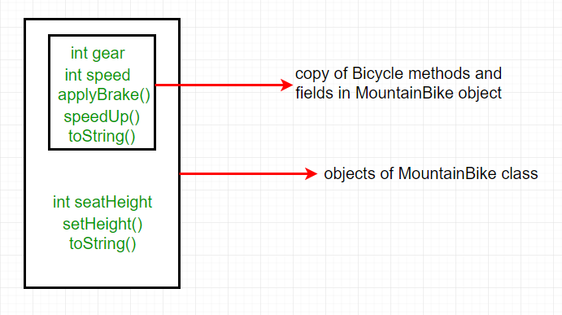
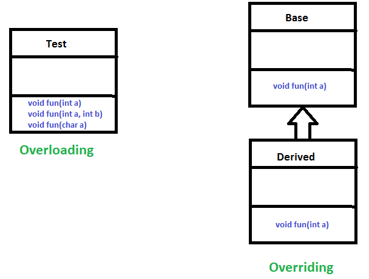
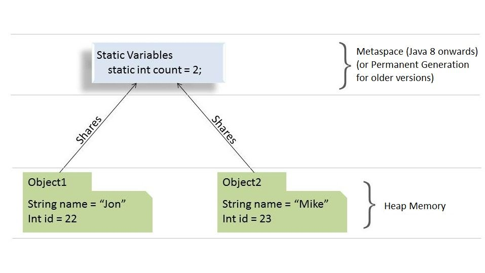
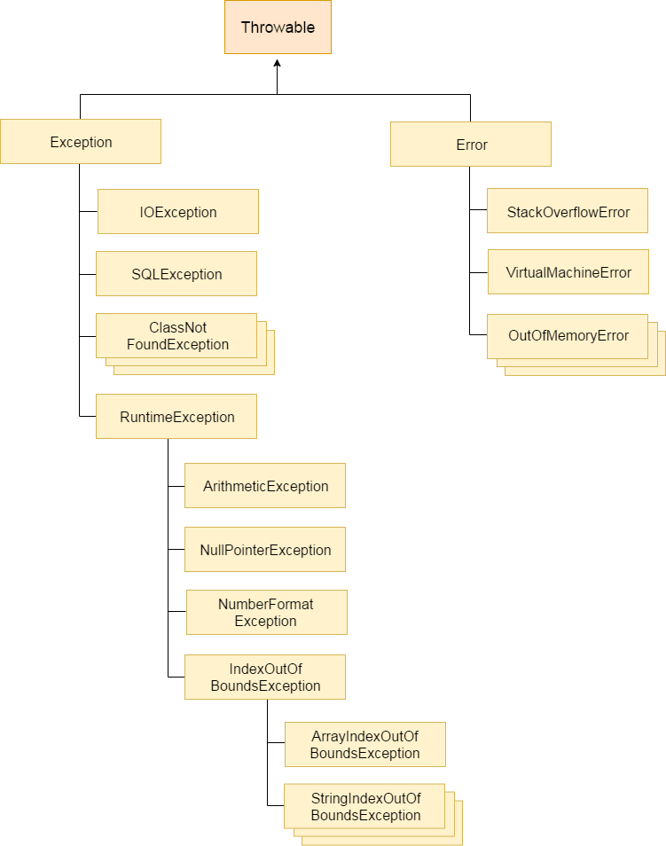

# 1. java interview questions spreadsheet 2019-12-22-1502 

```text
For learning and study
```

<!-- TOC -->

- [java interview questions spreadsheet 2019-12-22-1502](#java-interview-questions-spreadsheet-2019-12-22-1502)
- [Java CORE](#java-core)
- [How does multiple inheritance work in Java?](#how-does-multiple-inheritance-work-in-java)
- [What is an interface?](#what-is-an-interface)
- [What is an Abstract class?](#what-is-an-abstract-class)
- [What is the difference between an interface and an abstract class?](#what-is-the-difference-between-an-interface-and-an-abstract-class)
- [Access modifiers](#access-modifiers)
- [Inheritance](#inheritance)
- [Polymorphism](#polymorphism)
- [Method overriding](#method-overriding)
- [Method hiding](#method-hiding)
- [Encapsulation](#encapsulation)
- [Abstraction](#abstraction)
- [Java Object Oriented Programming (OOP) Principals and Concepts](#java-object-oriented-programming-oop-principals-and-concepts)
- [Static keyword](#static-keyword)
- [instance members accessed from within static context?](#instance-members-accessed-from-within-static-context)
- [java static import best practice](#java-static-import-best-practice)
- [Java static methods](#java-static-methods)
- [Marker interfaces](#marker-interfaces)
- [Why constructor in abstract class?](#why-constructor-in-abstract-class)
- [final/finally/finalize keywords usage](#finalfinallyfinalize-keywords-usage)
- [Exceptions hierarchy](#exceptions-hierarchy)
- [Checked vs Unchecked exceptions](#checked-vs-unchecked-exceptions)
- [Exceptions supressing when throwing exception from finally clause?](#exceptions-supressing-when-throwing-exception-from-finally-clause)
- [Java Try With Resources](#java-try-with-resources)
- [equals() vs "=="](#equals-vs-)
- [hashCode() in Java](#hashcode-in-java)
- [Why overriding both equals() and hashCode()? Uses in Hash collections?](#why-overriding-both-equals-and-hashcode-uses-in-hash-collections)
- [Annotations in Java](#annotations-in-java)
- [JAVA 101: LEARN JAVA By Jeff Friesen](#java-101-learn-java-by-jeff-friesen)
- [String pool affecting String comparison](#string-pool-affecting-string-comparison)
- [Collections hierarchy](#collections-hierarchy)
- [List and Set extending Collection, Map not?](#list-and-set-extending-collection-map-not)
- [Java List Interface](#java-list-interface)
- [List Interface in Java with Examples](#list-interface-in-java-with-examples)
- [Java ArrayList class](#java-arraylist-class)
- [ArrayList in Java](#arraylist-in-java)
- [Guide to the Java ArrayList](#guide-to-the-java-arraylist)
- [Java LinkedList class](#java-linkedlist-class)
- [LinkedList in Java](#linkedlist-in-java)
- [Difference between ArrayList and LinkedList](#difference-between-arraylist-and-linkedlist)
- [ArrayList vs LinkedList in Java](#arraylist-vs-linkedlist-in-java)
- [List vs ArrayList](#list-vs-arraylist)
    - [Difference Between List and ArrayList in Java](#difference-between-list-and-arraylist-in-java)
    - [Array vs ArrayList in Java](#array-vs-arraylist-in-java)
- [HashMap vs TreeMap vs LinkedHashMap](#hashmap-vs-treemap-vs-linkedhashmap)
    - [Difference between HashMap, LinkedHashMap and TreeMap](#difference-between-hashmap-linkedhashmap-and-treemap)
- [NATURAL ordering - implementing Comparable interface VS CUSTOM ordering - implementing Comparator](#natural-ordering---implementing-comparable-interface-vs-custom-ordering---implementing-comparator)
    - [Comparable vs Comparator in Java](#comparable-vs-comparator-in-java)
- [Tree collections created with Comparator as an argument or naturally ordered entities](#tree-collections-created-with-comparator-as-an-argument-or-naturally-ordered-entities)
- [generics - type erasure and polymorphism?](#generics---type-erasure-and-polymorphism)
- [autoboxing/unboxing of primitives and their wrapper classes](#autoboxingunboxing-of-primitives-and-their-wrapper-classes)
    - [Autoboxing and Unboxing](#autoboxing-and-unboxing)
    - [Autoboxing and Unboxing in Java](#autoboxing-and-unboxing-in-java)
- [order of initialization in a class](#order-of-initialization-in-a-class)
    - [Java Initialization order](#java-initialization-order)
- [Order of execution of Initialization blocks and Constructors in Java](#order-of-execution-of-initialization-blocks-and-constructors-in-java)
- [initialization and static blocks](#initialization-and-static-blocks)
- [Clone and Serialize objects](#clone-and-serialize-objects)
- [Deep and Shallow cloning; Deep cloning - how to?](#deep-and-shallow-cloning-deep-cloning---how-to)
- [Java Bean](#java-bean)
- [Inner/Nested/Local classes](#innernestedlocal-classes)
- [Nested class as a normal outer class?](#nested-class-as-a-normal-outer-class)
- [Nested vs Anonymous Inner classes?](#nested-vs-anonymous-inner-classes)
- [Parameters passing - parameters to methods passing by val; For objects reference is passed by val?](#parameters-passing---parameters-to-methods-passing-by-val-for-objects-reference-is-passed-by-val)
- [final parameters as objects? What can change?](#final-parameters-as-objects-what-can-change)
- [The “final” Keyword in Java](#the-final-keyword-in-java)
- [Too Many Parameters in Java Methods, Part 2: Parameters Object](#too-many-parameters-in-java-methods-part-2-parameters-object)
- [Varargs vs Arrays when overloading](#varargs-vs-arrays-when-overloading)
- [Arrays as objects](#arrays-as-objects)
- [creating objects without "new"; Reflection - Class.newInstance() vs Constructor.newInstance(...)](#creating-objects-without-new-reflection---classnewinstance-vs-constructornewinstance)
- [accessing private fields and constructors using reflection?](#accessing-private-fields-and-constructors-using-reflection)
- [transient/volatile keywords](#transientvolatile-keywords)
- [why make private fields also final if they cannot be accessed if getters and setters not provided? How do Spring inject private object fields?](#why-make-private-fields-also-final-if-they-cannot-be-accessed-if-getters-and-setters-not-provided-how-do-spring-inject-private-object-fields)
    - [why make private fields also final if they cannot be accessed if getters and setters not provided?](#why-make-private-fields-also-final-if-they-cannot-be-accessed-if-getters-and-setters-not-provided)
    - [How does Spring inject private object fields?](#how-does-spring-inject-private-object-fields)
- [Defensive copying](#defensive-copying)
- [GC algorithm (mark and sweep)](#gc-algorithm-mark-and-sweep)
- [Heap zones for GC](#heap-zones-for-gc)
- [java memory management for java virtual machine jvm](#java-memory-management-for-java-virtual-machine-jvm)
- [How does GC free the memory for circular references?](#how-does-gc-free-the-memory-for-circular-references)
- [ClassLoaders](#classloaders)
- [XML DOM vs SAX vs Stax](#xml-dom-vs-sax-vs-stax)
- [XSD, XJC - serialize objects in xml](#xsd-xjc---serialize-objects-in-xml)
- [XML binding of objects to xml](#xml-binding-of-objects-to-xml)
- [System.out.println(); what is each element?](#systemoutprintln-what-is-each-element)
- [How to print elements of a Stream in Java 8](#how-to-print-elements-of-a-stream-in-java-8)
- [Streams](#streams)
- [Java 8 Method Reference](#java-8-method-reference)
- [synchronized blocks/methods](#synchronized-blocksmethods)
- [thread locks on entire object for accesing synchronized method?](#thread-locks-on-entire-object-for-accesing-synchronized-method)
- [wait() and notify()](#wait-and-notify)
- [Producer and Consumer problem with wait and notify vs BlockingQueue?](#producer-and-consumer-problem-with-wait-and-notify-vs-blockingqueue)
- [thread lifecycle](#thread-lifecycle)
- [using Future with Callable](#using-future-with-callable)
- [When to create threads by implementing Runnable and when by extending Thread?](#when-to-create-threads-by-implementing-runnable-and-when-by-extending-thread)
- [javax.util.concurrent synchronized Collections](#javaxutilconcurrent-synchronized-collections)
- [ConcurrentHashMap vs Collections.synchronizedMap(...)?](#concurrenthashmap-vs-collectionssynchronizedmap)
- [Atomic classes](#atomic-classes)
- [ThreadLocal](#threadlocal)
- [immutable objects thread safe?](#immutable-objects-thread-safe)
- [Ancestor of HashMap, Hashtable thread safe?](#ancestor-of-hashmap-hashtable-thread-safe)
- [Executor Service](#executor-service)
- [Java memory model](#java-memory-model)
- [null](#null)
- [Dead-lock/Starvation/Live lock](#dead-lockstarvationlive-lock)
    - [Deadlock](#deadlock)
    - [Starvation](#starvation)
    - [Livelock](#livelock)
    - [Deadlock, Livelock and Starvation](#deadlock-livelock-and-starvation)
- [Parallel stream/ Fork / Join](#parallel-stream-fork--join)
    - [Fork-Join Framework API](#fork-join-framework-api)
    - [Fork-Join and Parallel Streams](#fork-join-and-parallel-streams)
- [Design patterns](#design-patterns)
    - [Creational Design Patterns](#creational-design-patterns)
    - [Structural Design Patterns](#structural-design-patterns)
    - [Behavioural Design Patterns](#behavioural-design-patterns)
        - [Strategy Design Pattern](#strategy-design-pattern)
- [SQL (Structured Query Language)](#sql-structured-query-language)
- [SQL select](#sql-select)
- [Index (good for select bad for insert?)](#index-good-for-select-bad-for-insert)
    - [Database index](#database-index)
- [Property of a transaction A.C.I.D](#property-of-a-transaction-acid)
- [View](#view)
    - [SQL view](#sql-view)
- [Trigger](#trigger)
    - [SQL trigger](#sql-trigger)
- [Stored Procedure](#stored-procedure)
    - [SQL Stored Procedure](#sql-stored-procedure)
- [Functions](#functions)
    - [SQL functions](#sql-functions)
- [Spring](#spring)
- [IoC and Dependency injection](#ioc-and-dependency-injection)
- [Spring Design Patterns](#spring-design-patterns)
    - [Design Patterns used in Spring Framework Part 2 - Creational Patterns - Factory - Builder - Singleton - Prototype](#design-patterns-used-in-spring-framework-part-2---creational-patterns---factory---builder---singleton---prototype)
    - [Design Patterns Spring Framework Part 1 - Inversion of Control - Dependency Injection](#design-patterns-spring-framework-part-1---inversion-of-control---dependency-injection)
    - [Spring IoC (Inversion Of Control) Design Patterns](#spring-ioc-inversion-of-control-design-patterns)
        - [Dependency Injection (DI) Pattern](#dependency-injection-di-pattern)
        - [Factory Pattern](#factory-pattern)
        - [Builder Pattern](#builder-pattern)
        - [Singleton Pattern](#singleton-pattern)
        - [Prototype Pattern](#prototype-pattern)
        - [Service Locator Pattern](#service-locator-pattern)
        - [Strategy Pattern](#strategy-pattern)
        - [Observer Pattern](#observer-pattern)
        - [Template Method Pattern](#template-method-pattern)
        - [Mixin Injection Pattern](#mixin-injection-pattern)
- [@Autowired and @Qualifier](#autowired-and-qualifier)
- [xml based configuration Vs annotation based config](#xml-based-configuration-vs-annotation-based-config)
- [bean scopes](#bean-scopes)
- [Spring security](#spring-security)
- [JDBC](#jdbc)
- [Statement/ Prepare statement / ResultSet](#statement-prepare-statement--resultset)
- [Stored procedure from java Code](#stored-procedure-from-java-code)
- [Connection pooling](#connection-pooling)

<!-- /TOC -->

# 2. Java CORE

```text
Java CORE
```

# 3. How does multiple inheritance work in Java?

|Junior |Mid  |Senior |
|-------|-----|-------|
|   x   |  x  |   x   |

`references:`
https://www.interviewsansar.com/2017/06/29/implement-multiple-inheritance-in-java/

Multiple inheritance in Java programming is achieved or implemented using interfaces. Java does not support multiple inheritance using classes.
In simple term, a class can inherit only one class and multiple interfaces in a java programs. In java terminology, we can say that

`"A class can extend only one class but it can implement multiple interfaces."`

----

`references:`
https://www.geeksforgeeks.org/java-and-multiple-inheritance/

Multiple Inheritance is a feature of object oriented concept, where a class can inherit properties of more than one parent class. The problem occurs when there exist methods with same signature in both the super classes and subclass. On calling the method, the compiler cannot determine which class method to be called and even on calling which class method gets the priority.

**Why Java doesn’t support Multiple Inheritance?**

Consider the below Java code. It shows error.


```java
// First Parent class 
class Parent1 
{ 
    void fun() 
    { 
        System.out.println("Parent1"); 
    } 
} 
  
// Second Parent Class 
class Parent2 
{ 
    void fun() 
    { 
        System.out.println("Parent2"); 
    } 
} 
  
// Error : Test is inheriting from multiple 
// classes 
class Test extends Parent1, Parent2 
{ 
   public static void main(String args[]) 
   { 
       Test t = new Test(); 
       t.fun(); 
   } 
} 
```

```text
Output :
Compiler Error
```

From the code, we see that, on calling the method fun() using Test object will cause complications such as whether to call Parent1’s fun() or Parent2’s fun() method.

1. The Diamond Problem:

```text
          GrandParent
           /     \
          /       \
      Parent1      Parent2
          \       /
           \     /
             Test
```

2. Simplicity – Multiple inheritance is not supported by Java using classes , handling the complexity that causes due to multiple inheritance is very complex. It creates problem during various operations like casting, constructor chaining etc and the above all reason is that there are very few scenarios on which we actually need multiple inheritance, so better to omit it for keeping the things simple and straightforward.

**How are above problems handled for Default Methods and Interfaces ?**

Java 8 supports default methods where interfaces can provide default implementation of methods. And a class can implement two or more interfaces. In case both the implemented interfaces contain default methods with same method signature, the implementing class should explicitly specify which default method is to be used or it should override the default method.

```java
// A simple Java program to demonstrate multiple 
// inheritance through default methods. 
interface PI1 
{ 
    // default method 
    default void show() 
    { 
        System.out.println("Default PI1"); 
    } 
} 
  
interface PI2 
{ 
    // Default method 
    default void show() 
    { 
        System.out.println("Default PI2"); 
    } 
} 
  
// Implementation class code 
class TestClass implements PI1, PI2 
{ 
    // Overriding default show method 
    public void show() 
    { 
        // use super keyword to call the show 
        // method of PI1 interface 
        PI1.super.show(); 
  
        // use super keyword to call the show 
        // method of PI2 interface 
        PI2.super.show(); 
    } 
  
    public static void main(String args[]) 
    { 
        TestClass d = new TestClass(); 
        d.show(); 
    } 
} 
```

```text
Output:

Default PI1
Default PI2
```

If we remove implementation of default method from "TestClass", we get compiler error. See this for a sample run.

If there is a diamond through interfaces, then there is no issue if none of the middle interfaces provide implementation of root interface. If they provide implementation, then implementation can be accessed as above using super keyword.

```java
// A simple Java program to demonstrate how diamond 
// problem is handled in case of default methods 
  
interface GPI 
{ 
    // default method 
    default void show() 
    { 
        System.out.println("Default GPI"); 
    } 
} 
  
interface PI1 extends GPI { } 
  
interface PI2 extends GPI { } 
  
// Implementation class code 
class TestClass implements PI1, PI2 
{ 
    public static void main(String args[]) 
    { 
        TestClass d = new TestClass(); 
        d.show(); 
    } 
}
```

```text
Output:
Default GPI
```

This article is contributed by Vishal S. If you like GeeksforGeeks and would like to contribute, you can also write an article using contribute.geeksforgeeks.org or mail your article to contribute@geeksforgeeks.org. See your article appearing on the GeeksforGeeks main page and help other Geeks.

Please write comments if you find anything incorrect, or you want to share more information about the topic discussed above.

----

`references:`
https://www.journaldev.com/1775/multiple-inheritance-in-java

**Composition to the rescue**

So what to do if we want to utilize ClassA function methodA() and ClassB function methodB() in ClassC. The solution lies in using composition. Here is a refactored version of ClassC that is using composition to utilize both classes methods and also using doSomething() method from one of the objects.

`ClassC.java`

```java
package com.journaldev.inheritance;

public class ClassC{

	ClassA objA = new ClassA();
	ClassB objB = new ClassB();
	
	public void test(){
		objA.doSomething();
	}
	
	public void methodA(){
		objA.methodA();
	}
	
	public void methodB(){
		objB.methodB();
	}
}
```

**Composition vs Inheritance**

One of the best practices of Java programming is to `"favor composition over inheritance"`. We will look into some of the aspects favoring this approach.

Suppose we have a superclass and subclass as follows:

`ClassC.java`

```java
package com.journaldev.inheritance;

public class ClassC{

	public void methodC(){
	}
}
```

`ClassD.java`

```java
package com.journaldev.inheritance;

public class ClassD extends ClassC{

	public int test(){
		return 0;
	}
}
```

The above code compiles and works fine but what if ClassC implementation is changed like below:

`ClassC.java`

```java
package com.journaldev.inheritance;

public class ClassC{

	public void methodC(){
	}

	public void test(){
	}
}
```

Notice that `test()` method already exists in the subclass but the return type is different. Now the `ClassD` won’t compile and if you are using any IDE, it will suggest you change the return type in either superclass or subclass.

Now imagine the situation where we have multiple levels of class inheritance and superclass is not controlled by us. We will have no choice but to change our subclass method signature or its name to remove the compilation error. Also, we will have to make a change in all the places where our subclass method was getting invoked, so inheritance makes our code fragile.

The above problem will never occur with composition and that makes it more favorable over inheritance.

Another problem with inheritance is that we are exposing all the superclass methods to the client and if our superclass is not properly designed and there are security holes, then even though we take complete care in implementing our class, we get affected by the poor implementation of the superclass.
Composition helps us in providing controlled access to the superclass methods whereas inheritance doesn’t provide any control of the superclass methods, this is also one of the major advantages of composition over inheritance.

Another benefit with composition is that it provides flexibility in the invocation of methods. Our above implementation of ClassC is not optimal and provides compile-time binding with the method that will be invoked, with minimal change we can make the method invocation flexible and make it dynamic.

`ClassC.java`

```java
package com.journaldev.inheritance;

public class ClassC{

	SuperClass obj = null;

	public ClassC(SuperClass o){
		this.obj = o;
	}
	public void test(){
		obj.doSomething();
	}
	
	public static void main(String args[]){
		ClassC obj1 = new ClassC(new ClassA());
		ClassC obj2 = new ClassC(new ClassB());
		
		obj1.test();
		obj2.test();
	}
}
```

```text
Output of above program is:

doSomething implementation of A
doSomething implementation of B
```

This flexibility in method invocation is not available in inheritance and boosts the best practice to favor composition over inheritance.

Unit testing is easy in composition because we know what all methods we are using from superclass and we can mock it up for testing whereas in inheritance we depend heavily on superclass and don’t know what all methods of superclass will be used, so we need to test all the methods of superclass, that is an extra work and we need to do it unnecessarily because of inheritance.
That’s all for multiple inheritances in java and a brief look at composition.

# 4. What is an interface?

|Junior |Mid  |Senior |
|-------|-----|-------|
|   x   |  x  |   x   |

`references:` https://blog.udemy.com/java-interface-example/

**What is a Java Interface?**

A Java interface is an abstract type used to designate a set of abstract methods for classes to implement. As mentioned before, when a class implements an interface, it must inherit all of the abstract methods declared within, as though signing into a contract and carrying out the agreement.

The most significant similarity between interfaces and classes is that they both contain methods. They are more different than they are the same, however: an interface lacks constructors, contains exclusively abstract methods (no method implementation), and exclusively final and static fields.

----

`references:`
http://tutorials.jenkov.com/java/interfaces.html

Java includes a concept called interfaces. A Java interface is a bit like a class, except a Java interface can only contain method signatures and fields. An Java interface cannot contain an implementation of the methods, only the signature (name, parameters and exceptions) of the method.

You can use interfaces in Java as a way to achieve polymorphism. I will get back to polymorphism later in this text.

**Java Interface Example**

Here is a simple Java interface example:

```java
public interface MyInterface {

    public String hello = "Hello";

    public void sayHello();
}
```

As you can see, an interface is declared using the Java interface keyword. Just like with classes, a Java interface can be declared public or package scope (no access modifier).

The interface example above contains one variable and one method. The variable can be accessed directly from the interface, like this:

`System.out.println(MyInterface.hello);`

As you can see, accessing a variable from an interface is very similar to accessing a static variable in a class.

The method, however, needs to be implemented by some class before you can access it. The next section will explain how that is done.

**Implementing an Interface**

Before you can really use an interface, you must implement that interface in some Java class. Here is a class that implements the MyInterface interface shown above:

```java
public class MyInterfaceImpl implements MyInterface {

    public void sayHello() {
        System.out.println(MyInterface.hello);
    }
}
```

Notice the implements MyInterface part of the above class declaration. This signals to the Java compiler that the MyInterfaceImpl class implements the MyInterface interface.

A class that implements an interface must implement all the methods declared in the interface. The methods must have the exact same signature (name + parameters) as declared in the interface. The class does not need to implement (declare) the variables of an interface. Only the methods.

**Interface Instances**

Once a Java class implements an Java interface you can use an instance of that class as an instance of that interface. Here is an example:

```java
MyInterface myInterface = new MyInterfaceImpl();

myInterface.sayHello();
```

Notice how the variable is declared to be of the interface type MyInterface while the object created is of type MyInterfaceImpl. Java allows this because the class MyInterfaceImpl implements the MyInterface interface. You can then reference instances of the MyInterfaceImpl class as instances of the MyInterface interface.

You cannot create instances of a Java interface by itself. You must always create an instance of some class that implements the interface, and reference that instance as an instance of the interface.

**Implementing Multiple Interfaces**

A Java class can implement multiple Java interfaces. In that case the class must implement all the methods declared in all the interfaces implemented. Here is an example:

```java
public class MyInterfaceImpl
    implements MyInterface, MyOtherInterface {

    public void sayHello() {
        System.out.println("Hello");
    }

    public void sayGoodbye() {
        System.out.println("Goodbye");
    }
}
```

This class implements two interfaces called MyInterface and MyOtherInterface. You list the names of the interfaces to implement after the implements keyword, separated by a comma.

If the interfaces are not located in the same packages as the implementing class, you will also need to import the interfaces. Java interfaces are imported using the import instruction just like Java classes. For instance:

```java
import com.jenkov.package1.MyInterface;
import com.jenkov.package2.MyOtherInterface;

public class MyInterfaceImpl implements MyInterface, MyOtherInterface {
    ...
}
```

Here are the two Java interfaces implemented by the class above:

```java
public interface MyInterface {

    public void sayHello();
}
public interface MyOtherInterface {

    public void sayGoodbye();
}
```

As you can see, each interface contains one method. These methods are implemented by the class MyInterfaceImpl

**Overlapping Method Signatures**

If a Java class implements multiple Java interfaces, there is a risk that some of these interfaces may contain methods with the same signature (name + parameters). Since a Java class can only implement at method with a given signature once, this could potentially lead to some problems.

The Java specification does not give any solution to this problem. It is up to you to decide what to do in that situation.

**Which Java Types Can Implement Interfaces?**

The following Java types can implement interfaces:

- Java Class
- Java Abstract Class
- Java Nested Class
- Java Enum
- Java Dynamic Proxy

**Interface Variables**

A Java interface can contain both variables and constants. However, often it does not makes sense to place variables in an interface. In some cases it can make sense to define constants in an interface. Especially if those constants are to be used by the classes implementing the interface, e.g. in calculations, or as parameters to some of the methods in the interface. However, my advice to you is to avoid placing variables in Java interfaces if you can.

All variables in an interface are public, even if you leave out the public keyword in the variable declaration.

**Interface Methods**

A Java interface can contain one or more method declarations. As mentioned earlier, the interface cannot specify any implementation for these methods. It is up to the classes implementing the interface to specify an implementation.

All methods in an interface are public, even if you leave out the public keyword in the method declaration.

**Interface Default Methods**

Before Java 8 Java interfaces could not contain an implementation of the methods, but only contain the method signatures. However, this results in some problems when an API needs to add a method to one of its interfaces. If the API just adds the method to the desired interface, all classes that implements the interface must implement that new method. That is fine if all implementing classes are located within the API. But if some implementing classes are located in client code of the API (the code that uses the API), then that code breaks.

Let me illustrate this with an example. Look at this interface and imagine that it is part of e.g. an open source API which many applications are using internally:

```java
public interface ResourceLoader {

    Resource load(String resourcePath);

}
```

Now imagine that a project uses this API and has implemented the ResourceLoader interface like this:

```java
public class FileLoader implements ResourceLoader {

    public Resource load(String resourcePath) {
        // in here is the implementation +
        // a return statement.
    }
}
```

If the developer of the API wants to add one more method to the ResourceLoader interface, then the FileLoader class will be broken when that project upgrades to the new version of the API.

To alleviate this Java interface evolution problem, Java 8 has added the concept of interface default methods to Java interfaces. An interface default method can contain a default implementation of that method. Classes that implement the interface but which contain no implementation for the default interface will then automatically get the default method implementation.

You mark a method in an interface as a default method using the default keyword. Here is an example of adding a default method to the ResourceLoader interface:

```java
public interface ResourceLoader {

    Resource load(String resourcePath);

    default Resource load(Path resourcePath) {
        // provide default implementation to load
        // resource from a Path and return the content
        // in a Resource object.
    }

}
```

This example adds the default method load(Path). The example leaves out the actual implementation (inside the method body) because this is not really interesting. What matters is how you declare the interface default method.

A class can override the implementation of a default method simply by implementing that method explicitly, as is done normally when implementing a Java interface. Any implementation in a class takes precedence over interface default method implementations.

**Interface Static Methods**

A Java interface can have static methods. Static methods in a Java interface must have implementation. Here is an example of a static method in a Java interface:

```java
public interface MyInterface {

    public static void print(String text){
        System.out.print(text);
    }
}
```

Calling a static method in an interface looks and works just like calling a static method in a class. Here is an example of calling the static print() method from the above MyInterface interface:

```java
MyInterface.print("Hello static method!");
```

Static methods in interfaces can be useful when you have some utility methods you would like to make available, which fit naturally into an interface related to the same responsibility. For instance, a Vehicle interface could have a printVehicle(Vehicle v) static method.


**Interfaces and Inheritance**

It is possible for a Java interface to inherit from another Java interface, just like classes can inherit from other classes. You specify inheritance using the extends keyword. Here is a simple interface inheritance example:

```java
public interface MySuperInterface {

    public void saiHello();

}
```

```java
public interface MySubInterface extends MySuperInterface {

    public void sayGoodbye();
}
```

The interface MySubInterface extends the interface MySuperInterface. That means, that the MySubInterface inherits all field and methods from MySuperInterface. That then means, that if a class implements MySubInterface, that class has to implement all methods defined in both MySubInterface and MySuperInterface.

It is possible to define methods in a subinterface with the same signature (name + parameters) as methods defined in a superinterface, should you find that desirable in your design, somehow.

Unlike classes, interfaces can actually inherit from multiple superinterfaces. You specify that by listing the names of all interfaces to inherit from, separated by comma. A class implementing an interface which inherits from multiple interfaces must implement all methods from the interface and its superinterfaces.

Here is an example of a Java interface that inherits from multiple interfaces:

```java
public interface MySubInterface extends
    SuperInterface1, SuperInterface2 {

    public void sayItAll();
}
```

As when implementing multiple interfaces, there are no rules for how you handle the situation when multiple superinterfaces have methods with the same signature (name + parameters).

**Inheritance and Default Methods**

Interface default methods add a bit complexity to the rules of interface inheritance. While it is normally possible for a class to implement multiple interfaces even if the interfaces contain methods with the same signature, this is not possible if one or more of these methods are default methods. In other words, if two interfaces contain the same method signature (name + parameters) and one of the interfaces declare this method as a default method, a class cannot automatically implement both interfaces.

The situation is the same if an interface extends (inherits from) multiple interfaces, and one or more of these interfaces contain methods with the same signature, and one of the superinterfaces declare the overlapping method as a default method.

In both of the above situations the Java compiler requires that the class implementing the interface(s) explicitly implements the method which causes the problem. That way there is no doubt about which implementation the class will have. The implementation in the class takes precedence over any default implementations.

**Interfaces and Polymorphism**

Java interfaces are a way to achieve polymorphism. Polymorphism is a concept that takes some practice and thought to master. Basically, polymorphism means that an instance of an class (an object) can be used as if it were of different types. Here, a type means either a class or an interface.

Look at this simple class diagram:


*Two parallel class hierarchies used in the same application.*

Two parallel class hierarchies used in the same application.
The classes above are all parts of a model representing different types of vehicles and drivers, with fields and methods. That is the responsibility of these classes - to model these entities from real life.

Now imagine you needed to be able to store these objects in a database, and also serialize them to XML, JSON, or other formats. You want that implemented using a single method for each operation, available on each Car, Truck or Vehicle object. A store() method, a serializeToXML() method and a serializeToJSON() method.

Please forget for a while, that implementing this functionality as methods directly on the objects may lead to a messy class hierarchy. Just imagine that this is how you want the operations implemented.

Where in the above diagram would you put these three methods, so they are accessible on all classes?

One way to solve this problem would be to create a common superclass for the Vehicle and Driver class, which has the storage and serialization methods. However, this would result in a conceptual mess. The class hierarchy would no longer model vehicles and drivers, but also be tied to the storage and serialization mechanisms used in your application.

A better solution would be to create some interfaces with the storage and serialization methods on, and let the classes implement these interfaces. Here are examples of such interfaces:

```java
public interface Storable {

    public void store();
}
```

```java
public interface Serializable {
    public void serializeToXML(Writer writer);
    public void serializeToJSON(Writer writer);
}
```

When each class implements these two interfaces and their methods, you can access the methods of these interfaces by casting the objects to instances of the interface types. You don't need to know exactly what class a given object is of, as long as you know what interface it implements. Here is an example:

```java
Car car = new Car();

Storable storable = (Storable) car;
storable.store();

Serializable serializable = (Serializable) car;
serializable.serializeToXML (new FileWriter("car.xml"));
serializable.serializeToJSON(new FileWriter("car.json"));
```

As you can probably imagine by now, interfaces provide a cleaner way of implementing cross cutting functionality in classes than inheritance.

**Generic Interfaces**

A generic Java interface is an interface which can be typed - meaning it can be specialized to work with a specific type (e.g. interface or class) when used. Let me first create a simple Java interface that contains a single method:

```java
public interface MyProducer() {

    public Object produce();

}
```

This interface represents an interface which contains a single method called produce() which can produce a single object. Since the return value of produce() is Object, it can return any Java object.

Here is a class that implements the MyProducer interface:

```java
public class CarProducer implements MyProducer{
    public Object produce() {
        return new Car();
    }
}
```

The above class CarProducer implements the MyProducer interface. The implementation of the produce() method returns a new Car object every time it is called. Here is how it looks to use the CarProducer class:

```java
MyProducer carProducer = new CarProducer();

Car car = (Car) carProducer.produce();
```

Notice how the object returned from the carProducer.produce() method call has to be cast to a Car instance, because the produce() method return type is Object. Using Java Generics you can type the MyProducer interface so you can specify what type of object it produces when you use it. Here is first a generic version of the MyProducer interface:

```java
public interface MyProducer <T>{
    
    public T produce();
    
}
```

Now when I implement the MyProducer interface in the CarProducer class, I have to include the generic type declaration too, like this:

```java
public class CarProducer<T> implements MyProducer<T>{

    @Override
    public T produce() {
        return (T) new Car();
    }
}
```

Now, when creating a CarProducer I can specify its generic interface type, like this:

```java
MyProducer<Car> myCarProducer = new CarProducer<Car>();

Car produce = myCarProducer.produce();
```

As you can see, since the generic type for the CarProducer instance is set to Car, it is no longer necessary to cast the object returned from the produce() method, since the original method declaration in the MyProducer interface states, that this method returns the same type as is specified in the generic type when used.

But - now it is actually possible to specify another generic type for a CarProducer instance than the type it actually returns from it's produce() method implementation. If you scroll up, you can see that the CarProducer.produce() implementation returns a Car object no matter what generic type you specify for it when you create it. So, the following declaration is possible, but would return in a ClassCastException when executed:

```java
MyProducer<String> myStringProducer = new CarProducer<String>();

String produce1 = myStringProducer.produce();
```

Instead, you can lock down the generic type of the MyProducer interface already when you implement it, in the CarProducer class. Here is an example of specifying the generic type of a generic interface when implementing it:

```java
public class CarProducer implements MyProducer<Car>{

    @Override
    public Car produce() {
        return new Car();
    }
}
```

Now you cannot specify the generic type of the CarProducer when using it. It is already typed to Car. Here is how using the CarProducer looks:

```java
MyProducer<Car> myCarProducer = new CarProducer();

Car produce = myCarProducer.produce();
```


As you can see, it is still not necessary to cast the object returned by produce(), as the CarProducer implementation declares that to be a Car instance.

Java generics is covered in more detail in my [Java Generics Tutorial](http://tutorials.jenkov.com/java-generics/index.html).

**Functional Interfaces**

From Java 8 a new concept was introduced called functional interfaces. In short, a functional interface is an interface with a single, unimplemented method (non-default, non-static method). I have explained functional interfaces in my [Java functional interface tutorial](http://tutorials.jenkov.com/java-functional-programming/functional-interfaces.html), which is part of my [Java Functional Programming Tutorial.](http://tutorials.jenkov.com/java-functional-programming/index.html) .

Functional interfaces are often intended to be implemented by a [Java Lambda Expression](http://tutorials.jenkov.com/java/lambda-expressions.html).

# 5. What is an Abstract class?

|Junior |Mid  |Senior |
|-------|-----|-------|
|   x   |  x  |   x   |

`references:` https://www.techopedia.com/definition/24335/abstract-class-java

**Definition - What does Abstract Class mean?**

An abstract class, in the context of Java, is a superclass that cannot be instantiated and is used to state or define general characteristics. An object cannot be formed from a Java abstract class; trying to instantiate an abstract class only produces a compiler error. The abstract class is declared using the keyword abstract.

Subclasses extended from an abstract class have all the abstract class's attributes, in addition to attributes specific to each subclass. The abstract class states the class characteristics and methods for implementation, thus defining a whole interface.

----

`references:` https://www.javatpoint.com/abstract-class-in-java

**Points to Remember**

- An abstract class must be declared with an abstract keyword.
- It can have abstract and non-abstract methods.
- It cannot be instantiated.
- It can have constructors and static methods also.
- It can have final methods which will force the subclass not to change the body of the method.

**Understanding the real scenario of Abstract class**

In this example, Shape is the abstract class, and its implementation is provided by the Rectangle and Circle classes.

Mostly, we don't know about the implementation class (which is hidden to the end user), and an object of the implementation class is provided by the factory method.

A factory method is a method that returns the instance of the class. We will learn about the factory method later.

In this example, if you create the instance of Rectangle class, draw() method of Rectangle class will be invoked.


```java
abstract class Shape{  
abstract void draw();  
}  
//In real scenario, implementation is provided by others i.e. unknown by end user  
class Rectangle extends Shape{  
void draw(){System.out.println("drawing rectangle");}  
}  
class Circle1 extends Shape{  
void draw(){System.out.println("drawing circle");}  
}  
//In real scenario, method is called by programmer or user  
class TestAbstraction1{  
public static void main(String args[]){  
Shape s=new Circle1();//In a real scenario, object is provided through method, e.g., getShape() method  
s.draw();  
}  
}  
```

----
`Refernce:` https://docs.oracle.com/javase/tutorial/java/IandI/abstract.html

**Abstract Methods and Classes**

An abstract class is a class that is declared abstract—it may or may not include abstract methods. Abstract classes cannot be instantiated, but they can be subclassed.

An abstract method is a method that is declared without an implementation (without braces, and followed by a semicolon), like this:

```java
abstract void moveTo(double deltaX, double deltaY);
```

If a class includes abstract methods, then the class itself must be declared abstract, as in:

```java
public abstract class GraphicObject {
   // declare fields
   // declare nonabstract methods
   abstract void draw();
}
```

When an abstract class is subclassed, the subclass usually provides implementations for all of the abstract methods in its parent class. However, if it does not, then the subclass must also be declared abstract.

`Note: Methods in an interface (see the Interfaces section) that are not declared as default or static are implicitly abstract, so the abstract modifier is not used with interface methods. (It can be used, but it is unnecessary.)`

- Abstract Classes Compared to Interfaces

Abstract classes are similar to interfaces. You cannot instantiate them, and they may contain a mix of methods declared with or without an implementation. However, with abstract classes, you can declare fields that are not static and final, and define public, protected, and private concrete methods. With interfaces, all fields are automatically public, static, and final, and all methods that you declare or define (as default methods) are public. In addition, you can extend only one class, whether or not it is abstract, whereas you can implement any number of interfaces.

Which should you use, abstract classes or interfaces?

- Consider using abstract classes if any of these statements apply to your situation:

    - You want to share code among several closely related classes.

    - You expect that classes that extend your abstract class have many common methods or fields, or require access modifiers other than public (such as protected and private).

    - You want to declare non-static or non-final fields. This enables you to define methods that can access and modify the state of the object to which they belong.

- Consider using interfaces if any of these statements apply to your situation:

    - You expect that unrelated classes would implement your interface. For example, the interfaces Comparable and Cloneable are implemented by many unrelated classes.

    - You want to specify the behavior of a particular data type, but not concerned about who implements its behavior.
    
    - You want to take advantage of multiple inheritance of type.

An example of an abstract class in the JDK is AbstractMap, which is part of the Collections Framework. Its subclasses (which include HashMap, TreeMap, and ConcurrentHashMap) share many methods (including get, put, isEmpty, containsKey, and containsValue) that AbstractMap defines.

An example of a class in the JDK that implements several interfaces is HashMap, which implements the interfaces Serializable, Cloneable, and Map<K, V>. By reading this list of interfaces, you can infer that an instance of HashMap (regardless of the developer or company who implemented the class) can be cloned, is serializable (which means that it can be converted into a byte stream; see the section Serializable Objects), and has the functionality of a map. In addition, the Map<K, V> interface has been enhanced with many default methods such as merge and forEach that older classes that have implemented this interface do not have to define.

`Note that many software libraries use both abstract classes and interfaces; the HashMap class implements several interfaces and also extends the abstract class AbstractMap.`

# 6. What is the difference between an interface and an abstract class?

|Junior |Mid  |Senior |
|-------|-----|-------|
|   x   |  x  |   x   |

Please see:
- What is an interface?
- What is an Abstract class?
    - Abstract Classes Compared to Interfaces

`references:` https://blog.udemy.com/difference-between-abstract-class-and-interface

- Abstract Classes

So what are abstract classes exactly? Let’s go over the basics. An abstract class is a class that you can’t instantiate. It will let other classes inherit from it, but it cannot be instantiated by itself. The only purpose of the abstract class is to let other sub classes inherit from it. It can be used to impose guidelines and hierarchies on sub classes.

- Interface

An interface is not a class, like the abstract class, but it is very similar to it. It contains methods without a signature (a body). An interface cannot do anything on its own. Think of it as an empty template that you can copy and fill. It, too, is used to impose guidelines and hierarchies and provide methods to sub classes. A class cannot inherit from more than one abstract class at one time in languages like Java and C. Because of the lack of support for multiple-inheritance, interfaces are used instead.

# 7. Access modifiers

|Junior |Mid  |Senior |
|-------|-----|-------|
|   x   |  x  |   x   |

`references:` https://docs.oracle.com/javase/tutorial/java/javaOO/accesscontrol.html

**Controlling Access to Members of a Class** 

Access level modifiers determine whether other classes can use a particular field or invoke a particular method. There are two levels of access control:

At the top level—public, or package-private (no explicit modifier).
At the member level—public, private, protected, or package-private (no explicit modifier).
A class may be declared with the modifier public, in which case that class is visible to all classes everywhere. If a class has no modifier (the default, also known as package-private), it is visible only within its own package (packages are named groups of related classes — you will learn about them in a later lesson.)

At the member level, you can also use the public modifier or no modifier (package-private) just as with top-level classes, and with the same meaning. For members, there are two additional access modifiers: private and protected. The private modifier specifies that the member can only be accessed in its own class. The protected modifier specifies that the member can only be accessed within its own package (as with package-private) and, in addition, by a subclass of its class in another package.

The following table shows the access to members permitted by each modifier.

|Modifier   |Class|Package|Subclass|World|
|-----------|-----|-------|--------|-----|
|public     |Y    |Y      |Y       |Y    |
|protected  |Y    |Y      |Y       |N    |
|no modifier|Y    |Y      |N       |N    |
|private    |Y    |N      |N       |N    |

----

`references:` https://www.geeksforgeeks.org/access-modifiers-java/

**Default**: When no access modifier is specified for a class , method or data member – It is said to be having the default access modifier by default.

The data members, class or methods which are not declared using any access modifiers i.e. having default access modifier are accessible only within the same **package**.

----

- [Access-modifiers-java-Javatpoint](refs/Access-modifiers-java-Javatpoint)

`references:` https://www.javatpoint.com/access-modifiers

**Access Modifiers in Java**

There are two types of modifiers in Java: access modifiers and non-access modifiers.

The access modifiers in Java specifies the accessibility or scope of a field, method, constructor, or class. We can change the access level of fields, constructors, methods, and class by applying the access modifier on it.

There are four types of Java access modifiers:

- `Private`: The access level of a private modifier is only within the class. It cannot be accessed from outside the class.

- `Default`: The access level of a default modifier is only within the package. It cannot be accessed from outside the package. If you do not specify any access level, it will be the default.

- `Protected`: The access level of a protected modifier is within the package and outside the package through child class. If you do not make the child class, it cannot be accessed from outside the package.

- `Public`: The access level of a public modifier is everywhere. It can be accessed from within the class, outside the class, within the package and outside the package.

----

`references:` https://www.w3schools.com/java/java_modifiers.asp

We divide modifiers into two groups:

- Access Modifiers - controls the access level
- Non-Access Modifiers - do not control access level, but provides other functionality

**Non-Access Modifiers**

For classes, you can use either final or abstract:

|Modifier|Description|
|--------|-----------|
|final   |The class cannot be inherited by other classes|
|abstract|The class cannot be used to create objects (To access an abstract class, it must be inherited from another class.|

For attributes and methods, you can use the one of the following:

|Modifier|Description|
|--------|-----------|
|final|Attributes and methods cannot be overridden/modified|
|static|Attributes and methods belongs to the class, rather than an object|
|abstract|Can only be used in an abstract class, and can only be used on methods. The method does not have a body, for example abstract void run();. The body is provided by the subclass (inherited from).|
|transient|Attributes and methods are skipped when serializing the object containing them|
|synchronized|Methods can only be accessed by one thread at a time|
|volatile|The value of an attribute is not cached thread-locally, and is always read from the "main memory"|

# 8. Inheritance

|Junior |Mid  |Senior |
|-------|-----|-------|
|   x   |  x  |   x   |

`references:` https://www.geeksforgeeks.org/inheritance-in-java/

Inheritance is an important pillar of OOP(Object Oriented Programming). It is the mechanism in java by which one class is allow to inherit the features(fields and methods) of another class.
Important terminology:

Super Class: The class whose features are inherited is known as super class(or a base class or a parent class).
Sub Class: The class that inherits the other class is known as sub class(or a derived class, extended class, or child class). The subclass can add its own fields and methods in addition to the superclass fields and methods.
Reusability: Inheritance supports the concept of “reusability”, i.e. when we want to create a new class and there is already a class that includes some of the code that we want, we can derive our new class from the existing class. By doing this, we are reusing the fields and methods of the existing class.

How to use inheritance in Java

The keyword used for inheritance is extends.
Syntax :

```java
class derived-class extends base-class  
{  
   //methods and fields  
}  
```

Example: In below example of inheritance, class Bicycle is a base class, class MountainBike is a derived class which extends Bicycle class and class Test is a driver class to run program.

```java
//Java program to illustrate the  
// concept of inheritance 
  
// base class 
class Bicycle  
{ 
    // the Bicycle class has two fields 
    public int gear; 
    public int speed; 
          
    // the Bicycle class has one constructor 
    public Bicycle(int gear, int speed) 
    { 
        this.gear = gear; 
        this.speed = speed; 
    } 
          
    // the Bicycle class has three methods 
    public void applyBrake(int decrement) 
    { 
        speed -= decrement; 
    } 
          
    public void speedUp(int increment) 
    { 
        speed += increment; 
    } 
      
    // toString() method to print info of Bicycle 
    public String toString()  
    { 
        return("No of gears are "+gear 
                +"\n"
                + "speed of bicycle is "+speed); 
    }  
} 
  
// derived class 
class MountainBike extends Bicycle  
{ 
      
    // the MountainBike subclass adds one more field 
    public int seatHeight; 
  
    // the MountainBike subclass has one constructor 
    public MountainBike(int gear,int speed, 
                        int startHeight) 
    { 
        // invoking base-class(Bicycle) constructor 
        super(gear, speed); 
        seatHeight = startHeight; 
    }  
          
    // the MountainBike subclass adds one more method 
    public void setHeight(int newValue) 
    { 
        seatHeight = newValue; 
    }  
      
    // overriding toString() method 
    // of Bicycle to print more info 
    @Override
    public String toString() 
    { 
        return (super.toString()+ 
                "\nseat height is "+seatHeight); 
    } 
      
} 
  
// driver class 
public class Test  
{ 
    public static void main(String args[])  
    { 
          
        MountainBike mb = new MountainBike(3, 100, 25); 
        System.out.println(mb.toString()); 
              
    } 
}
```

Output:
```text
No of gears are 3
speed of bicycle is 100
seat height is 25
```

In above program, when an object of MountainBike class is created, a copy of the all methods and fields of the superclass acquire memory in this object. That is why, by using the object of the subclass we can also access the members of a superclass.

Please note that during inheritance only object of subclass is created, not the superclass. 



In practice, inheritance and polymorphism are used together in java to achieve fast performance and readability of code.

Types of Inheritance in Java

Below are the different types of inheritance which is supported by Java.

- Single Inheritance : In single inheritance, subclasses inherit the features of one superclass. In image below, the class A serves as a base class for the derived class B.


```java
//Java program to illustrate the  
// concept of single inheritance 
import java.util.*; 
import java.lang.*; 
import java.io.*; 
  
class one 
{ 
    public void print_geek() 
    { 
        System.out.println("Geeks"); 
    } 
} 
  
class two extends one 
{ 
    public void print_for() 
    { 
        System.out.println("for"); 
    } 
} 
// Driver class 
public class Main 
{ 
    public static void main(String[] args) 
    { 
        two g = new two(); 
        g.print_geek(); 
        g.print_for(); 
        g.print_geek(); 
    } 
} 
```

Output:

```text
Geeks
for
Geeks
```

- Multilevel Inheritance : In Multilevel Inheritance, a derived class will be inheriting a base class and as well as the derived class also act as the base class to other class. In below image, the class A serves as a base class for the derived class B, which in turn serves as a base class for the derived class C. In Java, a class cannot directly access the grandparent’s members.


```java
// Java program to illustrate the  
// concept of Multilevel inheritance 
import java.util.*; 
import java.lang.*; 
import java.io.*; 
  
class one 
{ 
    public void print_geek() 
    { 
        System.out.println("Geeks"); 
    } 
} 
  
class two extends one 
{ 
    public void print_for() 
    { 
        System.out.println("for"); 
    } 
} 
  
class three extends two 
{ 
    public void print_geek() 
    { 
        System.out.println("Geeks"); 
    } 
} 
  
// Drived class 
public class Main 
{ 
    public static void main(String[] args) 
    { 
        three g = new three(); 
        g.print_geek(); 
        g.print_for(); 
        g.print_geek(); 
    } 
}
```

Output:

```text
Geeks
for
Geeks
```

- Hierarchical Inheritance : In Hierarchical Inheritance, one class serves as a superclass (base class) for more than one sub class.In below image, the class A serves as a base class for the derived class B,C and D.


```java
// Java program to illustrate the  
// concept of Hierarchical inheritance 
import java.util.*; 
import java.lang.*; 
import java.io.*; 
  
class one 
{ 
    public void print_geek() 
    { 
        System.out.println("Geeks"); 
    } 
} 
  
class two extends one 
{ 
    public void print_for() 
    { 
        System.out.println("for"); 
    } 
} 
  
class three extends one 
{ 
    /*............*/
} 
  
// Drived class 
public class Main 
{ 
    public static void main(String[] args) 
    { 
        three g = new three(); 
        g.print_geek(); 
        two t = new two(); 
        t.print_for(); 
        g.print_geek(); 
    } 
} 
```

Output:

```text
Geeks
for
Geeks
```

- Multiple Inheritance (Through Interfaces) : In Multiple inheritance ,one class can have more than one superclass and inherit features from all parent classes. Please note that Java does not support multiple inheritance with classes. In java, we can achieve multiple inheritance only through Interfaces. In image below, Class C is derived from interface A and B.


```java
// Java program to illustrate the  
// concept of Multiple inheritance 
import java.util.*; 
import java.lang.*; 
import java.io.*; 
   
interface one 
{ 
    public void print_geek(); 
} 
   
interface two 
{ 
    public void print_for(); 
} 
   
interface three extends one,two 
{ 
    public void print_geek(); 
} 
class child implements three 
{ 
    @Override
    public void print_geek() { 
        System.out.println("Geeks"); 
    } 
   
    public void print_for() 
    { 
        System.out.println("for"); 
    } 
} 
  
// Drived class 
public class Main 
{ 
    public static void main(String[] args) 
    { 
        child c = new child(); 
        c.print_geek(); 
        c.print_for(); 
        c.print_geek(); 
    } 
} 
```

Output:

```text
Geeks
for
Geeks
```

- Hybrid Inheritance(Through Interfaces) : It is a mix of two or more of the above types of inheritance. Since java doesn’t support multiple inheritance with classes, the hybrid inheritance is also not possible with classes. In java, we can achieve hybrid inheritance only through Interfaces.


Important facts about inheritance in Java

- Default superclass: Except Object class, which has no superclass, every class has one and only one direct superclass (single inheritance). In the absence of any other explicit superclass, every class is implicitly a subclass of Object class.

- Superclass can only be one: A superclass can have any number of subclasses. But a subclass can have only one superclass. This is because Java does not support multiple inheritance with classes. Although with interfaces, multiple inheritance is supported by java.

- Inheriting Constructors: A subclass inherits all the members (fields, methods, and nested classes) from its superclass. Constructors are not members, so they are not inherited by subclasses, but the constructor of the superclass can be invoked from the subclass.

- Private member inheritance: A subclass does not inherit the private members of its parent class. However, if the superclass has public or protected methods(like getters and setters) for accessing its private fields, these can also be used by the subclass.

What all can be done in a Subclass?

In sub-classes we can inherit members as is, replace them, hide them, or supplement them with new members:

- The inherited fields can be used directly, just like any other fields.
We can declare new fields in the subclass that are not in the superclass.

- The inherited methods can be used directly as they are.
We can write a new instance method in the subclass that has the same signature as the one in the superclass, thus overriding it (as in example above, toString() method is overridden).

- We can write a new static method in the subclass that has the same signature as the one in the superclass, thus hiding it.

- We can declare new methods in the subclass that are not in the superclass.

- We can write a subclass constructor that invokes the constructor of the superclass, either implicitly or by using the keyword super.

----

`references:`
http://tutorials.jenkov.com/java/inheritance.html

----

`references:`
https://docs.oracle.com/javase/tutorial/java/IandI/subclasses.html

----

# 9. Polymorphism

|Junior |Mid  |Senior |
|-------|-----|-------|
|   x   |  x  |   x   |

`references:`
https://www.geeksforgeeks.org/polymorphism-in-java/

**Polymorphism in Java**

The word polymorphism means having many forms. In simple words, we can define polymorphism as the ability of a message to be displayed in more than one form.

Real life example of polymorphism: A person at the same time can have different characteristic. Like a man at the same time is a father, a husband, an employee. So the same person posses different behaviour in different situations. This is called polymorphism.

Polymorphism is considered as one of the important features of Object Oriented Programming. Polymorphism allows us to perform a single action in different ways. In other words, polymorphism allows you to define one interface and have multiple implementations. The word “poly” means many and “morphs” means forms, So it means many forms.

**In Java polymorphism is mainly divided into two types:**

    - Compile time Polymorphism
    - Runtime Polymorphism

- Compile time polymorphism: It is also known as static polymorphism. This type of polymorphism is achieved by function overloading or operator overloading.



- Method Overloading: When there are multiple functions with same name but different parameters then these functions are said to be overloaded. Functions can be overloaded by change in number of arguments or/and change in type of arguments.

Example: By using different types of arguments

```java
// Java program for Method overloading 
  
class MultiplyFun { 
  
    // Method with 2 parameter 
    static int Multiply(int a, int b) 
    { 
        return a * b; 
    } 
  
    // Method with the same name but 2 double parameter 
    static double Multiply(double a, double b) 
    { 
        return a * b; 
    } 
} 
  
class Main { 
    public static void main(String[] args) 
    { 
  
        System.out.println(MultiplyFun.Multiply(2, 4)); 
  
        System.out.println(MultiplyFun.Multiply(5.5, 6.3)); 
    } 
} 
```

Output:

```text
8
34.65
```

- Example: By using different numbers of arguments

```java
// Java program for Method overloading 

class MultiplyFun { 

	// Method with 2 parameter 
	static int Multiply(int a, int b) 
	{ 
		return a * b; 
	} 

	// Method with the same name but 3 parameter 
	static int Multiply(int a, int b, int c) 
	{ 
		return a * b * c; 
	} 
} 

class Main { 
	public static void main(String[] args) 
	{ 
		System.out.println(MultiplyFun.Multiply(2, 4)); 

		System.out.println(MultiplyFun.Multiply(2, 7, 3)); 
	} 
} 
```

Output:

```text
8
42
```

- Operator Overloading: Java also provide option to overload operators. For example, we can make the operator (‘+’) for string class to concatenate two strings. We know that this is the addition operator whose task is to add two operands. So a single operator ‘+’ when placed between integer operands, adds them and when placed between string operands, concatenates them.
In java, Only “+” operator can be overloaded:

    - To add integers
    - To concatenate strings

Example:

```java
// Java program for Operator overloading 

class OperatorOVERDDN { 

	void operator(String str1, String str2) 
	{ 
		String s = str1 + str2; 
		System.out.println("Concatinated String - "
						+ s); 
	} 

	void operator(int a, int b) 
	{ 
		int c = a + b; 
		System.out.println("Sum = " + c); 
	} 
} 

class Main { 
	public static void main(String[] args) 
	{ 
		OperatorOVERDDN obj = new OperatorOVERDDN(); 
		obj.operator(2, 3); 
		obj.operator("joe", "now"); 
	} 
} 
```

Output:

```text
Sum = 5
Concatinated String - joenow
```

- Runtime polymorphism: It is also known as Dynamic Method Dispatch. It is a process in which a function call to the overridden method is resolved at Runtime. This type of polymorphism is achieved by Method Overriding.

    - Method overriding, on the other hand, occurs when a derived class has a definition for one of the member functions of the base class. That base function is said to be overridden.

Example:

```java
// Java program for Method overridding 

class Parent { 

	void Print() 
	{ 
		System.out.println("parent class"); 
	} 
} 

class subclass1 extends Parent { 

	void Print() 
	{ 
		System.out.println("subclass1"); 
	} 
} 

class subclass2 extends Parent { 

	void Print() 
	{ 
		System.out.println("subclass2"); 
	} 
} 

class TestPolymorphism3 { 
	public static void main(String[] args) 
	{ 

		Parent a; 

		a = new subclass1(); 
		a.Print(); 

		a = new subclass2(); 
		a.Print(); 
	} 
} 
```

Output:

```text
subclass1
subclass2
```

----
`references:`
https://docs.oracle.com/javase/tutorial/java/IandI/polymorphism.html


# 10. Method overriding

|Junior |Mid  |Senior |
|-------|-----|-------|
|   x   |  x  |   x   |

`references:`
https://www.geeksforgeeks.org/overriding-in-java/

**Overriding in Java**

In any object-oriented programming language, Overriding is a feature that allows a subclass or child class to provide a specific implementation of a method that is already provided by one of its super-classes or parent classes. When a method in a subclass has the same name, same parameters or signature and same return type(or sub-type) as a method in its super-class, then the method in the subclass is said to override the method in the super-class.

Method overriding is one of the way by which java achieve Run Time Polymorphism.The version of a method that is executed will be determined by the object that is used to invoke it. If an object of a parent class is used to invoke the method, then the version in the parent class will be executed, but if an object of the subclass is used to invoke the method, then the version in the child class will be executed. In other words, it is the type of the object being referred to (not the type of the reference variable) that determines which version of an overridden method will be executed.

```java
// A Simple Java program to demonstrate 
// method overriding in java 

// Base Class 
class Parent { 
	void show() 
	{ 
		System.out.println("Parent's show()"); 
	} 
} 

// Inherited class 
class Child extends Parent { 
	// This method overrides show() of Parent 
	@Override
	void show() 
	{ 
		System.out.println("Child's show()"); 
	} 
} 

// Driver class 
class Main { 
	public static void main(String[] args) 
	{ 
		// If a Parent type reference refers 
		// to a Parent object, then Parent's 
		// show is called 
		Parent obj1 = new Parent(); 
		obj1.show(); 

		// If a Parent type reference refers 
		// to a Child object Child's show() 
		// is called. This is called RUN TIME 
		// POLYMORPHISM. 
		Parent obj2 = new Child(); 
		obj2.show(); 
	} 
} 
```

Output:

```text
Parent's show()
Child's show()
```

Rules for method overriding:

1. Overriding and Access-Modifiers : The access modifier for an overriding method can allow more, but not less, access than the overridden method. For example, a protected instance method in the super-class can be made public, but not private, in the subclass. Doing so, will generate compile-time error.

```java
// A Simple Java program to demonstrate 
// Overriding and Access-Modifiers 

class Parent { 
	// private methods are not overridden 
	private void m1() 
	{ 
		System.out.println("From parent m1()"); 
	} 

	protected void m2() 
	{ 
		System.out.println("From parent m2()"); 
	} 
} 

class Child extends Parent { 
	// new m1() method 
	// unique to Child class 
	private void m1() 
	{ 
		System.out.println("From child m1()"); 
	} 

	// overriding method 
	// with more accessibility 
	@Override
	public void m2() 
	{ 
		System.out.println("From child m2()"); 
	} 
} 

// Driver class 
class Main { 
	public static void main(String[] args) 
	{ 
		Parent obj1 = new Parent(); 
		obj1.m2(); 
		Parent obj2 = new Child(); 
		obj2.m2(); 
	} 
} 
```

Output:

```text
From parent m2()
From child m2()
```

2. Final methods can not be overridden : If we don’t want a method to be overridden, we declare it as final.

```java
// A Java program to demonstrate that 
// final methods cannot be overridden 

class Parent { 
	// Can't be overridden 
	final void show() {} 
} 

class Child extends Parent { 
	// This would produce error 
	void show() {} 
} 
```

Output:

```java
13: error: show() in Child cannot override show() in Parent
    void show() {  }
         ^
  overridden method is final
```

3. Static methods can not be overridden(Method Overriding vs Method Hiding) : When you defines a static method with same signature as a static method in base class, it is known as method hiding.

    The following table summarizes what happens when you define a method with the same signature as a method in a super-class.

||SUPERCLASS INSTANCE METHOD|SUPERCLASS STATIC METHOD|
|----|----|----|
|SUBCLASS INSTANCE METHOD|Overrides|	Generates a compile-time error|
|SUBCLASS STATIC METHOD|Generates a compile-time error|Hides|

```java
// Java program to show that 
// if the static method is redefined by 
// a derived class, then it is not 
// overriding, it is hiding 

class Parent { 
	// Static method in base class 
	// which will be hidden in subclass 
	static void m1() 
	{ 
		System.out.println("From parent "
						+ "static m1()"); 
	} 

	// Non-static method which will 
	// be overridden in derived class 
	void m2() 
	{ 
		System.out.println("From parent "
						+ "non-static(instance) m2()"); 
	} 
} 

class Child extends Parent { 
	// This method hides m1() in Parent 
	static void m1() 
	{ 
		System.out.println("From child static m1()"); 
	} 

	// This method overrides m2() in Parent 
	@Override
	public void m2() 
	{ 
		System.out.println("From child "
						+ "non-static(instance) m2()"); 
	} 
} 

// Driver class 
class Main { 
	public static void main(String[] args) 
	{ 
		Parent obj1 = new Child(); 

		// As per overriding rules this 
		// should call to class Child static 
		// overridden method. Since static 
		// method can not be overridden, it 
		// calls Parent's m1() 
		obj1.m1(); 

		// Here overriding works 
		// and Child's m2() is called 
		obj1.m2(); 
	} 
} 
```

Output:

```text
From parent static m1()
From child non-static(instance) m2()
```

4. Private methods can not be overridden : Private methods cannot be overridden as they are bonded during compile time. Therefore we can’t even override private methods in a subclass.
 
5. The overriding method must have same return type (or subtype) : From Java 5.0 onwards it is possible to have different return type for a overriding method in child class, but child’s return type should be sub-type of parent’s return type. This phenomena is known as covariant return type.

6. Invoking overridden method from sub-class : We can call parent class method in overriding method using super keyword.

7. Overriding and constructor : We can not override constructor as parent and child class can never have constructor with same name(Constructor name must always be same as Class name).

8. Overriding and Exception-Handling: Below are two rules to note when overriding methods related to exception-handling.

    - Rule#1 : If the super-class overridden method does not throws an exception, subclass overriding method can only throws the unchecked exception, throwing checked exception will lead to compile-time error.

```java
/* Java program to demonstrate overriding when 
superclass method does not declare an exception 
*/

class Parent { 
	void m1() 
	{ 
		System.out.println("From parent m1()"); 
	} 

	void m2() 
	{ 
		System.out.println("From parent m2()"); 
	} 
} 

class Child extends Parent { 
	@Override
	// no issue while throwing unchecked exception 
	void m1() throws ArithmeticException 
	{ 
		System.out.println("From child m1()"); 
	} 

	@Override
	// compile-time error 
	// issue while throwin checked exception 
	void m2() throws Exception 
	{ 
		System.out.println("From child m2"); 
	} 
}
```

Output:

```java
error: m2() in Child cannot override m2() in Parent
    void m2() throws Exception{ System.out.println("From child m2");}
         ^
  overridden method does not throw Exception
```

    - Rule#2: If the super-class overridden method does throws an exception, subclass overriding method can only throw same, subclass exception. Throwing parent exception in Exception hierarchy will lead to compile time error.Also there is no issue if subclass overridden method is not throwing any exception.

```java
// Java program to demonstrate overriding when 
// superclass method does declare an exception 

class Parent { 
	void m1() throws RuntimeException 
	{ 
		System.out.println("From parent m1()"); 
	} 
} 

class Child1 extends Parent { 
	@Override
	// no issue while throwing same exception 
	void m1() throws RuntimeException 
	{ 
		System.out.println("From child1 m1()"); 
	} 
} 
class Child2 extends Parent { 
	@Override
	// no issue while throwing subclass exception 
	void m1() throws ArithmeticException 
	{ 
		System.out.println("From child2 m1()"); 
	} 
} 
class Child3 extends Parent { 
	@Override
	// no issue while not throwing any exception 
	void m1() 
	{ 
		System.out.println("From child3 m1()"); 
	} 
} 
class Child4 extends Parent { 
	@Override
	// compile-time error 
	// issue while throwing parent exception 
	void m1() throws Exception 
	{ 
		System.out.println("From child4 m1()"); 
	} 
} 
```

Output:

```text
error: m1() in Child4 cannot override m1() in Parent
    void m1() throws Exception
         ^
  overridden method does not throw Exception
```

9. Overriding and abstract method: Abstract methods in an interface or abstract class are meant to be overridden in derived concrete classes otherwise a compile-time error will be thrown.


10. Overriding and synchronized/strictfp method : The presence of synchronized/strictfp modifier with method have no effect on the rules of overriding, i.e. it’s possible that a synchronized/strictfp method can override a non synchronized/strictfp one and vice-versa.

**Note:**

1. In C++, we need virtual keyword to achieve overriding or Run Time Polymorphism. In Java, methods are virtual by default.

2. We can have multilevel method-overriding.

```java
// A Java program to demonstrate 
// multi-level overriding 

// Base Class 
class Parent { 
	void show() 
	{ 
		System.out.println("Parent's show()"); 
	} 
} 

// Inherited class 
class Child extends Parent { 
	// This method overrides show() of Parent 
	void show() { System.out.println("Child's show()"); } 
} 

// Inherited class 
class GrandChild extends Child { 
	// This method overrides show() of Parent 
	void show() 
	{ 
		System.out.println("GrandChild's show()"); 
	} 
} 

// Driver class 
class Main { 
	public static void main(String[] args) 
	{ 
		Parent obj1 = new GrandChild(); 
		obj1.show(); 
	} 
} 
```

Output:

```text
GrandChild's show()
```

3. Overriding vs Overloading :

    1. Overloading is about same method have different signatures. Overriding is about same method, same signature but different classes connected through inheritance.

    

    2. Overloading is an example of compiler-time polymorphism and overriding is an example of run time polymorphism.

**Why Method Overriding?**

As stated earlier, overridden methods allow Java to support run-time polymorphism. Polymorphism is essential to object-oriented programming for one reason: it allows a general class to specify methods that will be common to all of its derivatives while allowing subclasses to define the specific implementation of some or all of those methods. Overridden methods are another way that Java implements the “one interface, multiple methods” aspect of polymorphism.

Dynamic Method Dispatch is one of the most powerful mechanisms that object-oriented design brings to bear on code reuse and robustness. The ability to exist code libraries to call methods on instances of new classes without recompiling while maintaining a clean abstract interface is a profoundly powerful tool.

Overridden methods allow us to call methods of any of the derived classes without even knowing the type of derived class object.

**When to apply Method Overriding ?(with example)**

Overriding and Inheritance : Part of the key to successfully applying polymorphism is understanding that the superclasses and subclasses form a hierarchy which moves from lesser to greater specialization. Used correctly, the superclass provides all elements that a subclass can use directly. It also defines those methods that the derived class must implement on its own. This allows the subclass the flexibility to define its methods, yet still enforces a consistent interface. Thus, by combining inheritance with overridden methods, a superclass can define the general form of the methods that will be used by all of its subclasses.

Let’s look at a more practical example that uses method overriding. Consider an employee management software for an organization, let the code has a simple base class Employee, the class has methods like raiseSalary(), transfer(), promote(), .. etc. Different types of employees like Manager, Engineer, ..etc may have their implementations of the methods present in base class Employee. In our complete software, we just need to pass a list of employees everywhere and call appropriate methods without even knowing the type of employee. For example, we can easily raise the salary of all employees by iterating through the list of employees. Every type of employee may have its logic in its class, we don’t need to worry because if raiseSalary() is present for a specific employee type, only that method would be called.


```java
// A Simple Java program to demonstrate application 
// of overriding in Java 

// Base Class 
class Employee { 
	public static int base = 10000; 
	int salary() 
	{ 
		return base; 
	} 
} 

// Inherited class 
class Manager extends Employee { 
	// This method overrides salary() of Parent 
	int salary() 
	{ 
		return base + 20000; 
	} 
} 

// Inherited class 
class Clerk extends Employee { 
	// This method overrides salary() of Parent 
	int salary() 
	{ 
		return base + 10000; 
	} 
} 

// Driver class 
class Main { 
	// This method can be used to print the salary of 
	// any type of employee using base class reference 
	static void printSalary(Employee e) 
	{ 
		System.out.println(e.salary()); 
	} 

	public static void main(String[] args) 
	{ 
		Employee obj1 = new Manager(); 

		// We could also get type of employee using 
		// one more overridden method.loke getType() 
		System.out.print("Manager's salary : "); 
		printSalary(obj1); 

		Employee obj2 = new Clerk(); 
		System.out.print("Clerk's salary : "); 
		printSalary(obj2); 
	} 
} 
```

Output:

```text
Manager's salary : 30000
Clerk's salary : 20000
```

----

**Dynamic Method Dispatch or Runtime Polymorphism in Java**

`references:`
https://www.geeksforgeeks.org/dynamic-method-dispatch-runtime-polymorphism-java/
[Dynamic-Method-Dispatch-or-Runtime-Polymorphism-Java-GeeksforGeeks](refs/Dynamic-Method-Dispatch-or-Runtime-Polymorphism-Java-GeeksforGeeks)

----

**Overloading in Java**

`references:`
https://www.geeksforgeeks.org/overloading-in-java/

[Overloading-Java-GeeksforGeeks](refs/Overloading-Java-GeeksforGeeks)

----

**Different ways of Method Overloading in Java**

`references:`
https://www.geeksforgeeks.org/different-ways-method-overloading-java/

[Different-ways-of-Method-Overloading-Java -GeeksforGeeks](refs/Different-ways-of-Method-Overloading-Java -GeeksforGeeks)

----

# 11. Method hiding

|Junior |Mid  |Senior |
|-------|-----|-------|
|       |  x  |   x   |

`references:`
https://stackoverflow.com/questions/16313649/what-is-method-hiding-in-java-even-the-javadoc-explanation-is-confusing

```java
public class Animal {
    public static void foo() {
        System.out.println("Animal");
    }
}

public class Cat extends Animal {
    public static void foo() {  // hides Animal.foo()
        System.out.println("Cat");
    }
}
```

Here, Cat.foo() is said to hide Animal.foo(). Hiding does not work like overriding, because static methods are not polymorphic. So the following will happen:

```java
Animal.foo(); // prints Animal
Cat.foo(); // prints Cat

Animal a = new Animal();
Animal b = new Cat();
Cat c = new Cat();
Animal d = null;

a.foo(); // should not be done. Prints Animal because the declared type of a is Animal
b.foo(); // should not be done. Prints Animal because the declared type of b is Animal
c.foo(); // should not be done. Prints Cat because the declared type of c is Cat
d.foo(); // should not be done. Prints Animal because the declared type of d is Animal
```

**Calling static methods on instances rather than classes is a very bad practice, and should never be done.**

Compare this with instance methods, which are polymorphic and are thus overridden. The method called depends on the concrete, runtime type of the object:

```java
public class Animal {
    public void foo() {
        System.out.println("Animal");
    }
}

public class Cat extends Animal {
    public void foo() { // overrides Animal.foo()
        System.out.println("Cat");
    }
}
```

Then the following will happen:

```java
Animal a = new Animal();
Animal b = new Cat();
Animal c = new Cat();
Animal d = null;

a.foo(); // prints Animal
b.foo(); // prints Cat
c.foo(); // prints Cat
d.foo(): // throws NullPointerException
```

```text
edited Jun 14 '18 at 13:13

Honey Yadav
1501010 bronze badges
```

```text
answered May 1 '13 at 6:30

JB Nizet
583k7272 gold badges980980 silver badges1082
```

----

`references:`
https://www.baeldung.com/java-variable-method-hiding

**Variable Hiding**

Variable hiding happens when we declare a property in a local scope that has the same name as the one we already have in the outer scope.

Before jumping to the examples, let's briefly recap the possible variable scopes in Java. We can define them with the following categories:

- local variables – declared in a piece of code such as methods, constructors, in any block of code with curly braces

- instance variables – defined inside of a class and belong to the instance of the object

- class or static variables – are declared in the class with the static keyword. They have a class level scope.
Now, let's describe the hiding with examples, for each individual category of variables.

**The Power of Local**

Let's have a look at the HideVariable class:

```java
public class HideVariable {
 
    private String message = "this is instance variable";
 
    HideVariable() {
        String message = "constructor local variable";
        System.out.println(message);
    }
 
    public void printLocalVariable() {
        String message = "method local variable";
        System.out.println(message);
    }
 
    public void printInstanceVariable() {
        String message = "method local variable";
        System.out.println(this.message);
    }
}
```

Here we have the message variable declared in 4 different places. The local variables declared inside of the constructor and the two methods are shadowing the instance variable.

Let's test the initialization of an object and calling the methods:

```java
HideVariable variable = new HideVariable();
variable.printLocalVariable();
 
variable.printInstanceVariable();
```

The output of the code above is:

```text
constructor local variable
method local variable
this is instance variable
```

Here, the first 2 calls are retrieving the local variables.

To access the instance variable from the local scope, we can use this keyword like it is shown in printInstanceVariable() method.

**Hiding and The Hierarchy**

Similarly, when both the child and the parent classes have a variable with the same name, the child's variable hides the one from the parent.

Let's suppose we have the parent class:

```java
public class ParentVariable {
 
    String instanceVariable = "parent variable";
 
    public void printInstanceVariable() {
        System.out.println(instanceVariable);
    }
}
```

After that we define a child class:

```java
public class ChildVariable extends ParentVariable {
 
    String instanceVariable = "child variable";
 
    public void printInstanceVariable() {
        System.out.println(instanceVariable);
    }
}
```

To test it, let's initialize two instances. One with parent class and another with the child, then invoke the printInstanceVariable() methods on each of them:

```java
ParentVariable parentVariable = new ParentVariable();
ParentVariable childVariable = new ChildVariable();
 
parentVariable.printInstanceVariable();
childVariable.printInstanceVariable();
```

The output shows the property hiding:

```text
parent variable
child variable
```

In most cases, we should avoid creating variables with the same name both in parent and child classes. Instead, we should use a proper access modifier like private and provide getter/setter methods for that purpose.

# 12. Encapsulation

|Junior |Mid  |Senior |
|-------|-----|-------|
|   x   |  x  |   x   |

`references:`
https://www.geeksforgeeks.org/encapsulation-in-java/

**Encapsulation in Java**

Encapsulation is defined as the wrapping up of data under a single unit. It is the mechanism that binds together code and the data it manipulates.Other way to think about encapsulation is, it is a protective shield that prevents the data from being accessed by the code outside this shield.

- Technically in encapsulation, the variables or data of a class is hidden from any other class and can be accessed only through any member function of own class in which they are declared.

- As in encapsulation, the data in a class is hidden from other classes, so it is also known as data-hiding.

- Encapsulation can be achieved by: Declaring all the variables in the class as private and writing public methods in the class to set and get the values of variables.

```java
// Java program to demonstrate encapsulation 
public class Encapsulate 
{ 
	// private variables declared 
	// these can only be accessed by 
	// public methods of class 
	private String geekName; 
	private int geekRoll; 
	private int geekAge; 

	// get method for age to access 
	// private variable geekAge 
	public int getAge() 
	{ 
	return geekAge; 
	} 

	// get method for name to access 
	// private variable geekName 
	public String getName() 
	{ 
	return geekName; 
	} 
	
	// get method for roll to access 
	// private variable geekRoll 
	public int getRoll() 
	{ 
	return geekRoll; 
	} 

	// set method for age to access 
	// private variable geekage 
	public void setAge( int newAge) 
	{ 
	geekAge = newAge; 
	} 

	// set method for name to access 
	// private variable geekName 
	public void setName(String newName) 
	{ 
	geekName = newName; 
	} 
	
	// set method for roll to access 
	// private variable geekRoll 
	public void setRoll( int newRoll) 
	{ 
	geekRoll = newRoll; 
	} 
} 
```

In the above program the class EncapsulateDemo is encapsulated as the variables are declared as private. The get methods like getAge() , getName() , getRoll() are set as public, these methods are used to access these variables. The setter methods like setName(), setAge(), setRoll() are also declared as public and are used to set the values of the variables.

The program to access variables of the class EncapsulateDemo is shown below:

```java
public class TestEncapsulation 
{	 
	public static void main (String[] args) 
	{ 
		Encapsulate obj = new Encapsulate(); 
		
		// setting values of the variables 
		obj.setName("Harsh"); 
		obj.setAge(19); 
		obj.setRoll(51); 
		
		// Displaying values of the variables 
		System.out.println("Geek's name: " + obj.getName()); 
		System.out.println("Geek's age: " + obj.getAge()); 
		System.out.println("Geek's roll: " + obj.getRoll()); 
		
		// Direct access of geekRoll is not possible 
		// due to encapsulation 
		// System.out.println("Geek's roll: " + obj.geekName);		 
	} 
} 
```

Output:

```text
Geek's name: Harsh
Geek's age: 19
Geek's roll: 51
```

Advantages of Encapsulation:

- Data Hiding: The user will have no idea about the inner implementation of the class. It will not be visible to the user that how the class is storing values in the variables. He only knows that we are passing the values to a setter method and variables are getting initialized with that value.

- Increased Flexibility: We can make the variables of the class as read-only or write-only depending on our requirement. If we wish to make the variables as read-only then we have to omit the setter methods like setName(), setAge() etc. from the above program or if we wish to make the variables as write-only then we have to omit the get methods like getName(), getAge() etc. from the above program

- Reusability: Encapsulation also improves the re-usability and easy to change with new requirements.

- Testing code is easy: Encapsulated code is easy to test for unit testing.

```text
This article is contributed by Harsh Agarwal. If you like GeeksforGeeks and would like to contribute, you can also write an article using contribute.geeksforgeeks.org or mail your article to contribute@geeksforgeeks.org. See your article appearing on the GeeksforGeeks main page and help other Geeks.
```

# 13. Abstraction

|Junior |Mid  |Senior |
|-------|-----|-------|
|   x   |  x  |   x   |

`references:` https://www.javatpoint.com/abstract-class-in-java

**Abstraction in Java**

Abstraction is a process of hiding the implementation details and showing only functionality to the user.

Another way, it shows only essential things to the user and hides the internal details, for example, sending SMS where you type the text and send the message. You don't know the internal processing about the message delivery.

Abstraction lets you focus on what the object does instead of how it does it.

**Ways to achieve Abstraction**

There are two ways to achieve abstraction in java

- Abstract class (0 to 100%)
- Interface (100%)

----

# 14. Java Object Oriented Programming (OOP) Principals and Concepts

|Junior |Mid  |Senior |
|-------|-----|-------|
|   x   |  x  |   x   |

- [Java-OOPs-Concepts-Object-Oriented-Principles-HowToDoInJava](refs/Java-OOPs-Concepts-Object-Oriented-Principles-HowToDoInJava)

`references:`
https://howtodoinjava.com/oops/object-oriented-principles/

**Java OOPs Concepts – Object Oriented Principles**

In this Java OOPs concepts tutorial, we will learn four major object oriented principles – abstraction, encapsulation, inheritance, and polymorphism. They are also known as four pillars of the object oriented programming paradigm.

- Abstraction is the process of exposing the essential details of an entity, while ignoring the irrelevant details, to reduce the complexity for the users.

- Encapsulation is the process of bundling data and operations on the data together in an entity.

- Inheritance is used to derive a new type from an existing type, thereby establishing a parent-child relationship.

- Polymorphism lets an entity take on different meanings in different contexts.

**Data abstraction**

Data abstraction is the way to create complex data types from multiple smaller data types – which is more close to real life entity. e.g. An Employee class can be a complex object of having various small associations.

```java
public class Employee 
{
    private Department department;
    private Address address;
    private Education education;
    //So on...
}
```

So, if you want to fetch information of a employee, you ask it from Employee object – as you do in real life, ask the person itself.

**Control abstraction**

Control abstraction is achieved by hiding the sequence of actions for a complex task – inside a simple method call, so logic to perform the task can be hidden from the client and could be changed in future without impacting the client code.

```java
public class EmployeeManager
{
    public Address getPrefferedAddress(Employee e)
    {
        //Get all addresses from database 
        //Apply logic to determine which address is preferred
        //Return address
    }
}
```

In above example, tomorrow if you want to change the logic so that everytime domestic address is always the preferred address, you will change the logic inside getPrefferedAddress() method, and client will be unaffected.

**Encapsulation**

Wrapping data and methods within classes in combination with implementation hiding (through access control) is often called encapsulation in OOPs. The result is a data type with characteristics and behaviors. Encapsulation essentially has both i.e. information hiding and implementation hiding.

**_"Whatever changes, encapsulate it" – A famous design principle_**

Information hiding is done through using access control modifiers (public, private, protected) and implementation hiding is achieved through creation of interface for a class.

Implementation hiding gives the designer the freedom to modify how the responsibility is fulfilled by an object. This is especially valuable at points where the design (or even the requirements) are likely to change.

Let’s take an example to make it more clear.

- Information hiding

```java
class InformationHiding 
{
    //Restrict direct access to inward data
    private ArrayList items = new ArrayList();
 
    //Provide a way to access data - internal logic can safely be changed in future
    public ArrayList getItems(){
        return items;
    }
}
```

**Implementation hiding**

```java
interface ImplemenatationHiding {
    Integer sumAllItems(ArrayList items);
}

class InformationHiding implements ImplemenatationHiding
{
    //Restrict direct access to inward data
    private ArrayList items = new ArrayList();
 
    //Provide a way to access data - internal logic can safely be changed in future
    public ArrayList getItems(){
        return items;
    }
 
    public Integer sumAllItems(ArrayList items) {
        //Here you may do N number of things in any sequence
        //Which you do not want your clients to know
        //You can change the sequence or even whole logic
        //without affecting the client
    }
}
```

**Inheritance**

Inheritance is another important concept in object oriented programming. Inheritance in Java is a mechanism by which one object acquires the properties and behaviors of the parent object. It’s essentially creating a parent-child relationship between classes. In Java, you will use inheritance mainly for code re-usability and maintainability.

Keyword “extends” is used to inherit a class in java. The “extends” keyword indicates that you are making a new class that derives from an existing class. In the terminology of Java, a class that is inherited is called a super class. The new class is called a subclass.

A subclass inherits all the non-private members (fields, methods, and nested classes) from its superclass. Constructors are not members, so they are not inherited by subclasses, but the constructor of the superclass can be invoked from the subclass.

e.g.

```java
class Employee 
{
    private Department department;
    private Address address;
    private Education education;
    //So on...
}

class Manager extends Employee {
    private List<Employee> reportees;
}
```

In above example, Manager is specialized version of Employee and reuses department, address and education from Employee class as well as define it’s own reportees list.

**Polymorphism**

Polymorphism is the ability by which, we can create functions or reference variables which behaves differently in different programmatic context.

In java language, polymorphism is essentially considered into two versions:

- Compile time polymorphism (static binding or method overloading)

- Runtime polymorphism (dynamic binding or method overriding)

----

`references:`
https://raygun.com/blog/oop-concepts-java/#association

[6-OOP-Concepts-in-Java-with-examples-2020-Raygun-Blog](refs/6-OOP-Concepts-in-Java-with-examples-2020-Raygun-Blog)


**Association**

Besides the four main principles of OOP, Java also works with three further concepts (association, aggregation, composition) you can make use of when designing your programs. Aggregation is a special form of association, while composition is a special form of aggregation.

Association simply means the act of establishing a relationship between two unrelated classes. For example, when you declare two fields of different types (e.g. Car and Bicycle) within the same class and make them interact with each other, you have performed association.

Association in Java:

- Two separate classes are associated through their objects.
- The two classes are unrelated, each can exist without the other one.
- Can be a one-to-one, one-to-many, many-to-one, or many-to-many relationship.

**Aggregation**

Aggregation is a narrower kind of association. It occurs when there’s a one-way (HAS-A) relationship between the two classes you associate through their objects. For example, every Passenger has a Car but a Car doesn’t necessarily have a Passenger. When you declare the Passenger class, you can create a field of the Car type that shows which car the passenger belongs to. Then, when you instantiate a new Passenger object, you can access the data stored in the related Car as well.

Aggregation in Java:

- One-directional association.
- Represents a HAS-A relationship between two classes.
- Only one class is dependent on the other.

**Composition**

Compositionis a stricter form of aggregation. It occurs when the two classes you associate are mutually dependent on each other and can’t exist without each other. For example, take a Car and an Engine class. A Car cannot run without an Engine, while an Engine also can’t function without being built into a Car. This kind of relationship between objects is also called a PART-OF relationship.

Composition in Java:

- A restricted form of aggregation
- Represents a PART-OF relationship between two classes
- Both classes are dependent on each other
- If one class ceases to exist, the other can’t survive alone

----

`references:`
https://www.geeksforgeeks.org/object-oriented-programming-oops-concept-in-java/
[Object-Oriented-Programming-OOPs-Concept-in-Java-GeeksforGeeks](refs/Object-Oriented-Programming-OOPs-Concept-in-Java-GeeksforGeeks)

Class: A class is a user defined blueprint or prototype from which objects are created. It represents the set of properties or methods that are common to all objects of one type. In general, class declarations can include these components, in order:

- Modifiers: A class can be public or has default access (Refer this for details).

- Class name: The name should begin with a initial letter (capitalized by convention).

- Superclass(if any): The name of the class’s parent (superclass), if any, preceded by the keyword extends. A class can only extend (subclass) one parent.

- Interfaces(if any): A comma-separated list of interfaces implemented by the class, if any, preceded by the keyword implements. A class can implement more than one interface.

- Body: The class body surrounded by braces, { }.

Object: It is a basic unit of Object Oriented Programming and represents the real life entities. A typical Java program creates many objects, which as you know, interact by invoking methods. An object consists of:

- State : It is represented by attributes of an object. It also reflects the properties of an object.

- Behavior : It is represented by methods of an object. It also reflects the response of an object with other objects.

- Identity : It gives a unique name to an object and enables one object to interact with other objects.

----

`references:`
https://www.javatpoint.com/java-oops-concepts

[Java-OOPs-Concepts-Javatpoint](refs/Java-OOPs-Concepts-Javatpoint)

**Coupling**

Coupling refers to the knowledge or information or dependency of another class. It arises when classes are aware of each other. If a class has the details information of another class, there is strong coupling. In Java, we use private, protected, and public modifiers to display the visibility level of a class, method, and field. You can use interfaces for the weaker coupling because there is no concrete implementation.

**Cohesion**

Cohesion refers to the level of a component which performs a single well-defined task. A single well-defined task is done by a highly cohesive method. The weakly cohesive method will split the task into separate parts. The java.io package is a highly cohesive package because it has I/O related classes and interface. However, the java.util package is a weakly cohesive package because it has unrelated classes and interfaces.

----

`references:`
https://stackabuse.com/object-oriented-design-principles-in-java/

[Object-Oriented-Design-Principles-in-Java](refs/Object-Oriented-Design-Principles-in-Java)

**Object Oriented Design Principles in Java**

Don't Repeat Yourself (DRY) Principle
The Don't Repeat Yourself (DRY) principle is a common principle across programming paradigms, but it is especially important in OOP. According to the principle:

```text
Every piece of knowledge or logic must have a single, unambiguous representation within a system.
```

When it comes to OOP, this means utilizing abstract classes, interfaces, and public constants. Whenever there's a functionality common across classes, it either might make sense to abstract them away into a common parent class or use interfaces to couple their functionality:

```java
public class Animal {
    public void eatFood() {
        System.out.println("Eating food...");
    }
}

public class Cat extends Animal {
    public void meow() {
        System.out.println("Meow! *purrs*");
    }
}

public class Dog extends Animal {
    public void woof() {
        System.out.println("Woof! *wags tail*");
    }
}
```

Both a Cat and a Dog need to eat food, but they speak differently. Since eating food is a common functionality for them, we can abstract it into a parent class such as Animal and then have them extend the class.

Now, instead of both classes implementing the same functionality of eating food, each can focus on their own unique logic.

```java
Cat cat = new Cat();
cat.eatFood();
cat.meow();

Dog dog = new Dog();
dog.eatFood();
dog.woof();
```

The output would be:

```text
Eating food...
Meow! *purrs*
Eating food...
Woof! *wags tail*
```

Whenever there's a constant that's used multiple times, it's good practice to define it as a public constant:

```java
static final int GENERATION_SIZE = 5000;
static final int REPRODUCTION_SIZE = 200;
static final int MAX_ITERATIONS = 1000;
static final float MUTATION_SIZE = 0.1f;
static final int TOURNAMENT_SIZE = 40;
```

For an example, we'll be using these constants several times, and eventually we'll be changing their values manually to optimize a genetic algorithm. It would be easy to make a mistake if we had to update each of these values at multiple places.

Also, we don't want to make a mistake and programmatically change these values during execution, so we're also introducing the final modifier.

Note: Due to the naming convention in Java, these should be capitalized with words separated by an underscore ("_").

The purpose of this principle is to ensure easy maintenance of code, because when a functionality or a constant changes you have to edit the code only in one place. This not only makes the job easier, but ensures that mistakes won't happen in the future. You may forget to edit the code in multiple places, or somebody else who's not as familiar with your project may not know that you've repeated code and may end up editing it in just one place.

However, it's important to apply common sense when using this principle. If you use the same piece of code to do two different things initially, that doesn't mean those two things will always need to be dealt with in the same way.

This usually happens if structures are actually dissimilar, despite the same code being used to handle them. The code can also be 'over-dried', making it essentially unreadable because methods are called form unrelated, incomprehensible places.

A good architecture can amortize this, but the problem can crop up in practice nonetheless.

**_Violations of the DRY Principle_**

Violations of the DRY Principle are often referred to as WET solutions. WET can be an abbreviation for multiple things:

- We Enjoy Typing
- Waste Everyone's Time
- Write Every Time
- Write Everything Twice

WET solutions aren't always bad, as repetition is sometimes advisable in inherently dissimilar classes, or in order to make code more readable, less inter-dependent, etc.

**Keep It Simple and Stupid (KISS) Principle**

The Keep it Simple and Stupid (KISS) principle is a reminder to keep your code simple and readable for humans. If your method handles multiple use-cases, split them into smaller functions. If it performs multiple functionalities, make multiple methods instead.

The core of this principle is that for most cases, unless efficiency is extremely crucial, another stack call isn't going to severely affect the performance of your program. In fact, some compilers or runtime environments will even simplify a method call into an inline execution.

On the other hand, unreadable and long methods will be very hard to maintain for human programmers, bugs will be harder to find, and you might find yourself violating DRY as well because if a function does two things, you can't call it to do just one of them, so you'll make another method.

All in all, if you find yourself tangled up in your own code and unsure what each part does, it's time for reevaluation.

It's almost certain that the design could be tweaked to make it more readable. And if you are having trouble as the one who designed it while it's all still fresh in your mind, think about how somebody who sees it for the first time in the future will perform.

**The Single Responsibility Principle (SRP)**

The Single Responsibility Principle (SRP) states that there should never be two functionalities in one class. Sometimes, it's paraphrased as:

```text
"A class should only have one, and only one, reason to be changed."
```

Where a "reason to be changed" is the responsibility of the class. If there are more than one responsibilities, there are more reasons to change that class at some point.

This means that in the event of a functionality needing an update, there shouldn't be multiple separate functionalities in that same class that may be affected.

This principle makes it easier to deal with bugs, to implement changes without confusing co-dependencies, and to inherit from a class without having to implement or inherit methods your class doesn't need.


While it may seem that this encourages you to rely on dependencies a lot, this sort of modularity is much more important. Some level of dependency between classes is inevitable, which is why we also have principles and patterns to deal with that.

For an example, say our application should retrieve some product information from the database, then process it and finally display it to the end-user.

We could use a single class to handle the database call, process the information and push the information to the presentation layer. Though, bundling these functionalities makes our code unreadable and illogical.

What we'd do instead is defining a class, such as ProductService that would fetch the product from the database, a ProductController to process the info and then we'd display it in a presentation layer - either an HTML page or another class/GUI.

**The Open/Closed Principle**

The Open/Closed principle states that classes or objects and methods should be open for extension, but closed for modifications.

What this means in essence is that you should design your classes and modules with possible future updates in mind, so they should have a generic design that you won't need to change the class itself in order to extend their behavior.

You can add more fields or methods, but in such a way that you don't need to rewrite old methods, delete old fields and modify the old code in order to make it work again. Thinking ahead will help you write stable code, before and after an update of requirements.

This principle is important in order to ensure backwards compatibility and prevent regressions - a bug which happens when your programs features or efficiency breaks after an update.


**Liskov Substitution Principle (LSP)**

According to the Liskov Substitution Principle (LSP), derived classes should be able to substitute their base classes without the behavior of your code changing.

This principle is closely related to The Interface Segregation Principle and The Single Responsibility Principle, meaning that a violation of either of those is likely to be (or become) a violation of LSP as well. This is because if a class does more than one thing, subclasses extending it are less likely to meaningfully implement those two or more functionalities.

A common way people think about object relationships (which can be a bit misleading at times) is that there needs to be an is relationship between classes.

For example:

Car is a Vehicle
TeachingAssistaint is a CollegeEmployee
It's important to note that these relationships don't go in both directions. The fact that Car is a Vehicle might not mean that Vehicle is a Car - it can be a Motorcycle, Bicycle, Truck...

The reason this can be misleading is a common mistake people make when thinking about it in natural language. For example, if I asked you if Square has an "is relationship" with Rectangle, you might automatically say yes.

After all, we know from geometry that a square is a special case of rectangle. But depending on how your structures are implemented, this might not be the case:

```java
public class Rectangle {
    protected double a;
    protected double b;

    public Rectangle(double a, double b) {
        this.a = a;
        this.b = b;
    }

    public void setA(double a) {
        this.a = a;
    }

    public void setB(double b) {
        this.b = b;
    }

    public double calculateArea() {
        return a*b;
    }
}
```

Now let's try inheriting from it for our Square within the same package:

```java
public class Square extends Rectangle {
    public Square(double a) {
        super(a, a);
    }

    @Override
    public void setA(double a) {
        this.a = a;
        this.b = a;
    }

    @Override
    public void setB(double b) {
        this.a = b;
        this.b = b;
    }
}
```

You'll notice that setters here actually set both a and b. Some of you may already guess the problem. Let's say we initialized our Square and applied polymorphism to contain it within a Rectangle variable:

```java
Rectangle rec = new Square(5);
```

And let's say that sometime later in the program, maybe in an entirely separate function, another programmer who had nothing to do with implementing these classes, decides that they want to resize their rectangle. They may try something like this:

```java
rec.setA(6);
rec.setB(3);
```

They'll get completely unexpected behavior and it might be difficult to trace back what the problem is.

If they try to use rec.calculateArea() the result won't be 18 as they might expect from a rectangle with sides of lengths 6 and 3.

The result would instead be 9 because their rectangle is actually a square and has two equal sides - of length 3.

You may say that this is exactly the behavior you wanted because that's how a square works, but it's nonetheless not the expected behavior from a rectangle.

So when we're inheriting we have to keep in mind the behavior of our classes and are they really functionally interchangeable within the code, rather than just the concepts being similar outside of the context of their usage in the program.

The Interface Segregation Principle (ISP)
The Interface Segregation Principle (ISP) states that the client should never be forced to depend on an interface they aren't using in their entirety. This means that an interface should have a minimum set of methods necessary for the functionality it ensures, and should be limited to only one functionality.

For example, a Pizza interface shouldn't be required to implement an addPepperoni() method, because this doesn't have to be available for every type of pizza. For the sake of this tutorial, let's assume that all pizzas have a sauce and need to be baked and there's not a single exception.

This is when we can define an interface:

```java
public interface Pizza {
    void addSauce();
    void bake();
}
```

And then, let's implement this through a couple of classes:

```java
public class VegetarianPizza implements Pizza {
    public void addMushrooms() {System.out.println("Adding mushrooms");}

    @Override
    public void addSauce() {System.out.println("Adding sauce");}

    @Override
    public void bake() {System.out.println("Baking the vegetarian pizza");}
}

public class PepperoniPizza implements Pizza {
    public void addPepperoni() {System.out.println("Adding pepperoni");}

    @Override
    public void addSauce() {System.out.println("Adding sauce");}

    @Override
    public void bake() {System.out.println("Baking the pepperoni pizza");}
}
```
The VegetarianPizza has mushrooms whereas the PepperoniPizza has pepperoni. Both, of course, need sauce and need to be baked, which is also defined in the interface.

If the addMushrooms() or addPepperoni() methods were located in the interface, both classes would have to implement them even though they don't need both, but rather only one each.

We should strip interfaces of all but absolutely necessary functionalities.

**The Dependency Inversion Principle (DIP)**

According to the Dependency Inversion Principle (DIP), high-level and low-level modules should be decoupled in such a way that changing (or even replacing) low-level modules doesn't require (much) rework of high-level modules. Given that, both low-level and high-level modules shouldn't depend on each other, but rather they should depend on abstractions, such as interfaces.

Another important thing DIP states is:

```text
Abstractions should not depend on details. Details (concrete implementations) should depend on abstractions.
```

This principle is important because it decouples modules, making the system less complex, easier to maintain and update, easier to test, and more reusable. I can't stress enough how much of a game changer this is, especially for unit testing and reusability. If the code is written generically enough, it can easily find application in another project, while code that's too specific and interdependent with other modules of the original project will be hard to decouple from it.

This principle is closely related to the dependency injection, which is practically the implementation or rather, the goal of DIP. DI boils down to - if two classes are dependent, their features should be abstracted away and they should both depend on the abstraction, instead of on each other. This essentially should allow us to change details of the implementation while retaining its functionality.

The Dependency Inversion Principle and Inversion of Control (IoC) are used interchangeably by some people, although it is not technically true.

Dependency Inversion guides us towards decoupling by using dependency injection through an Inversion of Control Container. Another name of IoC Containers could very well be Dependency Injection Containers, though the old name sticks around.

**The Composition Over Inheritance Principle**

One should often prefer composition over inheritance when designing their systems. In Java, this means that we should more often define interfaces and implement them, rather than defining classes and extending them.

We've already mentioned the Car is a Vehicle as a common guiding principle people use to determine whether classes should inherit one another or not.

Despite being tricky to think about and tending to violate The Liskov Substitution Principle, this way of thinking is extremely problematic when it comes to reusing and repurposing code later in development.

The problem here is illustrated by the following example:


Spaceship and Airplane extend an abstract class FlyingVehicle, while Car and Truck extend GroundVehicle. Each have their respective methods which make sense for the type of vehicle, and we'd naturally group them together with abstraction when thinking of them in these terms.

This inheritance structure is based on thinking about objects in terms of what they are instead of what they do.

The problem with this is that new requirements can throw the whole hierarchy off balance. In this example, what if your boss waltzed in and informed you that a client wants a flying car now? If you inherit from FlyingVehicle, you'll have to implement drive() again even though that same functionality already exists, thereby violating the DRY Principle, and vice-versa:

```java
public class FlyingVehicle {
    public void fly() {}
    public void land() {}
}

public class GroundVehicle {
    public void drive() {}
}

public class FlyingCar extends FlyingVehicle {

    @Override
    public void fly() {}

    @Override
    public void land() {}

    public void drive() {}
}

public class FlyingCar2 extends GroundVehicle {

    @Override
    public void drive() {}

    public void fly() {}
    public void land() {}
}
```

Since most languages, including Java, don't allow multiple inheritance, we can opt to extend either one of these classes. Though, in both cases, we can't inherit the functionality of the other and have to rewrite it.

You may figure out a way to change the whole architecture to fit around this new FlyingCar class, but depending on how deep in the development you are that can be a costly process.

Given this problem, we could try and avoid this whole mess by basing our generalities on common functionality instead of inherent similarity. This is the way a lot of built-in Java mechanisms have been developed.

```text
If your class is going to implement all of the functionalities and your child class can be used as a substitute for your parent class, use inheritance.

If you class is going to implement some specific functionalities, use composition.
```

We use Runnable, Comparable, etc. instead of using some abstract classes implementing their methods because it's cleaner, it makes code more reusable, and it makes it easy to create a new class that conforms to what we need in order to use previously made functionalities.

This also resolves the problem of dependencies destroying important functionalities and causing a chain reaction throughout our code. Instead of having a big problem when we need to make our code work for a new type of thing, we can simply make that new thing conform to previously set standards and work just as well as the old thing.

In our vehicle example, we could just implement interfaces Flyable and Drivable instead of introducing abstraction and inheritance.

Our Airplane and Spaceship could implement Flyable, our Car and Truck could implement Drivable, and our new FlyingCar could implement both.

No changes in the class structure needed, no major DRY violations, no confusion of colleagues. If you happen to need exact same functionality in multiple classes, you can implement it using a default method in your interface, to avoid violating DRY.

----

`references:`
https://dev.to/javinpaul/top-10-object-oriented-design-principles-for-writing-clean-code-4pe1

[Top-10-Object-Oriented-Design-Principles-for-writing-Clean-Code-DEV-Community](refs/Top-10-Object-Oriented-Design-Principles-for-writing-Clean-Code-DEV-Community)

**Encapsulate What Changes**

There is only one thing which is constant in the software field and that is "Change", So, encapsulate the code you expect or suspect to be changed in future.

```text
The benefit of this OOP Design principle is that It's easy to test and maintain proper encapsulated code.
```

If you are coding in Java then follow the principle of making variable and methods private by default and increasing access step by step like from a private to protected and not public.

Several of the design patterns in Java uses Encapsulation, the Factory design pattern is one example of Encapsulation which encapsulates object creation code and provides flexibility to introduce a new product later with no impact on existing code.

**Programming for Interface not implementation**

A programmer should always program for the interface and not for implementation this will lead to flexible code which can work with any new implementation of the interface.

In concrete words, you should use interface type on variables, return types of a method or argument type of methods in Java like using SuperClass type to store object rather using SubClass.

I mean

```java
List numbers= getNumbers();
```

instead of

```java
ArrayList numbers = getNumbers();
```

This has also been advised in many Java books including in "Effective Java" and "Head First design pattern" book.

----

`references:`
https://en.wikipedia.org/wiki/SOLID

**SOLID**

**SOLID principles of object-oriented programming**

Concepts

- **S**ingle responsibility principle
A class should only have a single responsibility, that is, only changes to one part of the software's specification should be able to affect the specification of the class.

- **O**pen–closed principle
"Software entities ... should be open for extension, but closed for modification."

- **L**iskov substitution principle
"Objects in a program should be replaceable with instances of their subtypes without altering the correctness of that program." See also design by contract.

- **I**nterface segregation principle
"Many client-specific interfaces are better than one general-purpose interface."

- **D**ependency inversion principle
One should "depend upon abstractions, not concretions."

----

`references:`
https://en.wikipedia.org/wiki/GRASP_(object-oriented_design)

GRASP (object-oriented design)

General Responsibility Assignment Software Patterns (or Principles), abbreviated GRASP, consist of guidelines for assigning responsibility to classes and objects in object-oriented design. It is not related to the SOLID design principle.

----

- [Object-Oriented-Design-Principles-Everythone-Should-Know-Devdiaries](refs/Object-Oriented-Design-Principles-Everythone-Should-Know-Devdiaries)

`references:`
https://www.devdiaries.net/blog/10-Object-oriented-design-principles-everythone-should-know/

----

# 15. Static keyword

|Junior |Mid  |Senior |
|-------|-----|-------|
|   x   |  x  |   x   |

`references:`
https://www.baeldung.com/java-static

[A-Guide-to-the-Static-Keyword-in-Java_Baeldung](refs/A-Guide-to-the-Static-Keyword-in-Java_Baeldung)

**A Guide to the Static Keyword in Java**

___The Anatomy of the static Keyword___

In the Java programming language, the keyword static indicates that the particular member belongs to a type itself, rather than to an instance of that type.

This means that only one instance of that static member is created which is shared across all instances of the class.



The keyword can be applied to variables, methods, blocks and nested class.

___The static Fields (Or Class Variables)___

In Java, if a field is declared static, then exactly a single copy of that field is created and shared among all instances of that class. It doesn't matter how many times we initialize a class; there will always be only one copy of static field belonging to it. The value of this static field will be shared across all object of either same of any different class.

From the memory perspective, static variables go in a particular pool in JVM memory called Metaspace (before Java 8, this pool was called Permanent Generation or PermGen, which was completely removed and replaced with Metaspace).

___Example of the static Field___

Suppose we have a Car class with several attributes (instance variables). Whenever new objects are initialized from this Car blueprint, each new object will have its distinct copy of these instance variables.

However, suppose we are looking for a variable that holds the count of the number of Car objects that are initialized and is shared across all instances such that they can access it and increment it upon their initialization.

That's where static variables come in:

```java
public class Car {
    private String name;
    private String engine;
     
    public static int numberOfCars;
     
    public Car(String name, String engine) {
        this.name = name;
        this.engine = engine;
        numberOfCars++;
    }
 
    // getters and setters
}
```

Now for every object of this class that gets initialized, the same copy of the numberOfCars variable is incremented. So for this case, the following assertions will be true:

```java
@Test
public void whenNumberOfCarObjectsInitialized_thenStaticCounterIncreases() {
    new Car("Jaguar", "V8");
    new Car("Bugatti", "W16");
  
    assertEquals(2, Car.numberOfCars);
}
```

_Compelling Reasons to Use static Fields_

- When the value of variable is independent of objects
- When the value is supposed to be shared across all objects

_Key Points to Remember_

- Since static variables belong to a class, they can be accessed directly using class name and don't need any object reference

- static variables can only be declared at the class level

- static fields can be accessed without object initialization

- Although we can access static fields using an object reference (like ford.numberOfCars++) , we should refrain from using it as in this case it becomes difficult to figure whether it’s an instance variable or a class variable; instead, we should always refer to static variables using class name (for example, in this case, Car.numberOfCars++)

___The static Methods (Or Class Methods)___

Similar to static fields, static methods also belong to a class instead of the object, and so they can be called without creating the object of the class in which they reside. They're meant to be used without creating objects of the class.


_Example of static Method_

static methods are generally used to perform an operation that is not dependent upon instance creation.

If there is a code that is supposed to be shared across all instances of that class, then write that code in a static method:

```java
public static void setNumberOfCars(int numberOfCars) {
    Car.numberOfCars = numberOfCars;
}
```
static methods are also widely used to create utility or helper classes so that they can be obtained without creating a new object of these classes.

Just take a look at Collections or Math utility classes from JDK, StringUtils from Apache or CollectionUtils from Spring framework and notice that all methods are static.

_Compelling Reasons to Use static Methods_

- To access/manipulate static variables and other static methods that don't depend upon objects
- static methods are widely used in utility and helper classes

_Key Points to Remember_

- static methods in Java are resolved at compile time. Since method overriding is part of Runtime Polymorphism, so static methods can't be overridden

- abstract methods can't be static

- static methods cannot use this or super keywords

- The following combinations of the instance, class methods and variables are valid:

    - Instance methods can directly access both instance methods and instance variables

    - Instance methods can also access static variables and static methods directly

    - static methods can access all static variables and other static methods

    - static methods cannot access instance variables and instance methods directly; they need some object reference to do so


___A static Block___

A static block is used for initializing static variables. Although static variables can be initialized directly during declaration, there are situations when we're required to do the multiline processing.

In such cases, static blocks come in handy.

**If static variables require additional, multi-statement logic while initialization, then a static block can be used.**

_The static Block Example_

Suppose we want to initialize a list object with some pre-defined values.

This becomes easy with static blocks:

```java
public class StaticBlockDemo {
    public static List<String> ranks = new LinkedList<>();
 
    static {
        ranks.add("Lieutenant");
        ranks.add("Captain");
        ranks.add("Major");
    }
     
    static {
        ranks.add("Colonel");
        ranks.add("General");
    }
}
```

In this example, it wouldn't be possible to initialize List object with all the initial values along with declaration; and that's why we've utilized the static block here.

_Compelling Reasons to Use static Blocks_

- If initialization of static variables requires some additional logic except the assignment
- If the initialization of static variables is error-prone and requires exception handling

_Key Points to Remember_

- A class can have multiple static blocks
- static fields and static blocks are resolved and executed in the same order as they are present in the class

___A static Class___

Java programming language allows us to create a class within a class. It provides a compelling way of grouping elements that are only going to be used in one place, this helps to keep our code more organized and readable.

The nested class architecture is divided into two:

- nested classes that are declared static are called static nested classes whereas,
- nested classes that are non-static are called inner classes

The main difference between these two is that the inner classes have access to all member of the enclosing class (including private), whereas the static nested classes only have access to static members of the outer class.

In fact, **static nested classes behaved exactly like any other top-level class but enclosed in the only class which will access it, to provide better packaging convenience.**

_Example of static Class_

The most widely used approach to create singleton objects is through static nested class is it doesn't require any synchronization and is easy to learn and implement:

```java
public class Singleton  {    
    private Singleton() {}
     
    private static class SingletonHolder {    
        public static final Singleton instance = new Singleton();
    }    
 
    public static Singleton getInstance() {    
        return SingletonHolder.instance;    
    }    
}
```

_Compelling Reasons to Use a static Inner Class_

- Grouping classes that will be used only in one place increases encapsulation

- The code is brought closer to the place that will be only one to use it; this increases readability and code is more maintainable

- If nested class doesn't require any access to it's enclosing class instance members, then it's better to declare it as static because this way, it won't be coupled to the outer class and hence will be more optimal as they won't require any heap or stack memory

_Key Points to Remember_

- **static nested classes do not have access to any instance members of the enclosing outer class**; it can only access them through an object's reference

- static nested classes can access all static members of the enclosing class, including private ones

- Java programming specification doesn't allow us to declare the top-level class as static; only classes within the classes (nested classes) can be made as static

----

# 16. instance members accessed from within static context?

|Junior |Mid  |Senior |
|-------|-----|-------|
|       |  x  |   x   |

See [Static keyword](#Static-keyword).

`references:`
https://stackoverflow.com/questions/27252915/static-method-cannot-access-instance-members-of-a-class

Accessing an instance member means accessing a field or attribute of the instance, not the instance itself since that would not compile. A dot does not literally mean "accessing" in the exact way you think and I guess that's the source of confusion you have. The dot is used to call a method on a certain object (see this link) or to access a field of an object (or class if the field is static).

For example, assuming the class is defined as follows:

class MyClass {

   private int x;

   static void foo() {
      ... // foo cannot access member x
   }
}
So in method foo, you can't reference x because it is a member field of MyClass that is bound to an instance of MyClass.

Also see [Understanding Class Members](https://docs.oracle.com/javase/tutorial/java/javaOO/classvars.html) to understand the difference between static members and instance members.

```text
edited Dec 2 '14 at 15:51
answered Dec 2 '14 at 15:26

manouti
57.7k1313 gold badges9999 silver badges141
```

----

# 17. java static import best practice

`references:`
https://stackoverflow.com/questions/420791/what-is-a-good-use-case-for-static-import-of-methods

`references:`
https://carlosbecker.com/posts/avoid-static-imports/s

`references:`
https://coderanch.com/t/374900/java/practice-static-import

`references:`
https://coderanch.com/t/430739/java/advantages-disadvantages-static-import-feature

----

# 18. Java static methods

`references:`
https://stackoverflow.com/questions/9541233/java-static-methods-pros-cons

`references:`
https://www.javacodegeeks.com/2012/05/java-static-methods-can-be-code-smell.html

----

# 19. Marker interfaces

|Junior |Mid  |Senior |
|-------|-----|-------|
|       |  x  |   x   |

`references:`
https://www.baeldung.com/java-marker-interfaces

[Marker-Interfaces-in-Java_Baeldung](refs/Marker-Interfaces-in-Java_Baeldung)

**Marker Interfaces in Java**

___Marker Interfaces___

A marker interface is an interface that has no methods or constants inside it. It provides run-time type information about objects, so the compiler and JVM have additional information about the object.

A marker interface is also called a tagging interface.

Though marker interfaces are still in use, they very likely point to a code smell and should be used carefully. The main reason for this is that they blur the lines about what an interface represents since markers don't define any behavior. Newer development favors annotations to solve some of the same problems.

___JDK Marker Interfaces___

Java has many built-in marker interfaces, such as Serializable, Cloneable, and Remote.

Let's take the example of the Cloneable interface. If we try to clone an object that doesn't implement this interface, the JVM throws a CloneNotSupportedException. Hence, the Cloneable marker interface is an indicator to the JVM that we can call the Object.clone() method.

In the same way, when calling the ObjectOutputStream.writeObject() method, the JVM checks if the object implements the Serializable marker interface. When it's not the case, a NotSerializableException is thrown. Therefore, the object isn't serialized to the output stream.

___Custom Marker Interface___

Let's create our own marker interface.

For example, we could create a marker that indicates whether an object can be removed from the database:

```java
public interface Deletable {
}
```

In order to delete an entity from the database, the object representing this entity has to implement our Deletable marker interface:

```java
public class Entity implements Deletable {
    // implementation details
}
```

Let's say that we have a DAO object with a method for removing entities from the database. We can write our delete() method so that only objects implementing our marker interface can be deleted:

```java
public class ShapeDao {
 
    // other dao methods
 
    public boolean delete(Object object) {
        if (!(object instanceof Deletable)) {
            return false;
        }
 
        // delete implementation details
         
        return true;
    }
}
```

As we can see, we are giving an indication to the JVM, about the runtime behavior of our objects. If the object implements our marker interface, it can be deleted from the database.

___Marker Interfaces vs. Annotations___

By introducing annotations, Java has provided us with an alternative to achieve the same results as the marker interfaces. Moreover, like marker interfaces, we can apply annotations to any class, and we can use them as indicators to perform certain actions.

So what is the key difference?

Unlike annotations, interfaces allow us to take advantage of polymorphism. As a result, we can add additional restrictions to the marker interface.

For instance, let's add a restriction that only a Shape type can be removed from the database:

```java
public interface Shape {
    double getArea();
    double getCircumference();
}
```

In this case, our marker interface, let's call it DeletableShape, will look like the following:

```java
public interface DeletableShape extends Shape {
}
```

Then our class will implement the marker interface:

```java
public class Rectangle implements DeletableShape {
    // implementation details
}
```

Therefore, all DeletableShape implementations are also Shape implementations. Obviously, we can't do that using annotations.

However, every design decision has trade-offs and polymorphism can be used as a counter-argument against marker interfaces. In our example, every class extending Rectangle will automatically implement DeletableShape.

___Marker Interfaces vs. Typical Interfaces___

In the previous example, we could get the same results by modifying our DAO's delete() method to test whether our object is a Shape or not, instead of testing whether it's a Deletable:

```java
public class ShapeDao { 
 
    // other dao methods 
     
    public boolean delete(Object object) {
        if (!(object instanceof Shape)) {
            return false;
        }
     
        // delete implementation details
         
        return true;
    }
}
```

So why create a marker interface when we can achieve the same results using a typical interface?

Let's imagine that, in addition to the Shape type, we want to remove the Person type from the database as well. In this case, there are two options to achieve that:

The first option is to add an additional check to our previous delete() method to verify whether the object to delete is an instance of Person or not.

```java
public boolean delete(Object object) {
    if (!(object instanceof Shape || object instanceof Person)) {
        return false;
    }
     
    // delete implementation details
         
    return true;
}
```

But what if we have more types that we want to remove from the database as well? Obviously, this won't be a good option because we have to change our method for every new type.

The second option is to make the Person type implement the Shape interface, which acts as a marker interface. But is a Person object really a Shape? The answer is clearly no, and that makes the second option worse than the first one.

Hence, although we can achieve the same results by using a typical interface as a marker, we'll end up with a poor design.

----

# 20. Why constructor in abstract class?

|Junior |Mid  |Senior |
|-------|-----|-------|
|       |  x  |   x   |

`references:`
https://www.java67.com/2013/02/can-abstract-class-have-constructor-in-java.html

**Can abstract class have Constructor in Java - Interview Question**

Yes, an abstract class can have a constructor in Java. You can either explicitly provide a constructor to abstract class or if you don't, the compiler will add default constructor of no argument in abstract class. This is true for all classes and it also applies to an abstract class. For those who want to recall what is an abstract class in Java, it's a class which can not be instantiated with new() operator or any other ways. In order to use an abstract class in Java,  You need to extend it and provide a concrete class. Abstract class is commonly used to define a base class for a type hierarchy with default implementation, which is applicable to all child classes.

___Why can an abstract class have a constructor in Java?___

Now if we say we can not create an instance of an abstract class then why do Java adds a constructor in the abstract class. One of the reasons which make sense is  when any class extends an abstract class, the constructor of sub class will invoke the constructor of super class either implicitly or explicitly. This chaining of constructors is one of the reasons abstract class can have constructors in Java.

Here is an example Java program, which proves that abstract class can have constructors in Java:

```java
/**
 * Simple Java program to prove that abstract class can have constructor in Java.
 * @author http://java67.blogspot.com
 */
public class AbstractConstructorTest {

    public static void main(String args[]) {
       Server server = new Tomcat("Apache Tomcat");
       server.start();
    }
}

abstract class Server{
    protected final String name;
   
    public Server(String name){
        this.name = name;
    }
   
    public abstract boolean start();
}

class Tomcat extends Server{
   
    public Tomcat(String name){
        super(name);
    }

    @Override
    public boolean start() {
       System.out.println( this.name + " started successfully");
       return true;
    }
   
}

Output:
Apache Tomcat started successfully
```

In this example Java program, we have an abstract class Server, which has a constructor with one parameter, which accepts the name. Subclass provides that name to superclass while creating a concrete instance of Server and overriding abstract method starts(). Since this program compiles and run fine you can definitely say abstract class can have constructors in Java.

----

`references:`
https://stackoverflow.com/questions/260666/can-an-abstract-class-have-a-constructor


You would define a constructor in an abstract class if you are in one of these situations:

you want to perform some initialization (to fields of the abstract class) before the instantiation of a subclass actually takes place
you have defined final fields in the abstract class but you did not initialize them in the declaration itself; in this case, you MUST have a constructor to initialize these fields
Note that:

you may define more than one constructor (with different arguments)
you can (should?) define all your constructors protected (making them public is pointless anyway)
your subclass constructor(s) can call one constructor of the abstract class; it may even have to call it (if there is no no-arg constructor in the abstract class)
In any case, don't forget that if you don't define a constructor, then the compiler will automatically generate one for you (this one is public, has no argument, and does nothing).

```text
answered Nov 4 '08 at 7:30

jfpoilpret
9,81022 gold badges2424 silver badges29
```

----

# 21. final/finally/finalize keywords usage

|Junior |Mid  |Senior |
|-------|-----|-------|
|       |  x  |   x   |

`references:`
https://www.tutorialspoint.com/final-finally-and-finalize-in-Java

- The **final** ___keyword___ can be used with class method and variable. A final class cannot be instantiated, a final method cannot be overridden and a final variable cannot be reassigned.

- The **finally** ___keyword___ is used to create a block of code that follows a try block. A finally block of code always executes, whether or not an exception has occurred. Using a finally block allows you to run any cleanup-type statements that you just wish to execute, despite what happens within the protected code.

- The **finalize()** ___method___ is used just before object is destroyed and can be called just prior to object creation.

----

`references:`
https://www.baeldung.com/java-final-finally-finalize

**Differences Between Final, Finally and Finalize in Java**

___final Keyword___

Let's first take a look at the final keyword, where to use it and why. We can apply the final keyword to class, method, field, variable and method parameter declarations.

It doesn't have the same effect on each of them though:

- Making a class final means that it won't be possible to extend that class

- Adding final to a method means that it won't be possible to override that method

- Finally, putting final in front of a field, a variable or a parameter means that once the reference has been assigned then it cannot be changed (however, if the reference is to a mutable object, it's internal state could change despite being final)

A detailed article about the final keyword can be found [here](https://www.baeldung.com/java-final).

Let's see how the final keyword works through some examples.

___final Fields, Parameters, and Variables___

Let's create a Parent class with two int fields, a final one, and a regular non-final one:

```java
public class Parent {
 
    int field1 = 1;
    final int field2 = 2;
 
    Parent() {
        field1 = 2; // OK
        field2 = 3; // Compilation error
    }
 
}
```

As we can see, the compiler forbids us to assign a new value to field2.

Let's now add a method with a regular and a final argument:

```java
void method1(int arg1, final int arg2) {
    arg1 = 2; // OK
    arg2 = 3; // Compilation error
}
```

Similarly to fields, it's not possible to assign something to arg2 as it's declared final.

We can now add a second method to illustrate how this works with local variables:

```java
void method2() {
    final int localVar = 2; // OK
    localVar = 3; // Compilation error
}
```

Nothing surprising happens, the compiler doesn't let us assign a new value to localVar after its first assignation.

___final Method___

Now suppose we make method2 final and create a subclass of Parent, let's say Child, in which we try to override both its superclass methods:

```java
public class Child extends Parent {
 
    @Override
    void method1(int arg1, int arg2) {
        // OK
    }
     
    @Override
    final void method2() {
        // Compilation error
    }
 
}
```

As we can see, there's no problem with overriding method1(), but we get a compilation error when trying to override method2().

___final Class___

And finally, let's make the Child class final and try to create a subclass of it, GrandChild:

```java
public final class Child extends Parent { 
    // ... 
}

public class GrandChild extends Child {
    // Compilation error
}
```

Once again, the compiler complains. The Child class is final and therefore impossible to extend.

___finally Block___

The finally block is an optional block to use with a try/catch statement. In this block, we include code to execute after the try/catch structure, whether an exception is thrown or not.

It's even possible to use it with the try block without any catch block provided we include a finally block. The code will then be executed after the try or after an exception is thrown.

We have an in-depth article about exception handling in Java [here](https://www.baeldung.com/java-exceptions).

Now let's demonstrate a finally block in a short example. We'll create a dummy main() method with a try/catch/finally structure:

```java
public static void main(String args[]) {
    try {
        System.out.println("Execute try block");
        throw new Exception();
    } catch (Exception e) {
        System.out.println("Execute catch block");
    } finally {
        System.out.println("Execute finally block");
    }
}
```

If we run this code, it'll output the following:

```java
Execute try block
Execute catch block
Execute finally block
```

Let's now modify the method by removing the catch block (and add throws Exception to the signature):

```java
public static void main(String args[]) throws Exception {
    try {
        System.out.println("Execute try block");
        throw new Exception();
    } finally {
        System.out.println("Execute finally block");
    }
}
```

The output is now:

```text
Execute try block
Execute finally block
```

If we now remove the throw new Exception() instruction, we can observe that the output stays the same. Our finally block execution occurs every time.

___finalize Method___

And finally, the finalize method is a protected method, defined in the Object class. It's called by the garbage collector on objects that aren't referenced anymore and have been selected for garbage collection.

Like any other non-final method we can override this method to define the behavior an object must have when collected by the garbage collector.

Again, a detailed article covering the finalize method can be found [here](https://www.baeldung.com/java-finalize).

Let's see an example of how it works. We'll use System.gc() to suggest the JVM to trigger garbage collection:

```java
@Override
protected void finalize() throws Throwable {
    System.out.println("Execute finalize method");
    super.finalize();
}

public static void main(String[] args) throws Exception {
    FinalizeObject object = new FinalizeObject();
    object = null;
    System.gc();
    Thread.sleep(1000);
}
```

In this example, we override finalize() method in our object and create a main() method which instantiates our object and immediately drops the reference by setting the created variable to null.

After that, we call System.gc() to run the garbage collector (at least we expect it to run) and wait for a second (just to ensure that the JVM doesn't shut down before garbage collector has the chance to call finalize() method).

The output of this code execution should be:

```text
Execute finalize method
```

Note that it's considered bad practice to override finalize() method as its execution depends on garbage collection which is in the hand of the JVM. Plus, this method has been deprecated since Java 9.

----

`references:`
https://www.geeksforgeeks.org/g-fact-24-finalfinally-and-finalize-in-java/

[final-finally-and-finalize-in-Java-GeeksforGeeks](refs/final-finally-and-finalize-in-Java-GeeksforGeeks)

----

`references:`
https://hackernoon.com/java-lang-object-finalize-is-finally-deprecated-f99df40fa71

**java.lang.Object.finalize() is finally deprecated**

----

**When is the finally clause not executed?**

|Junior |Mid  |Senior |
|-------|-----|-------|
|   x   |  x  |   x   |

`references:`
https://stackoverflow.com/questions/464098/does-a-finally-block-always-run/464102

from the [Sun Tutorials](http://docs.oracle.com/javase/tutorial/essential/exceptions/finally.html)

_Note: If the JVM exits while the try or catch code is being executed, then the finally block may not execute. Likewise, if the thread executing the try or catch code is interrupted or killed, the finally block may not execute even though the application as a whole continues._

I don't know of any other ways the finally block wouldn't execute...

```text
edited Dec 19 '12 at 0:26

mt0321
8344 bronze badges
answered Jan 21 '09 at 4:42

hhafez
33.8k3333 gold badges105105 silver badges139
```

----

System.exit shuts down the Virtual Machine.

_Terminates the currently running Java Virtual Machine. The argument serves as a status code; by convention, a nonzero status code indicates abnormal termination._

_This method calls the exit method in class Runtime. This method never returns normally._

    try {
        System.out.println("hello");
        System.exit(0);
    }
    finally {
        System.out.println("bye");
    } // try-finally
"bye" does not print out in above code.

```text
edited Jan 21 '09 at 4:46
answered Jan 21 '09 at 4:41

Eugene Yokota
86k4141 gold badges194194 silver badges286
```

----

`references:`
https://stackoverflow.com/questions/17424801/when-does-the-finally-block-not-execute-while-try-or-catch-block-is-interrupted

Good answers can be found [here](https://stackoverflow.com/questions/65035/does-finally-always-execute-in-java).

Besides a System.exit(), the finally block will not run if the JVM crashes for some reason (e.g. infinite loop in your try block).

As far as the thread itself, only if it is stopped using the stop() method (or suspend() without resume()) will the finally block not be executed. A call to interrupt() will still result in the finally block being executed.

It's also worth noting that, since any return statement in the finally block will override any returns or exception throws in the try/catch blocks, program behavior can quickly become erratic and hard to debug if this happens to you. Not really anything worth taking precaution against (as it only happens in extremely rare cases), but worth being aware of so you can recognize it when it happens.

```text
edited May 23 '17 at 12:24

Community♦
111 silver badge
answered Jul 2 '13 at 11:59

Pat Lillis
99155 silver badges18
```

```text
thanks for your answering, but what i really want to find is the meaning of interrupted in the sentence if the thread executing the try or catch code is interrupted or killed, the finally block may not execute even though the application as a whole continues.. Does it means stop for stop() or suspend(). As in your answer, A call to interrupt() does not stop the finally from being executed. – andy Jul 2 '13 at 13:26 
----
Is [this](http://stackoverflow.com/questions/3590000/what-does-java-lang-thread-interrupt-do) what you're looking for? – Pat Lillis Jul 2 '13 at 13:29 
----
1
This is wrong. If a thread is stopped via Thread.stop, finally blocks are executed. – Holger Nov 12 '14 at 15:20
```

----

`references:`
https://stackoverflow.com/questions/12430642/what-are-the-circumstances-under-which-a-finally-block-will-not-execute

If you call System.exit() the program exits immediately without finally being called.

A JVM Crash e.g. Segmentation Fault, will also prevent finally being called. i.e. the JVM stops immediately at this point and produces a crash report.

An infinite loop would also prevent a finally being called.

The finally block is always called when a Throwable is thrown. Even if you call Thread.stop() which triggers a ThreadDeath to be thrown in the target thread. This can be caught (it's an Error) and the finally block will be called.

```java
public static void main(String[] args) {
    testOutOfMemoryError();
    testThreadInterrupted();
    testThreadStop();
    testStackOverflow();
}

private static void testThreadStop() {
    try {
        try {
            final Thread thread = Thread.currentThread();
            new Thread(new Runnable() {
                @Override
                public void run() {
                    thread.stop();
                }
            }).start();
            while(true)
                Thread.sleep(1000);
        } finally {
            System.out.print("finally called after ");
        }
    } catch (Throwable t) {
        System.out.println(t);
    }
}

private static void testThreadInterrupted() {
    try {
        try {
            final Thread thread = Thread.currentThread();
            new Thread(new Runnable() {
                @Override
                public void run() {
                    thread.interrupt();
                }
            }).start();
            while(true)
                Thread.sleep(1000);
        } finally {
            System.out.print("finally called after ");
        }
    } catch (Throwable t) {
        System.out.println(t);
    }
}

private static void testOutOfMemoryError() {
    try {
        try {
            List<byte[]> bytes = new ArrayList<byte[]>();
            while(true)
                bytes.add(new byte[8*1024*1024]);
        } finally {
            System.out.print("finally called after ");
        }
    } catch (Throwable t) {
        System.out.println(t);
    }
}

private static void testStackOverflow() {
    try {
        try {
            testStackOverflow0();
        } finally {
            System.out.print("finally called after ");
        }
    } catch (Throwable t) {
        System.out.println(t);
    }
}

private static void testStackOverflow0() {
    testStackOverflow0();
}
```

prints

```text
finally called after java.lang.OutOfMemoryError: Java heap space
finally called after java.lang.InterruptedException: sleep interrupted
finally called after java.lang.ThreadDeath
finally called after java.lang.StackOverflowError
```

```text
edited Jun 5 '16 at 13:08

RAnders00
3,80944 gold badges2626 silver badges5555 bronze badges
answered Sep 14 '12 at 19:22

Peter Lawrey
470k6666 gold badges632632 silver badges1013
```

----

# 22. Exceptions hierarchy

|Junior |Mid  |Senior |
|-------|-----|-------|
|       |  x  |   x   |

`references:`
https://www.javamex.com/tutorials/exceptions/exceptions_hierarchy.shtml


----

`references:`
https://www.geeksforgeeks.org/exceptions-in-java/

[Exceptions-in-Java-GeeksforGeeks](refs/Exceptions-in-Java-GeeksforGeeks)


----

`references:`
https://www.tutorialspoint.com/java/java_exceptions.htm


----

`references:`
https://www.javatpoint.com/exception-handling-in-java



----

`references:`
https://www.baeldung.com/java-exceptions

**Exception Handling in Java**

[Exception-Handling-in-Java_Baeldung](refs/Exception-Handling-in-Java_Baeldung)

----

`references:`
https://4comprehension.com/sneakily-throwing-exceptions-in-lambda-expressions-in-java/

**Sneakily Throwing Exceptions in Lambda Expressions in Java**

----

# 23. Checked vs Unchecked exceptions

|Junior |Mid  |Senior |
|-------|-----|-------|
|   x   |  x  |   x   |

`references:`

https://www.javamex.com/tutorials/exceptions/exceptions_hierarchy.shtml

**Checked vs unchecked exceptions**

We mentioned above that certain exceptions are generally indicative of a programming error rather than errors that we'd expect to occur in the normal course of events. (Whereas, it is reasonable for the programmer to expect that a networking or file system error will occur from time to time.) We also mentioned that subclasses of Error are not necessarily programming errors, but still errors that we wouldn't really expect to occur in the normal course of events.

A feature built into the Java language is that Errors and RuntimeExceptions (and their subclasses– marked in red in Figure 1) are what are called unchecked exceptions:

- unchecked exceptions can be thrown "at any time";
- methods don't explicitly have to declare that - they can throw an unchecked exception;
callers don't have to handle them explicitly.

----

`references:`
https://docs.oracle.com/javase/tutorial/essential/exceptions/runtime.html

**Unchecked Exceptions — The Controversy**

Because the Java programming language does not require methods to catch or to specify unchecked exceptions (RuntimeException, Error, and their subclasses), programmers may be tempted to write code that throws only unchecked exceptions or to make all their exception subclasses inherit from RuntimeException. Both of these shortcuts allow programmers to write code without bothering with compiler errors and without bothering to specify or to catch any exceptions. Although this may seem convenient to the programmer, it sidesteps the intent of the catch or specify requirement and can cause problems for others using your classes.

Why did the designers decide to force a method to specify all uncaught checked exceptions that can be thrown within its scope? Any Exception that can be thrown by a method is part of the method's public programming interface. Those who call a method must know about the exceptions that a method can throw so that they can decide what to do about them. These exceptions are as much a part of that method's programming interface as its parameters and return value.

The next question might be: "If it's so good to document a method's API, including the exceptions it can throw, why not specify runtime exceptions too?" Runtime exceptions represent problems that are the result of a programming problem, and as such, the API client code cannot reasonably be expected to recover from them or to handle them in any way. Such problems include arithmetic exceptions, such as dividing by zero; pointer exceptions, such as trying to access an object through a null reference; and indexing exceptions, such as attempting to access an array element through an index that is too large or too small.

Runtime exceptions can occur anywhere in a program, and in a typical one they can be very numerous. Having to add runtime exceptions in every method declaration would reduce a program's clarity. Thus, the compiler does not require that you catch or specify runtime exceptions (although you can).

One case where it is common practice to throw a RuntimeException is when the user calls a method incorrectly. For example, a method can check if one of its arguments is incorrectly null. If an argument is null, the method might throw a NullPointerException, which is an unchecked exception.

Generally speaking, do not throw a RuntimeException or create a subclass of RuntimeException simply because you don't want to be bothered with specifying the exceptions your methods can throw.

Here's the bottom line guideline: If a client can reasonably be expected to recover from an exception, make it a checked exception. If a client cannot do anything to recover from the exception, make it an unchecked exception.

----

**Checked exception:**

- A situational error (checked), example:  _IOException, ServletException_

**Unchecked exception:**

- A usage error (unchecked), example:
_NullPointerException, IllegalArgumentException, and SecurityException_

- Result of a programming problem

----

# 24. Exceptions supressing when throwing exception from finally clause?

|Junior |Mid  |Senior |
|-------|-----|-------|
|       |  x  |   x   |


Please see: 

[Checked vs Unchecked exceptions](#Checked-vs-Unchecked-exceptions)

[Exceptions hierarchy](#Exceptions-hierarchy)

----

`references:`
https://stackoverflow.com/questions/40503733/suppressed-exception-disappeared-when-using-finally

Here is code that does what you would expect:

```java
public class TestTest {
    public static void main (String[] args) throws Exception {
        try {
            run();
        } catch(Exception e) {
            printSuppressedExceptions(e);
        }
    }

    public static void printSuppressedExceptions(Throwable t) {
        System.out.println(t);
        System.out.println("suppressed exceptions (" + t.getSuppressed().length + "):");
        for (Throwable suppressed : t.getSuppressed()) {
            System.out.println("  - " + suppressed);
        }
    }

    public static void run() throws Exception {
        Exception exceptionFromCatch = null;
        try(MyResource r = new MyResource("resource");) {
            System.out.println("try");
            System.getProperty("").length(); // throws illegalArgumentException
        } catch(Exception e) {
            exceptionFromCatch = e;
            printSuppressedExceptions(e);
            throw e;
        } finally {
            try {
                new MyResource("finally").close();
            } catch (Exception e) {
                if (exceptionFromCatch!=null) {
                    e.addSuppressed(exceptionFromCatch);
                }
                throw e;
            }
        }
    }   
}

class MyResource implements AutoCloseable {
    private final String name;

    public MyResource(String name) {
        this.name = name;
    }

    @Override
    public void close() throws Exception {
        throw new Exception("exception" + " from " + this.name);
    }
}
```

So lets go trough the try-with-resource part of your code (as introduced in JDK 1.7.0) and see what happens (see What is the Java 7 try-with-resources bytecode equivalent using try-catch-finally? for more details):

- the try-with-resource block MyResource r = new MyResource("resource") is executed

- the try block is executed and throws an IllegalArgumentException

- the try-with-resource block calls close() for all resources (in your example only one)

- close() throws an exception, but since the exception from the try block has priority the exception from thrown by close() is suppressed and added via addSuppressed(..)

So that part works like you expected from reading the tutorial.

And now the try-catch-finally part of your code (as in JDK 1.6 and earlier):

- the try block is executed and throws an IllegalArgumentException

- (the catch block behaves the same way as if there was no catch block)

- the finally block is executed and throws an Exception

- the exception from the finally block has priority and the one from the try block is suppressed

But this time the word suppressed used in the java tutorial does not stand for "suppressed and added to the actually thrown exception" but "suppressed and lost to nirvana". So it still behaves as in JDK 1.6 and earlier and does not make use of the newly introduced addSuppressed(..) getSuppressed() functionality. That's the reason it doesn't behave like you expected.

I would argue the behaviour you expected wouldn't be logical either. I would like it to behave like this:

```java
...
        } finally {
            try {
                new MyResource("finally").close();
            } catch (Exception e) {
                if (exceptionFromCatch!=null) {
                    exceptionFromCatch.addSuppressed(e);
                } else {
                    throw e;
                }
            }
        }
...
```

That would always give priority to the exception from the try block (as implemented with the new try-with-resource feature) and add the exception from the catch block as suppressed to the list. But that would break compatibility with JDK 1.6, so I guess that's the reason why it doesn't behave like that.

```text
edited May 23 '17 at 12:13

Community♦
111 silver badge
answered Nov 9 '16 at 12:23

tuempl
692
```

----

`references:`
https://howtodoinjava.com/java7/java-suppressed-exceptions/
[Java-suppressed-exceptions-with-example-HowToDoInJava](refs/Java-suppressed-exceptions-with-example-HowToDoInJava)

I think this is phrased wrong:


_Suppressed exceptions, as name suggest, are exceptions thrown in the code but were ignored somehow. If you remember try-catch-finally block execution sequence and how they return any value or exceptions, you will recall that exceptions thrown in finally block are suppressed if an exception is thrown in try block also._


And should be:


_Suppressed exceptions, as name suggest, are exceptions thrown in the code but were ignored somehow. If you remember try-catch-finally block execution sequence and how they return any value or exceptions, you will recall that **exceptions thrown in `try` block are suppressed if an exception is thrown in `finally` block also**._

----

`references:`
https://eclipsesource.com/blogs/2013/04/25/when-an-exception-gets-lost/

----

# 25. Java Try With Resources

- [jenkov-Java-Try-With-Resources](refs/jenkov-Java-Try-With-Resources)

`references:`
http://tutorials.jenkov.com/java-exception-handling/try-with-resources.html

----

# 26. equals() vs "=="

|Junior |Mid  |Senior |
|-------|-----|-------|
|   x   |  x  |   x   |

`references:`
https://www.javaworld.com/article/3305792/comparing-java-objects-with-equals-and-hashcode.html
[Comparing-Java-objects-with-equals-and-hashcode_JavaWorld](refs/Comparing-Java-objects-with-equals-and-hashcode_JavaWorld)

----

`references:`
https://stackabuse.com/javas-object-methods-equals-object/

[Java's-Object-Methods_equals(Object)](refs/Java's-Object-Methods_equals(Object))

----

`references:`
https://www.geeksforgeeks.org/difference-equals-method-java/

In general both equals() and “==” operator in Java are used to compare objects to check equality but here are some of the differences between the two:

- Main difference between .equals() method and == operator is that one is method and other is operator.

- We can use == operators for reference comparison (address comparison) and .equals() method for content comparison. In simple words, 
== checks if both objects point to the same memory location whereas .equals() evaluates to the comparison of values in the objects.

- If a class does not override the equals method, then by default it uses equals(Object o) method of the closest parent class that has overridden this method. See this for detail

----

`references:`
https://www.java67.com/2012/11/difference-between-operator-and-equals-method-in.html


----

# 27. hashCode() in Java

`references:`
https://stackabuse.com/javas-object-methods-hashcode/

[Java's-Object-Methods_hashCode](refs/Java's-Object-Methods_hashCode)

----

# 28. Why overriding both equals() and hashCode()? Uses in Hash collections?

|Junior |Mid  |Senior |
|-------|-----|-------|
|   x   |  x  |   x   |

Please see:

[equals() vs "=="](#equals()-vs-"==")

----

`references:`
https://www.geeksforgeeks.org/annotations-in-java/

# 29. Annotations in Java


`references:`
http://tutorials.jenkov.com/java/annotations.html

**Java Annotations**

----

`references:`
https://www.javaworld.com/blog/java-101/

# 30. JAVA 101: LEARN JAVA By Jeff Friesen

^ Do not know how good are these?

----

# 31. String pool affecting String comparison

|Junior |Mid  |Senior |
|-------|-----|-------|
|       |  x  |   x   |

`references:`
https://www.baeldung.com/java-string-pool

[Guide-to-Java-String-Pool_Baeldung](refs/Guide-to-Java-String-Pool_Baeldung)

----

`references:`
https://medium.com/@sameira/java-string-pool-25c5484c7206


```java
firstHelloWorld == secondHelloWorld => false

firstHelloWorld == thirdHelloWorld => false

firstHelloWorld == forthHelloWorld => false

secondHelloWorld == thirdHelloWorld => true

secondHelloWorld == forthHelloWorld => false
```

----

`references:`
https://www.javaworld.com/article/3276354/string-comparisons-in-java.html#key

[String-comparisons-in-Java_JavaWorld](refs/String-comparisons-in-Java_JavaWorld)

**String comparisons in Java**

----

# 32. Collections hierarchy

|Junior |Mid  |Senior |
|-------|-----|-------|
|       |  x  |   x   |

`references:`
https://www.javatpoint.com/collections-in-java

[Collections-in-Java-javatpoint](refs/Collections-in-Java-javatpoint)


----

`references:`
http://www.falkhausen.de/Java-8/java.util/Collection-Hierarchy.html


----

`references:`
https://www.scientecheasy.com/2018/09/collection-hierarchy-in-java.html

[Collection-Hierarchy-in-Java_Collections-class_ScientechEasy](refs/Collection-Hierarchy-in-Java_Collections-class_ScientechEasy)

----

`references:`
https://www.edureka.co/blog/java-collections/
[Java-Collections-Framework_Collections-in-Java-With-Examples_Edureka](refs/Java-Collections-Framework_Collections-in-Java-With-Examples_Edureka)

----

`references:`
https://dzone.com/articles/an-introduction-to-the-java-collections-framework
[An-Introduction-to-the-Java-Collections-Framework-DZone-Java](refs/An-Introduction-to-the-Java-Collections-Framework-DZone-Java)

----

`references:`
https://www.geeksforgeeks.org/collections-in-java-2/

[Collections-in-Java-GeeksforGeeks](refs/Collections-in-Java-GeeksforGeeks)

----

`references:`
https://www.geeksforgeeks.org/java-collection-tutorial/

**Java Collection Tutorial**

----

`references:`
https://www.baeldung.com/java-collections

**Java Collections**

----

# 33. List and Set extending Collection, Map not?

|Junior |Mid  |Senior |
|-------|-----|-------|
|   x   |  x  |   x   |

Please see:

[Collections hierarchy](#Collections-hierarchy)

`List` and `Set` **do not** extend `Map`, they extend `Collection`.

----

# 34. Java List Interface

`references:`
https://www.javatpoint.com/java-list

List Interface is the subinterface of Collection. It contains index-based methods to insert and delete elements. It is a factory of ListIterator interface.

# 35. List Interface in Java with Examples

`references:`
https://www.geeksforgeeks.org/list-interface-java-examples/

The Java.util.List is a child interface of Collection. It is an ordered collection of objects in which duplicate values can be stored. Since List preserves the insertion order, it allows positional access and insertion of elements. List Interface is implemented by the classes of ArrayList, LinkedList, Vector and Stack.

----

# 36. Java ArrayList class

`references:`
https://www.javatpoint.com/java-arraylist

Java ArrayList class uses a dynamic array for storing the elements. It inherits AbstractList class and implements List interface.

The important points about Java ArrayList class are:

- Java ArrayList class can contain duplicate elements.

- Java ArrayList class maintains insertion order.

- Java ArrayList class is non synchronized.

- Java ArrayList allows random access because array works at the index basis.

- In Java ArrayList class, manipulation is slow because a lot of shifting needs to occur if any element is removed from the array list.

- Can contain null.

# 37. ArrayList in Java

`references:`
https://www.geeksforgeeks.org/arraylist-in-java/

ArrayList in Java

ArrayList is a part of collection framework and is present in java.util package. It provides us dynamic arrays in Java. Though, it may be slower than standard arrays but can be helpful in programs where lots of manipulation in the array is needed.

- ArrayList inherits `AbstractList class` and implements `List interface`.

- ArrayList is initialized by a size, however the size can increase if collection grows or shrunk if objects are removed from the collection.

- Java ArrayList allows us to `randomly access` the list.

- ArrayList can not be used for `primitive types`, like `int`, `char`, etc. We need a wrapper class for such cases (see [this](https://www.geeksforgeeks.org/array-vs-arraylist-in-java/) for details).

- ArrayList in Java can be seen as similar to vector in C++.

- Allows `null`.

# 38. Guide to the Java ArrayList

`references:`
https://www.baeldung.com/java-arraylist

List represents an ordered sequence of values where some value may occur more than one time.

ArrayList is one of the List implementations built atop an array, which is able to dynamically grow and shrink as you add/remove elements. Elements could be easily accessed by their indexes starting from zero. This implementation has the following properties:

- Random access takes O(1) time
- Adding element takes amortized constant time O(1)
- Inserting/Deleting takes O(n) time
- Searching takes O(n) time for unsorted array and O(log n) for a sorted one

----

# 39. Java LinkedList class

`references:`
https://www.javatpoint.com/java-linkedlist

Java LinkedList class uses a doubly linked list to store the elements. It provides a linked-list data structure. It inherits the AbstractList class and implements List and Deque interfaces.

The important points about Java LinkedList are:

- Java LinkedList class can contain duplicate elements.

- Java LinkedList class maintains insertion order.

- Java LinkedList class is non synchronized.

- In Java LinkedList class, manipulation is fast because no shifting needs to occur.

- Java LinkedList class can be used as a list, stack or queue.

# 40. LinkedList in Java

`references:`
https://www.geeksforgeeks.org/linked-list-in-java/

Linked List are linear data structures where the elements are not stored in contiguous locations and every element is a separate object with a data part and address part. The elements are linked using pointers and addresses. Each element is known as a node. Due to the dynamicity and ease of insertions and deletions, they are preferred over the arrays. It also has few disadvantages like **the nodes cannot be accessed directly** instead we need to start from the head and follow through the link to reach to a node we wish to access.
To store the elements in a linked list we use a doubly linked list which provides a linear data structure and also used to inherit an abstract class and implement list and deque interfaces.

In Java, LinkedList class implements the list interface. The LinkedList class also consists of various constructors and methods like other java collections.


----

# 41. Difference between ArrayList and LinkedList

`Refernce:`
https://www.javatpoint.com/difference-between-arraylist-and-linkedlist

[Difference-between-ArrayList-LinkedList-javatpoint](refs/Difference-between-ArrayList-LinkedList-javatpoint)

# 42. ArrayList vs LinkedList in Java

`references:`
https://www.geeksforgeeks.org/arraylist-vs-linkedlist-java/

----

# 43. List vs ArrayList

|Junior |Mid  |Senior |
|-------|-----|-------|
|   x   |  x  |   x   |

## 43.1. Difference Between List and ArrayList in Java

`references:`
https://techdifferences.com/difference-between-list-and-arraylist-in-java.html

[Difference-Between-List-ArrayList-Java-Tech-Differences](refs/Difference-Between-List-ArrayList-Java-Tech-Differences)

## 43.2. Array vs ArrayList in Java

`references:`
https://www.geeksforgeeks.org/array-vs-arraylist-in-java/

[Array-vs-ArrayList-Java-GeeksforGeeks](refs/Array-vs-ArrayList-Java-GeeksforGeeks)

----

# 44. HashMap vs TreeMap vs LinkedHashMap

|Junior |Mid  |Senior |
|-------|-----|-------|
|       |  x  |   x   |

`references:`
https://www.geeksforgeeks.org/differences-treemap-hashmap-linkedhashmap-java/
[Differences-between-TreeMap-HashMap-LinkedHashMap-GeeksforGeeks](refs/Differences-between-TreeMap-HashMap-LinkedHashMap-GeeksforGeeks)


## 44.1. Difference between HashMap, LinkedHashMap and TreeMap

`references:`
https://stackoverflow.com/questions/2889777/difference-between-hashmap-linkedhashmap-and-treemap

```text
All three classes implement the Map interface and offer mostly the same functionality. The most important difference is the order in which iteration through the entries will happen:

- HashMap makes absolutely no guarantees about the iteration order. It can (and will) even change completely when new elements are added.

- TreeMap will iterate according to the "natural ordering" of the keys according to their compareTo() method (or an externally supplied Comparator). Additionally, it implements the SortedMap interface, which contains methods that depend on this sort order.
- LinkedHashMap will iterate in the order in which the entries were put into the map

"Hashtable" is the generic name for hash-based maps. In the context of the Java API, Hashtable is an obsolete class from the days of Java 1.1 before the collections framework existed. It should not be used anymore, because its API is cluttered with obsolete methods that duplicate functionality, and its methods are synchronized (which can decrease performance and is generally useless). Use ConcurrentHashMap instead of Hashtable.
```

----

# 45. NATURAL ordering - implementing Comparable interface VS CUSTOM ordering - implementing Comparator

|Junior |Mid  |Senior |
|-------|-----|-------|
|       |  x  |   x   |


## 45.1. Comparable vs Comparator in Java

`references:`
https://www.geeksforgeeks.org/comparable-vs-comparator-in-java/

[Comparable-vs-Comparator-Java-GeeksforGeeks](refs/Comparable-vs-Comparator-Java-GeeksforGeeks)

`references:`
http://zetcode.com/java/comparablecomparator/

[Java-Comparable-Comparator-zetcode](refs/Java-Comparable-Comparator-zetcode)

`references:`
https://hellokoding.com/java-comparable-vs-comparator-examples/

`references:`
https://docs.oracle.com/javase/tutorial/collections/interfaces/order.html

`references:`
https://www.codejava.net/java-core/collections/understanding-object-ordering-in-java-with-comparable-and-comparator

----

# 46. Tree collections created with Comparator as an argument or naturally ordered entities

|Junior |Mid  |Senior |
|-------|-----|-------|
|       |  x  |   x   |

`references:`
https://stackoverflow.com/questions/29699103/treeset-constructor-with-comparator-parameter

```text
The elements in a TreeSet are kept sorted.

If you use a constructor that has no Comparator, the natural ordering of the element class (defined by the implementation of Comparable) would be used to sort the elements of the TreeSet.

If you want a different ordering, you supply a Comparator in the constructor.
```

`references:`
https://www.geeksforgeeks.org/treeset-comparator-method-in-java/


See [NATURAL ordering - implementing Comparable interface VS CUSTOM ordering - implementing Comparator](#NATURAL-ordering-implementing-Comparable-interface-VS-CUSTOM-ordering-implementing-Comparator).

----

# 47. generics - type erasure and polymorphism?

|Junior |Mid  |Senior |
|-------|-----|-------|
|       |  x  |   x   |

`references:`
https://www.baeldung.com/java-type-erasure

[Type-Erasure-in-Java-Explained-Baeldung](refs/Type-Erasure-in-Java-Explained-Baeldung)

`references:`
https://docs.oracle.com/javase/tutorial/java/generics/genTypes.html

----

# 48. autoboxing/unboxing of primitives and their wrapper classes

|Junior |Mid  |Senior |
|-------|-----|-------|
|   x   |  x  |   x   |

## 48.1. Autoboxing and Unboxing

`references:`
https://docs.oracle.com/javase/tutorial/java/data/autoboxing.html

|Primitive type|Wrapper class|
|-------|-------|
|boolean    |Boolean|
|byte       |Byte|
|char       |Character|
|float      |Float|
|int        |Integer|
|long       |Long|
|short      |Short|
|double     |Double|

## 48.2. Autoboxing and Unboxing in Java

`references:`
https://www.geeksforgeeks.org/autoboxing-unboxing-java/

[Autoboxing-and-Unboxing-Java-GeeksforGeeks](refs/Autoboxing-and-Unboxing-Java-GeeksforGeeks)

----

# 49. order of initialization in a class

|Junior |Mid  |Senior |
|-------|-----|-------|
|       |  x  |   x   |

## 49.1. Java Initialization order

`references:`
https://farenda.com/java/java-initialization-order/

- Ordering rules

    - **Static fields** and **static blocks** of **ancestors**.
    In each class they are initialized **in order of appearance**.

    - **Static fields** and **static blocks** of **instantiated class**.

    - **Instance fields** and **initialization blocks** of **ancestors**.
    In each class they are initialized **in order of appearance**.

    - **Constructor** of **ancestor** **after initialization** of **its instance fields**.

    - **Instance fields** and **initialization blocks** of the **current class**.
    Also **in order of appearance**.

    - **Constructor** of the **current class**.

- Initialization example:

```java
package com.farenda.java.lang;
 
public class InitializationOrder {
 
    // Prints message and returns given object
    static <T> T init(String name, T object) {
        System.out.printf("Initializing '%s' to '%s'%n",
                name, object);
        return object;
    }
 
    static class Base {
        private int i = init("Base instance i", 5);
 
        private static int x = init("Base static x", 1);
 
        private int ctorI;
 
        public Base() {
            ctorI = init("Base ctorI", 7);
        }
 
        private static int y = init("Base static y", 2);
 
        { // instance initialization block:
            j = init("Base instance block j", 6);
        }
 
        private static int z;
        static { // static initialization block:
            z = init("Base.z static block", 3);
        }
 
        private int j;
    }
 
    static class Subclass extends Base {
 
        public Subclass() {
            ctorB = init("Subclass ctorB", 9);
        }
 
        int ctorB;
 
        int a = init("Subclass instance a", 8);
 
        static int foo = init("Subclass static foo", 4);
    }
 
    public static void main(String[] args) {
        System.out.println("First Subclass instance:");
        Base base = new Subclass();
 
        System.out.println("Another Subclass instance:");
        base = new Subclass();
 
        System.out.println("Instance of Base:");
        base = new Base();
    }
}
```
The above code clearly shows initialization order:

```text
First Subclass instance:
Initializing 'Base static x' to '1'
Initializing 'Base static y' to '2'
Initializing 'Base.z static block' to '3'
Initializing 'Subclass static foo' to '4'
Initializing 'Base instance i' to '5'
Initializing 'Base instance block j' to '6'
Initializing 'Base ctorI' to '7'
Initializing 'Subclass instance a' to '8'
Initializing 'Subclass ctorB' to '9'
 
Another Subclass instance:
Initializing 'Base instance i' to '5'
Initializing 'Base instance block j' to '6'
Initializing 'Base ctorI' to '7'
Initializing 'Subclass instance a' to '8'
Initializing 'Subclass ctorB' to '9'
 
Instance of Base:
Initializing 'Base instance i' to '5'
Initializing 'Base instance block j' to '6'
Initializing 'Base ctorI' to '7'
```

References:
[Java primitive types default values](https://farenda.com/java/primitive-types-default-values/)

# 50. Order of execution of Initialization blocks and Constructors in Java

`references:`
https://www.geeksforgeeks.org/order-execution-initialization-blocks-constructors-java/
[Order-of-execution-of-Initialization-blocks-Constructors-Java-GeeksforGeeks](refs/Order-of-execution-of-Initialization-blocks-Constructors-Java-GeeksforGeeks)

----

# 51. initialization and static blocks

|Junior |Mid  |Senior |
|-------|-----|-------|
|   x   |  x  |   x   |

Please see: 

[order of initialization in a class](#order-of-initialization-in-a-class)

----

# 52. Clone and Serialize objects

|Junior |Mid  |Senior |
|-------|-----|-------|
|       |  x  |   x   |

- Clone Serializable Object - JAVA

```text
The (simple) clone() method of Object performs a shallow copy of an object. This means that primitive fields are copied, but objects within the cloned object are not copied. Rather, the references within the new object point to the objects referenced by the original object. This can sometimes lead to unexpected results. Sometimes a deep copy of an object is needed. In a deep copy, rather than references in the new object pointing to the same objects as the original class, the references point to new objects (whose values have been copied over).

That's why for deep cloning we first serialize (to copy primitive and non-primitive type objects) and then deserialize (to get and return object from bytes) the object so that we get every thing within the object not just primitive type.
```

`references:`
https://stackoverflow.com/questions/31825009/clone-serializable-object-java/31825429

- [Java-deep-copy-in-memory-serialization-HowToDoInJava](refs/Java-deep-copy-in-memory-serialization-HowToDoInJava)

`references:`
https://howtodoinjava.com/java/serialization/how-to-do-deep-cloning-using-in-memory-serialization-in-java/

- [How-to-Make-a-Deep-Copy-of-an-Object-Java-Baeldung](refs/How-to-Make-a-Deep-Copy-of-an-Object-Java-Baeldung)

`references:`
https://www.baeldung.com/java-deep-copy

- [Deep-Clone-an-Object -Java-In-Memory-Serialization-DZone](refs/Deep-Clone-an-Object -Java-In-Memory-Serialization-DZone)

`references:`
https://dzone.com/articles/how-to-deep-clone-an-object-using-java-in-memory-s

- [Deep-Clone-an-Object -Java-In-Memory-Serialization-DZone](refs/Deep-Clone-an-Object -Java-In-Memory-Serialization-DZone)

`references:`
https://www.obsidianscheduler.com/blog/easy-deep-cloning-of-serializable-and-non-serializable-objects-in-java/

- [Clone-method-in-Java-GeeksforGeeks](refs/Clone-method-in-Java-GeeksforGeeks)

`references:`
https://www.geeksforgeeks.org/clone-method-in-java-2/

- [Copy-an-object-in-Java-Stack-Overflow](refs/Copy-an-object-in-Java-Stack-Overflow)

`references:`
https://stackoverflow.com/questions/869033/how-do-i-copy-an-object-in-java

- [Java-Cloning-Copy-Constructors-vs-Cloning-DZone](refs/Java-Cloning-Copy-Constructors-vs-Cloning-DZone)

`references:`
https://dzone.com/articles/java-cloning-copy-constructor-vs-cloning

- What is object serialization?

```text
Serialization is the conversion of an object to a series of bytes, so that the object can be easily saved to persistent storage or streamed across a communication link. The byte stream can then be deserialized - converted into a replica of the original object.
```

`references:`
https://stackoverflow.com/questions/447898/what-is-object-serialization

- [Java-Serialization-Tutorialspoint](refs/Java-Serialization-Tutorialspoint)

`references:`
https://www.tutorialspoint.com/java/java_serialization.htm

- [Serialization-and-Deserialization-in-Java-GeeksforGeeks](refs/Serialization-and-Deserialization-in-Java-GeeksforGeeks)

`references:`
https://www.geeksforgeeks.org/serialization-in-java/

- [Introduction-to-Java-Serialization-Baeldung](refs/Introduction-to-Java-Serialization-Baeldung)

`references:`
https://www.baeldung.com/java-serialization

- [Intro-to-the-Jackson-ObjectMapper-Baeldung](refs/Intro-to-the-Jackson-ObjectMapper-Baeldung)

`references:`
https://www.baeldung.com/jackson-object-mapper-tutorial

----

# 53. Deep and Shallow cloning; Deep cloning - how to?

|Junior |Mid  |Senior |
|-------|-----|-------|
|       |  x  |   x   |

Please see: 

[Clone and Serialize objects](#Clone-and-Serialize-objects)

----

# 54. Java Bean

- [java-What-is-a-JavaBean-exactly-StackOverflow](refs/java-What-is-a-JavaBean-exactly-StackOverflow)

```text
A JavaBean is just a standard

All properties private (use getters/setters)
A public no-argument constructor
Implements Serializable.
That's it. It's just a convention. Lots of libraries depend on it though.

With respect to Serializable, from the API documentation:

Serializability of a class is enabled by the class implementing the java.io.Serializable interface. Classes that do not implement this interface will not have any of their state serialized or deserialized. All subtypes of a serializable class are themselves serializable. The serialization interface has no methods or fields and serves only to identify the semantics of being serializable.

In other words, serializable objects can be written to streams, and hence files, object databases, anything really.

Also, there is no syntactic difference between a JavaBean and another class -- a class is a JavaBean if it follows the standards.

There is a term for it because the standard allows libraries to programmatically do things with class instances you define in a predefined way. For example, if a library wants to stream any object you pass into it, it knows it can because your object is serializable (assuming the lib requires your objects be proper JavaBeans).
```

`references:`
https://stackoverflow.com/questions/3295496/what-is-a-javabean-exactly

----

# 55. Inner/Nested/Local classes

|Junior |Mid  |Senior |
|-------|-----|-------|
|       |  x  |   x   |

- [Nested-Classes-in-Java-GeeksforGeeks](refs/Nested-Classes-in-Java-GeeksforGeeks)

`references:`
https://www.geeksforgeeks.org/nested-classes-java/

- [Inner-class-in-java-GeeksforGeeks](refs/Inner-class-in-java-GeeksforGeeks)

`references:`
https://www.geeksforgeeks.org/inner-class-java/

- [Local-Inner-Class-in-Java-GeeksforGeeks](refs/Local-Inner-Class-in-Java-GeeksforGeeks)

`references:`
https://www.geeksforgeeks.org/local-inner-class-java/

- [Anonymous-Inner-Class-in-Java-GeeksforGeeks](refs/Anonymous-Inner-Class-in-Java-GeeksforGeeks)

`references:`
https://www.geeksforgeeks.org/anonymous-inner-class-java/

- Please see: 
[Nested class as a normal outer class?](#Nested-class-as-a-normal-outer-class?)

----

# 56. Nested class as a normal outer class?

|Junior |Mid  |Senior |
|-------|-----|-------|
|       |  x  |   x   |

- Please see: 
[Inner/Nested/Local classes](#Inner/Nested/Local-classes)

- Static Nested Classes

```text
Static Nested Classes
As with class methods and variables, a static nested class is associated with its outer class. And like static class methods, a static nested class cannot refer directly to instance variables or methods defined in its enclosing class: it can use them only through an object reference.

Note: A static nested class interacts with the instance members of its outer class (and other classes) just like any other top-level class. In effect, a static nested class is behaviorally a top-level class that has been nested in another top-level class for packaging convenience.
Static nested classes are accessed using the enclosing class name:

OuterClass.StaticNestedClass
For example, to create an object for the static nested class, use this syntax:

OuterClass.StaticNestedClass nestedObject =
     new OuterClass.StaticNestedClass();
```

`references:`
https://docs.oracle.com/javase/tutorial/java/javaOO/nested.html

- Static Nested Classes

[Java-Nested-Classes](refs/Java-Nested-Classes)

`references:`
http://tutorials.jenkov.com/java/nested-classes.html

----

# 57. Nested vs Anonymous Inner classes?

|Junior |Mid  |Senior |
|-------|-----|-------|
|       |  x  |   x   |

- Please see:
    - [Inner/Nested/Local classes](#Inner/Nested/Local-classes)
    - [Nested class as a normal outer class?](#Nested-class-as-a-normal-outer-class?)

- When to Use Nested Classes, Local Classes, Anonymous Classes, and Lambda Expressions

"As mentioned in the section Nested Classes, nested classes enable you to logically group classes that are only used in one place, increase the use of encapsulation, and create more readable and maintainable code. Local classes, anonymous classes, and lambda expressions also impart these advantages; however, they are intended to be used for more specific situations:

- Local class: Use it if you need to create more than one instance of a class, access its constructor, or introduce a new, named type (because, for example, you need to invoke additional methods later).

- Anonymous class: Use it if you need to declare fields or additional methods.

- Lambda expression:

    - Use it if you are encapsulating a single unit of behavior that you want to pass to other code. For example, you would use a lambda expression if you want a certain action performed on each element of a collection, when a process is completed, or when a process encounters an error.

    - Use it if you need a simple instance of a functional interface and none of the preceding criteria apply (for example, you do not need a constructor, a named type, fields, or additional methods).

- Nested class: Use it if your requirements are similar to those of a local class, you want to make the type more widely available, and you don't require access to local variables or method parameters.

    - Use a non-static nested class (or inner class) if you require access to an enclosing instance's non-public fields and methods. Use a static nested class if you don't require this access."

`references:`
https://docs.oracle.com/javase/tutorial/java/javaOO/whentouse.html

- [What-are-Nested-Classes-and-Why-Do-We-Need-Them-DZone](refs/What-are-Nested-Classes-and-Why-Do-We-Need-Them-DZone)

`references:`
https://dzone.com/articles/what-are-nested-classes-and

- [The-Ultimate-Guide-to-Nested-Classes-in-Java-StackChief](refs/The-Ultimate-Guide-to-Nested-Classes-in-Java-StackChief)

`references:`
https://www.stackchief.com/tutorials/The%20Ultimate%20Guide%20to%20Nested%20Classes%20in%20Java

- [Anonymous-inner-classes-in-Java-What-and-Why–Edayans-notes](refs/Anonymous-inner-classes-in-Java-What-and-Why–Edayans-notes)

`references:`
http://edayan.info/java/anonymous-inner-classes-in-java-what-and-why

- [Nested-Classes-in-Java-Baeldung](refs/Nested-Classes-in-Java-Baeldung)

`references:`
https://www.baeldung.com/java-nested-classes

----

# 58. Parameters passing - parameters to methods passing by val; For objects reference is passed by val?

|Junior |Mid  |Senior |
|-------|-----|-------|
|   x   |  x  |   x   |

- [Pass-By-Value-a-Parameter-Passing-Mechanism-Java-Baeldung](refs/Pass-By-Value-a-Parameter-Passing-Mechanism-Java-Baeldung)

`references:`
https://www.baeldung.com/java-pass-by-value-or-pass-by-reference

- [Does-Java-pass-by-reference-or-pass-by-value-JavaWorld](refs/Does-Java-pass-by-reference-or-pass-by-value-JavaWorld)

`references:`
https://www.javaworld.com/article/3512039/does-java-pass-by-reference-or-pass-by-value.html

----

# 59. final parameters as objects? What can change?

|Junior |Mid  |Senior |
|-------|-----|-------|
|   x   |  x  |   x   |

```text
Sometimes it's nice to be explicit (for readability) that the variable doesn't change. Here's a simple example where using final can save some possible headaches:

public void setTest(String test) {
    test = test;
}

If you forget the 'this' keyword on a setter, then the variable you want to set doesn't get set. However, if you used the final keyword on the parameter, then the bug would be caught at compile time.
```

```text
Stop a Variable’s Reassignment
While these answers are intellectually interesting, I've not read the short simple answer:

Use the keyword final when you want the compiler to prevent a variable from being re-assigned to a different object.

Whether the variable is a static variable, member variable, local variable, or argument/parameter variable, the effect is entirely the same.

Example
Let’s see the effect in action.

Consider this simple method, where the two variables (arg and x) can both be re-assigned different objects.

// Example use of this method: 
//   this.doSomething( "tiger" );
void doSomething( String arg ) {
  String x = arg;   // Both variables now point to the same String object.
  x = "elephant";   // This variable now points to a different String object.
  arg = "giraffe";  // Ditto. Now neither variable points to the original passed String.
}
Mark the local variable as final. This results in a compiler error.

void doSomething( String arg ) {
  final String x = arg;  // Mark variable as 'final'.
  x = "elephant";  // Compiler error: The final local variable x cannot be assigned. 
  arg = "giraffe";  
}
Instead, let’s mark the parameter variable as final. This too results in a compiler error.

void doSomething( final String arg ) {  // Mark argument as 'final'.
  String x = arg;   
  x = "elephant"; 
  arg = "giraffe";  // Compiler error: The passed argument variable arg cannot be re-assigned to another object.
}
Moral of the story:

If you want to ensure a variable always points to the same object, mark the variable final.

Never Reassign Arguments
As good programming practice (in any language), you should never re-assign a parameter/argument variable to an object other than the object passed by the calling method. In the examples above, one should never write the line arg =. Since humans make mistakes, and programmers are human, let’s ask the compiler to assist us. Mark every parameter/argument variable as 'final' so that the compiler may find and flag any such re-assignments.

In Retrospect
As noted in other answers… Given Java's original design goal of helping programmers to avoid dumb mistakes such as reading past the end of an array, Java should have been designed to automatically enforce all parameter/argument variables as 'final'. In other words, Arguments should not be variables. But hindsight is 20/20 vision, and the Java designers had their hands full at the time.

So, always add final to all arguments?
Should we add final to each and every method parameter being declared?

In theory, yes.
In practice, no.
➥ Add final only when the method’s code is long or complicated, where the argument may be mistaken for a local or member variable and possibly re-assigned.
If you buy into the practice of never re-assigning an argument, you will be inclined to add a final to each. But this is tedious and makes the declaration a bit harder to read.

For short simple code where the argument is obviously an argument, and not a local variable nor a member variable, I do not bother adding the final. If the code is quite obvious, with no chance of me nor any other programmer doing maintenance or refactoring accidentally mistaking the argument variable as something other than an argument, then don’t bother. In my own work, I add final only in longer or more involved code where an argument might mistaken for a local or member variable.

Another case added for the completeness
public class MyClass {
    private int x;
    //getters and setters
}

void doSomething( final MyClass arg ) {  // Mark argument as 'final'.

   arg =  new MyClass();  // Compiler error: The passed argument variable arg  cannot be re-assigned to another object.

   arg.setX(20); // allowed
  // We can re-assign properties of argument which is marked as final
 }
```

`references:`
https://stackoverflow.com/questions/500508/why-should-i-use-the-keyword-final-on-a-method-parameter-in-java

----

# 60. The “final” Keyword in Java

`references:`
https://www.baeldung.com/java-final

- Use final liberally

```text
Use the final keyword liberally to communicate your intent.
The final keyword has more than one meaning:

a final class cannot be extended
a final method cannot be overridden
final fields, parameters, and local variables cannot change their value once set
In the last case, "value" for primitives is understood in the usual sense, while "value" for objects means the object's identity, not its state. Once the identity of a final object reference is set, it can still change its state, but not its identity (that is, you can't re-point the object reference to some other object).
Declaring primitive fields as final automatically ensures thread-safety for that field.

Some habitually declare parameters as final, since this is almost always the desired behaviour. Others find this verbose, and of little real benefit.

Consistently using final with local variables (when appropriate) can be useful as well. It brings attention to the non-final local variables, which usually have more logic associated with them (for example, result variables, accumulators, loop variables). Many find this verbose. A reasonable approach is to occasionally use final for local variables, but only if there is some unusual condition, whereby making final explicit can call attention to at least one non-final local variable in the method; this serves to quickly distinguish the non-final local variables from the others.

Using final:

clearly communicates your intent
allows the compiler and virtual machine to perform minor optimizations
clearly flags items which are simpler in behaviour - final says, "If you are looking for complexity, you won't find it here."
Example
import java.util.*;

/** This class cannot be extended, since it's final. */
public final class Boat {

  public Boat(final String name, final int length, final Date dateManufactured){
    this.name = name;
    this.length = length;
    //make a defensive copy of the date
    this.dateManufactured = new Date(dateManufactured.getTime());

    //does not compile, since the items are final:
    //aDateManufactured = null;
    //aLength = 0;
  }

  /** Cannot be overridden, since the class itself is final. */
  public void setDate(final Date newDate){
    //even though the field is final, its state can change:
    dateManufactured.setTime(newDate.getTime());

    //does not compile, since field is final:
    //fDateManufactured = aNewDate;
  }

  /** Return the highest race score. */
  public Integer bestRaceScore(){
    //the result reference can't be final, since it can be 
    //re-pointed to different objects
    Integer result = Integer.valueOf(0); 
    //final Integer result = Integer.valueOf(0); //doesn't compile
    
    //this example is artificial, since raceScores could be 
    //referenced directly here...
    final List<Integer> scores = raceScores;
    for(Integer score : scores){
      if (score > result){
        result = score; //re-point to the max value
      }
    }
    return result;
  }
  
  //..elided

  // PRIVATE
  private final String name;
  private final int length;
  private List<Integer> raceScores = new ArrayList<>();
  /** 
   New code should almost always use java.time, not java.util.Date.
   java.util.Date is used here simply as an example of a mutable field.
  */ 
  private final Date dateManufactured;
}  
```

`references:`
http://www.javapractices.com/topic/TopicAction.do?Id=23

----

# 61. Too Many Parameters in Java Methods, Part 2: Parameters Object

`references:`
https://www.javaworld.com/article/2074935/too-many-parameters-in-java-methods--part-2--parameters-object.html

- Too Many Parameters in Java Methods, Part 1: Custom Types

`references:`
https://www.javaworld.com/article/2074932/too-many-parameters-in-java-methods-part-1-custom-types.html

----

# 62. Varargs vs Arrays when overloading

|Junior |Mid  |Senior |
|-------|-----|-------|
|       |  x  |   x   |

- [Method-Overloading-and-Ambiguity-in-Varargs-Java-GeeksforGeeks](refs/Method-Overloading-and-Ambiguity-in-Varargs-Java-GeeksforGeeks)

`references:`
https://www.geeksforgeeks.org/method-overloading-ambiguity-varargs-java/

----

# 63. Arrays as objects

|Junior |Mid  |Senior |
|-------|-----|-------|
|       |  x  |   x   |

- [Is-an-array-a-primitive-type-or-an-object-Java-GeeksforGeeks](refs/Is-an-array-a-primitive-type-or-an-object-Java-GeeksforGeeks)

`references:`
https://www.geeksforgeeks.org/array-primitive-type-object-java/

----

# 64. creating objects without "new"; Reflection - Class.newInstance() vs Constructor.newInstance(...)

|Junior |Mid  |Senior |
|-------|-----|-------|
|       |  x  |   x   |

- [5-Different-Ways-to-Create-Objects-Java-DZone](refs/5-Different-Ways-to-Create-Objects-Java-DZone)

`references:`
https://dzone.com/articles/5-different-ways-to-create-objects-in-java-with-ex

- [5-Different-Ways-To-Create-Objects-In-Java-Programming-Mitra](refs/5-Different-Ways-To-Create-Objects-In-Java-Programming-Mitra)

`references:`
https://www.programmingmitra.com/2016/05/different-ways-to-create-objects-in-java-with-example.html

- [reflection-Java-newInstance-of-class-that-has-no-default-constructor-Stack-Overflow](refs/reflection-Java-newInstance-of-class-that-has-no-default-constructor-Stack-Overflow)

`references:`
https://stackoverflow.com/questions/3671649/java-newinstance-of-class-that-has-no-default-constructor

- [Different-ways-to-create-objects-in-Java-GeeksforGeeks](refs/Different-ways-to-create-objects-in-Java-GeeksforGeeks)

`references:`
https://www.geeksforgeeks.org/different-ways-create-objects-java/

- [new-operator-vs-newInstance-method-in-Java-GeeksforGeeks](refs/new-operator-vs-newInstance-method-in-Java-GeeksforGeeks)

`references:`
https://www.geeksforgeeks.org/new-operator-vs-newinstance-method-java/

----

# 65. accessing private fields and constructors using reflection?

|Junior |Mid  |Senior |
|-------|-----|-------|
|       |     |   x   |


- [Reflection-in-Java-GeeksforGeeks](refs/Reflection-in-Java-GeeksforGeeks)

`references:`
https://www.geeksforgeeks.org/reflection-in-java/

- [Java-Reflection-Example-Tutorial-JournalDev](refs/Java-Reflection-Example-Tutorial-JournalDev)

`references:`
https://www.journaldev.com/1789/java-reflection-example-tutorial

```text
```

- [jenkov-Java-Reflection-Tutorial](refs/jenkov-Java-Reflection-Tutorial)

`references:`
http://tutorials.jenkov.com/java-reflection/index.html

- [jenkov-Java-Reflection-Classes](refs/jenkov-Java-Reflection-Classes)

`references:`
http://tutorials.jenkov.com/java-reflection/classes.html

- [jenkov-Java-Reflection-Constructors](refs/jenkov-Java-Reflection-Constructors)

`references:`
http://tutorials.jenkov.com/java-reflection/constructors.html

- [jenkov-Java-Reflection-Fields](refs/jenkov-Java-Reflection-Fields)

`references:`
http://tutorials.jenkov.com/java-reflection/fields.html

- [jenkov-Java-Reflection-Methods](refs/jenkov-Java-Reflection-Methods)

`references:`
http://tutorials.jenkov.com/java-reflection/methods.html

- [jenkov-Java-Reflection-Getters-and-Setters](refs/jenkov-Java-Reflection-Getters-and-Setters)

`references:`
http://tutorials.jenkov.com/java-reflection/getters-setters.html

- [jenkov-Java-Reflection-Private-Fields-and-Methods](refs/jenkov-Java-Reflection-Private-Fields-and-Methods)

`references:`
http://tutorials.jenkov.com/java-reflection/private-fields-and-methods.html

- [jenkov-Java-Reflection-Annotations](refs/jenkov-Java-Reflection-Annotations)

`references:`
http://tutorials.jenkov.com/java-reflection/annotations.html

- [jenkov-Java-Reflection-Generics](refs/jenkov-Java-Reflection-Generics)

`references:`
http://tutorials.jenkov.com/java-reflection/generics.html

- [jenkov-Java-Reflection-Arrays](refs/jenkov-Java-Reflection-Arrays)

`references:`
http://tutorials.jenkov.com/java-reflection/arrays.html

- [jenkov-Java-Reflection-Dynamic-Proxies](refs/jenkov-Java-Reflection-Dynamic-Proxies)

`references:`
http://tutorials.jenkov.com/java-reflection/dynamic-proxies.html

- [jenkov-Java-Reflection-Dynamic-Class-Loading-and-Reloading](refs/jenkov-Java-Reflection-Dynamic-Class-Loading-and-Reloading)

`references:`
http://tutorials.jenkov.com/java-reflection/dynamic-class-loading-reloading.html

- [jenkov-JavaReflection-Modules](refs/jenkov-JavaReflection-Modules)

`references:`
http://tutorials.jenkov.com/java-reflection/modules.html

----

# 66. transient/volatile keywords

|Junior |Mid  |Senior |
|-------|-----|-------|
|       |  x  |   x   |

- [Difference-between-transient-and-volatile-keyword-Java](refs/Difference-between-transient-and-volatile-keyword-Java)

`references:`
https://javarevisited.blogspot.com/2012/03/difference-between-transient-and.html

- [Difference-between-transient-vs-volatile-Java-Java67](refs/Difference-between-transient-vs-volatile-Java-Java67)

`references:`
https://www.java67.com/2012/11/difference-between-transient-vs-volatile-modifier-variable-java.html

- [Difference-between-Serializable-and-Externalizable-Java-Serialization](refs/Difference-between-Serializable-and-Externalizable-Java-Serialization)

`references:`
https://javarevisited.blogspot.com/2012/01/serializable-externalizable-in-java.html

- [Why-Enum-Singleton-are-better-Java](refs/Why-Enum-Singleton-are-better-Java)

`references:`
https://javarevisited.blogspot.com/2012/07/why-enum-singleton-are-better-in-java.html

- What are Transient and Volatile Modifiers?

```text
The volatile and transient modifiers can be applied to fields of classes1 irrespective of field type. Apart from that, they are unrelated.

The transient modifier tells the Java object serialization subsystem to exclude the field when serializing an instance of the class. When the object is then deserialized, the field will be initialized to the default value; i.e. null for a reference type, and zero or false for a primitive type. Note that the JLS (see 8.3.1.3) does not say what transient means, but defers to the Java Object Serialization Specification. Other serialization mechanisms may pay attention to a field's transient-ness. Or they may ignore it.

(Note that the JLS permits a static field to be declared as transient. This combination doesn't make sense for Java Object Serialization, since it doesn't serialize statics anyway. However, it could make sense in other contexts, so there is some justification for not forbidding it outright.)

The volatile modifier tells the JVM that writes to the field should always be synchronously flushed to memory, and that reads of the field should always read from memory. This means that fields marked as volatile can be safely accessed and updated in a multi-thread application without using native or standard library-based synchronization. Similarly, reads and writes to volatile fields are atomic. (This does not apply to >>non-volatile<< long or double fields, which may be subject to "word tearing" on some JVMs.) The relevant parts of the JLS are 8.3.1.4, 17.4 and 17.7.
```

```text
volatile and transient keywords

1) transient keyword is used along with instance variables to exclude them from serialization process. If a field is transient its value will not be persisted.

On the other hand, volatile keyword is used to mark a Java variable as "being stored in main memory".

Every read of a volatile variable will be read from the computer's main memory, and not from the CPU cache, and that every write to a volatile variable will be written to main memory, and not just to the CPU cache.

2) transient keyword cannot be used along with static keyword but volatile can be used along with static.

3) transient variables are initialized with default value during de-serialization and there assignment or restoration of value has to be handled by application code.

For more information, see my blog:
http://javaexplorer03.blogspot.in/2015/07/difference-between-volatile-and.html
```

`references:`
https://stackoverflow.com/questions/3544919/what-are-transient-and-volatile-modifiers

- [transient-keyword-Java-GeeksforGeeks](refs/transient-keyword-Java-GeeksforGeeks)

`references:`
https://www.geeksforgeeks.org/transient-keyword-java/

- [volatile-keyword-Java-GeeksforGeeks](refs/volatile-keyword-Java-GeeksforGeeks)

`references:`
https://www.geeksforgeeks.org/volatile-keyword-in-java/

- [Volatile-Keyword-Java-Javatpoint](refs/Volatile-Keyword-Java-Javatpoint)

`references:`
https://www.javatpoint.com/volatile-keyword-in-java

```text
```

- [diff-between-static-and-transient-variable-Java-Coderanch](refs/diff-between-static-and-transient-variable-Java-Coderanch)

`references:`
https://coderanch.com/t/375926/java/diff-static-transient-variable

- [Transient-and-final-instance-variables-Java-Clement-Pinchedez](refs/Transient-and-final-instance-variables-Java-Clement-Pinchedez)

`references:`
http://blog.clempinch.com/transient-and-final-instance-variables-in-java/

```text
```

- Volatile vs Static in Java

```text
Declaring a static variable in Java, means that there will be only one copy, no matter how many objects of the class are created. The variable will be accessible even with no Objects created at all. However, threads may have locally cached values of it.

When a variable is volatile and not static, there will be one variable for each Object. So, on the surface it seems there is no difference from a normal variable but totally different from static. However, even with Object fields, a thread may cache a variable value locally.

This means that if two threads update a variable of the same Object concurrently, and the variable is not declared volatile, there could be a case in which one of the thread has in cache an old value.

Even if you access a static value through multiple threads, each thread can have its local cached copy! To avoid this you can declare the variable as static volatile and this will force the thread to read each time the global value.

However, volatile is not a substitute for proper synchronisation!
For instance:

private static volatile int counter = 0;

private void concurrentMethodWrong() {
  counter = counter + 5;
  //do something
  counter = counter - 5;
}
Executing concurrentMethodWrong concurrently many times may lead to a final value of counter different from zero!
To solve the problem, you have to implement a lock:

private static final Object counterLock = new Object();

private static volatile int counter = 0;

private void concurrentMethodRight() {
  synchronized (counterLock) {
    counter = counter + 5;
  }
  //do something
  synchronized (counterLock) {
    counter = counter - 5;
  }
}
Or use the AtomicInteger class.
```

`references:`
https://stackoverflow.com/questions/2423622/volatile-vs-static-in-java

- [java-final-vs-volatile-Stack-Overflow](refs/java-final-vs-volatile-Stack-Overflow)

`references:`
https://stackoverflow.com/questions/14790478/final-vs-volatile-guaranntee-w-rt-to-safe-publication-of-objects

- [java-volatile-vs-final-use-of-final-over-here-Stack-Overflow](refs/java-volatile-vs-final-use-of-final-over-here-Stack-Overflow)

`references:`
https://stackoverflow.com/questions/25657770/volatile-vs-final-what-is-the-use-of-final-over-here/25657877

- [jenkovJava-Volatile-Keyword](refs/jenkovJava-Volatile-Keyword)

`references:`
http://tutorials.jenkov.com/java-concurrency/volatile.html

----

# 67. why make private fields also final if they cannot be accessed if getters and setters not provided? How do Spring inject private object fields?

|Junior |Mid  |Senior |
|-------|-----|-------|
|       |  x  |   x   |


## 67.1. why make private fields also final if they cannot be accessed if getters and setters not provided?

- [final-keyword-java-GeeksforGeeks](refs/final-keyword-java-GeeksforGeeks)

`references:`
https://www.geeksforgeeks.org/final-keyword-java/

- [java-Why-declare-a-copy-of-a-private-field-final-Stack-Overflow](refs/java-Why-declare-a-copy-of-a-private-field-final-Stack-Overflow)

`references:`
https://stackoverflow.com/questions/19577079/why-declare-a-copy-of-a-private-field-as-final

- final (Java)

`references:`
https://en.wikipedia.org/wiki/Final_(Java)

## 67.2. How does Spring inject private object fields?

- [dependency-injection-How-does-Spring-annotation-Autowired-work-Stack-Overflow](refs/dependency-injection-How-does-Spring-annotation-Autowired-work-Stack-Overflow)

`references:`
https://stackoverflow.com/questions/3536674/how-does-spring-annotation-autowired-work

- [Field-injection-is-not-recommended-Spring-IOC-Marc-Nuri](refs/Field-injection-is-not-recommended-Spring-IOC-Marc-Nuri)

`references:`
https://blog.marcnuri.com/field-injection-is-not-recommended/

- [Field-Dependency-Injection-Considered-Harmful-VojtechRuzickas-Programming-Blog](refs/Field-Dependency-Injection-Considered-Harmful-VojtechRuzickas-Programming-Blog)

`references:`
https://www.vojtechruzicka.com/field-dependency-injection-considered-harmful/

- [To-field-inject-or-not-to-field-inject-in-Spring-That-which-inspires-awe](refs/To-field-inject-or-not-to-field-inject-in-Spring-That-which-inspires-awe)

`references:`
https://blog.indrek.io/articles/to-field-inject-or-not-to/

- Spring Dependency Injection – Field vs Setter vs Constructor Injection

`references:`

https://www.amitph.com/spring-field-injection-example/

https://www.amitph.com/spring-field-setter-constructor-injection/

https://dzone.com/articles/spring-di-patterns-the-good-the-bad-and-the-ugly

----

# 68. Defensive copying

`references:`
http://www.javapractices.com/topic/TopicAction.do?Id=15

----

# 69. GC algorithm (mark and sweep)

|Junior |Mid  |Senior |
|-------|-----|-------|
|       |  x  |   x   |

- [Mark-and-Sweep-Garbage-Collection-Algorithm-GeeksforGeeks](refs/Mark-and-Sweep-Garbage-Collection-Algorithm-GeeksforGeeks)

`references:`
https://www.geeksforgeeks.org/mark-and-sweep-garbage-collection-algorithm/

- [Understanding-Java-Garbage-Collection-CUBRID-blog](refs/Understanding-Java-Garbage-Collection-CUBRID-blog)

`references:`
https://www.cubrid.org/blog/understanding-java-garbage-collection

- [JVM-Garbage-Collectors-Baeldung](refs/JVM-Garbage-Collectors-Baeldung)

`references:`
https://www.baeldung.com/jvm-garbage-collectors

- [How-to-Tune-Java-Garbage-Collection-CUBRID-blog](refs/How-to-Tune-Java-Garbage-Collection-CUBRID-blog)

`references:`
https://www.cubrid.org/blog/how-to-tune-java-garbage-collection

----

# 70. Heap zones for GC

|Junior |Mid  |Senior |
|-------|-----|-------|
|       |     |   x   |

Please see:

- [GC algorithm (mark and sweep)](#GC-algorithm-(mark-and-sweep))

```text
```

- [Java-Memory-Architecture-Cheat-Sheet-DZone](refs/Java-Memory-Architecture-Cheat-Sheet-DZone)


`references:`
https://dzone.com/articles/java-memory-architecture-model-garbage-collection

----

# 71. java memory management for java virtual machine jvm

- [Java-Memory-Management-JVM-Betsol](refs/Java-Memory-Management-JVM-Betsol)

`references:`
https://betsol.com/2017/06/java-memory-management-for-java-virtual-machine-jvm

----

# 72. How does GC free the memory for circular references?

|Junior |Mid  |Senior |
|-------|-----|-------|
|       |     |   x   |

Please see:

- [GC algorithm (mark and sweep)](#GC-algorithm-(mark-and-sweep))

- [Heap zones for GC](#Heap-zones-for-GC)

```text
```

- [How-does-Java-GC-work-with-Circular-References-Stack-Overflow](refs/How-does-Java-GC-work-with-Circular-References-Stack-Overflow)

`references:`
https://stackoverflow.com/questions/1910194/how-does-java-garbage-collection-work-with-circular-references

----

# 73. ClassLoaders

|Junior |Mid  |Senior |
|-------|-----|-------|
|       |     |   x   |

- [ClassLoader-Java-GeeksforGeeks](refs/ClassLoader-Java-GeeksforGeeks)

`references:`
https://www.geeksforgeeks.org/classloader-in-java/

- [Class-Loaders-Explained-Java-Tutorial-Network](refs/Class-Loaders-Explained-Java-Tutorial-Network)

`references:`
https://javatutorial.net/java-class-loaders-explained

- [Java-ClassLoader-JournalDev](refs/Java-ClassLoader-JournalDev)

`references:`
https://www.journaldev.com/349/java-classloader

----

# 74. XML DOM vs SAX vs Stax

|Junior |Mid  |Senior |
|-------|-----|-------|
|       |  x  |   x   |

- `DOM` - Document Object Model,
- `SAX` - Simple API for XML,
- `StAX` - Streaming API for XML

- [java-differences-between-DOM-SAX-StAX-XML-parsers-StackOverflow](refs/java-differences-between-DOM-SAX-StAX-XML-parsers-StackOverflow)

```text
It mostly depends on your needs. Each has it's own features.

DOM - pull the whole thing into memory and walk around inside it. Good for comparatively small chunks of XML that you want to do complex stuff with. XSLT uses DOM.

SAX - Walk the XML as it arrives watching for things as they fly past. Good for large amounts of data or comparatively simple processing.

StAX - Much like SAX but instead of responding to events found in the stream you iterate through the xml - See When should I choose SAX over StAX? for discussion of which is best.

There's a good discussion here Parsing XML using DOM, SAX and StAX Parser in Java - By Mohamed Sanaulla. NB: There's a fault in his SAX parser - he should append characters, not replace them as character data is cumulative and may arrive in chunks.

  content = String.copyValueOf(ch, start, length);
should be

  content += String.copyValueOf(ch, start, length);
Also a blog post by Kaan Yamanyar Differences between DOM, SAX or StAX.
```

`references:`
https://stackoverflow.com/questions/21019509/what-are-the-differences-between-dom-sax-and-stax-xml-parsers

- [java-When-should-I-choose-SAX-over-StAX-StackOverflow](refs/java-When-should-I-choose-SAX-over-StAX-StackOverflow)

`references:`
https://stackoverflow.com/questions/7521803/when-should-i-choose-sax-over-stax


- [DOM-Vs-SAX-Vs-StAX-parsers-My-learnings-and-experience-with-Java](refs/DOM-Vs-SAX-Vs-StAX-parsers-My-learnings-and-experience-with-Java)


`references:`
https://rdayala.wordpress.com/dom-vs-sax-parsers/

- [jenkov-Java-SAX-vs-StAX](refs/jenkov-Java-SAX-vs-StAX)

`references:`
http://tutorials.jenkov.com/java-xml/sax-vs-stax.html


|                     |DOM    |SAX  |StAX   |
|---------------------|-------|-----|-------|
|**SCHEMA VALIDATION**|  yes  | yes |   no  |

----

# 75. XSD, XJC - serialize objects in xml

|Junior |Mid  |Senior |
|-------|-----|-------|
|       |  x  |   x   |

```text
XSD
```

- XML Schema (W3C) (XSD)

`references:`
https://en.wikipedia.org/wiki/XML_Schema_(W3C)

- XML Schema Tutorial

`references:`
https://www.w3schools.com/xml/schema_intro.asp

- XSD Tutorial

`references:`
https://www.tutorialspoint.com/xsd/index.htm

- XML TECHNOLOGY

`references:`
https://www.w3.org/standards/xml/

```text
Serialize Deserialize XML in Java with Jackson
```

- [Serialize-Deserialize-XML-Java-with-Jackson](refs/Serialize-Deserialize-XML-Java-with-Jackson)

`references:`
https://stackabuse.com/serialize-and-deserialize-xml-in-java-with-jackson/

```text
JAXB (Java Architecture for XML Binding)
```

- [Guide-to-JAXB-Baeldung](refs/Guide-to-JAXB-Baeldung)

`references:`
https://www.baeldung.com/jaxb

- [Using-JAXB-for-XML-With-Java-DZone](refs/Using-JAXB-for-XML-With-Java-DZone)

`references:`
https://dzone.com/articles/using-jaxb-for-xml-with-java

- [Java-Architecture-for-XML-Binding-JAXB](refs/Java-Architecture-for-XML-Binding-JAXB)

`references:`
https://www.oracle.com/technical-resources/articles/javase/jaxb.html

```text
XJC
```

- XJC

`references:`
https://docs.oracle.com/javase/9/tools/xjc.htm#JSWOR741

- [Generate-your-JAXB-classes-with-xjc-Thoughts-on-Java](refs/Generate-your-JAXB-classes-with-xjc-Thoughts-on-Java)

`references:`
https://thoughts-on-java.org/generate-your-jaxb-classes-in-second/

----

# 76. XML binding of objects to xml

|Junior |Mid  |Senior |
|-------|-----|-------|
|       |  x  |   x   |

- Please see:

    - [XSD, XJC - serialize objects in xml](#xsd-xjc-serialize-objects-in-xml)

----

# 77. System.out.println(); what is each element?

|Junior |Mid  |Senior |
|-------|-----|-------|
|   x   |  x  |   x   |

- [System.out.println-Javapapers](refs/System.out.println-Javapapers)

`references:`
https://javapapers.com/core-java/system-out-println/

----

# 78. How to print elements of a Stream in Java 8

- [How-to-print-elements-of-a-Stream-Java8-GeeksforGeeks](refs/How-to-print-elements-of-a-Stream-Java8-GeeksforGeeks)

`references:`
https://www.geeksforgeeks.org/how-to-print-elements-of-a-stream-in-java-8/

----

# 79. Streams

|Junior |Mid  |Senior |
|-------|-----|-------|
|   x   |  x  |   x   |

- [jenkov-Java-Stream-API](refs/jenkov-Java-Stream-API)

`references:`
http://tutorials.jenkov.com/java-functional-programming/streams.html

- [Java-8-Stream-Tutorial](refs/Java-8-Stream-Tutorial)

`references:`
https://winterbe.com/posts/2014/07/31/java8-stream-tutorial-examples/

- [A-Guide-to-Streams-in-Java8-In-Depth-Tutorial-with-Examples](refs/A-Guide-to-Streams-in-Java8-In-Depth-Tutorial-with-Examples)

`references:`
https://stackify.com/streams-guide-java-8/

- [Java8-Stream-API-Tutorial-Baeldung](refs/Java8-Stream-API-Tutorial-Baeldung)

`references:`
https://www.baeldung.com/java-8-streams

----

# 80. Java 8 Method Reference

- [Java-8-Method-Reference-How-to-Use-it-Codementor](refs/Java-8-Method-Reference-How-to-Use-it-Codementor)

`references:`
https://www.codementor.io/@eh3rrera/using-java-8-method-reference-du10866vx

----

```text
Threads
```

# 81. synchronized blocks/methods

|Junior |Mid  |Senior |
|-------|-----|-------|
|       |  x  |   x   |

- [jenkov-Java-Synchronized-Blocks](refs/jenkov-Java-Synchronized-Blocks)

`references:`
http://tutorials.jenkov.com/java-concurrency/synchronized.html

----

# 82. thread locks on entire object for accesing synchronized method?

|Junior |Mid  |Senior |
|-------|-----|-------|
|       |     |   x   |

- [Java-synchronized-method-lock-on-object-or-method-StackOverflow](refs/Java-synchronized-method-lock-on-object-or-method-StackOverflow)

`references:`
https://stackoverflow.com/questions/3047564/java-synchronized-method-lock-on-object-or-method

- [Object-level-lock-vs-Class-level-lock-in-Java-HowToDoInJava](refs/Object-level-lock-vs-Class-level-lock-in-Java-HowToDoInJava)

`references:`
https://howtodoinjava.com/java/multi-threading/object-vs-class-level-locking/

----

# 83. wait() and notify()

|Junior |Mid  |Senior |
|-------|-----|-------|
|       |  x  |   x   |

- [wait-notify-and-notifyAll-in-Java-HowToDoInJava](refs/wait-notify-and-notifyAll-in-Java-HowToDoInJava)

`references:`
https://howtodoinjava.com/java/multi-threading/wait-notify-and-notifyall-methods/

- [Java-Thread-wait-notify-andnotifyAll-Example-JournalDev](refs/Java-Thread-wait-notify-andnotifyAll-Example-JournalDev)

`references:`
https://www.journaldev.com/1037/java-thread-wait-notify-and-notifyall-example

- [Java-BlockingQueue-Example-JournalDev](refs/Java-BlockingQueue-Example-JournalDev)

`references:`
https://www.journaldev.com/1034/java-blockingqueue-example

----

# 84. Producer and Consumer problem with wait and notify vs BlockingQueue?

|Junior |Mid  |Senior |
|-------|-----|-------|
|       |     |   x   |

- [java-Blocking-Queue-Vs-Classical-implementation-of-Producer-Consumer-pattern-StackOverflow](refs/java-Blocking-Queue-Vs-Classical-implementation-of-Producer-Consumer-pattern-StackOverflow)

`references:`
https://stackoverflow.com/questions/20184688/blocking-queue-vs-classical-implementation-of-producer-consumer-pattern

- [Producer-Consumer-Problem-Using-BlockingQueue-HowToDoInJava](refs/Producer-Consumer-Problem-Using-BlockingQueue-HowToDoInJava)

`references:`
https://howtodoinjava.com/java/multi-threading/producer-consumer-problem-using-blockingqueue/

- [A-simple-scenario-using-wait-and-notify-java-StackOverflow](refs/A-simple-scenario-using-wait-and-notify-java-StackOverflow)

`references:`
https://stackoverflow.com/questions/2536692/a-simple-scenario-using-wait-and-notify-in-java

----

# 85. thread lifecycle

|Junior |Mid  |Senior |
|-------|-----|-------|
|   x   |  x  |   x   |

- [Java-Thread-Life-Cycle-and-Thread-States-HowToDoInJava](refs/Java-Thread-Life-Cycle-and-Thread-States-HowToDoInJava)


`references:`
https://howtodoinjava.com/java/multi-threading/java-thread-life-cycle-and-thread-states/

- [Life-Cycle-of-a-Thread-in-Java-Baeldung](refs/Life-Cycle-of-a-Thread-in-Java-Baeldung)

`references:`
https://www.baeldung.com/java-thread-lifecycle

- Life Cycle of a Thread

`references:`
https://www.tutorialspoint.com/java/java_multithreading.htm

----

# 86. using Future with Callable

|Junior |Mid  |Senior |
|-------|-----|-------|
|       |     |   x   |

- [jenkov-Java-Callable](refs/jenkov-Java-Callable)

`references:`
http://tutorials.jenkov.com/java-util-concurrent/java-callable.html

- [jenkov-Java-Future](refs/jenkov-Java-Future) 

`refernces:`
http://tutorials.jenkov.com/java-util-concurrent/java-future.html

```text
```

`references:`

https://docs.oracle.com/javase/7/docs/api/java/util/concurrent/Future.html

https://docs.oracle.com/javase/7/docs/api/java/util/concurrent/FutureTask.html

https://docs.oracle.com/javase/7/docs/api/java/lang/Runnable.html

https://docs.oracle.com/javase/7/docs/api/java/util/concurrent/Callable.html

```text
```

- [Callable-and-Future-in-Java-GeeksforGeeks](refs/Callable-and-Future-in-Java-GeeksforGeeks)

`references:`
https://www.geeksforgeeks.org/callable-future-java/

- [Java-Callable-Future-Example-HowToDoInJava](refs/Java-Callable-Future-Example-HowToDoInJava)

`references:`
https://howtodoinjava.com/java/multi-threading/java-callable-future-example/

- [Runnable-vs-Callable-in-Java-Baeldung](refs/Runnable-vs-Callable-in-Java-Baeldung)

`references:`
https://www.baeldung.com/java-runnable-callable

- [Understanding-Callable-and-Future-Interfaces-in-Java-Developer.com](refs/Understanding-Callable-and-Future-Interfaces-in-Java-Developer.com)

`references:`
https://www.developer.com/java/data/understanding-callable-and-future-interfaces-in-java.html

- [Understand-Java-Callable-and-Future-DZone](refs/Understand-Java-Callable-and-Future-DZone)

`refernces:`
https://dzone.com/articles/java-callable-future-understanding

----

# 87. When to create threads by implementing Runnable and when by extending Thread?

|Junior |Mid  |Senior |
|-------|-----|-------|
|   x   |  x  |   x   |

- [Implement-Runnable-vs-Extend-Thread-in-Java-GeeksforGeeks](refs/Implement-Runnable-vs-Extend-Thread-in-Java-GeeksforGeeks)

`references:`
https://www.geeksforgeeks.org/implement-runnable-vs-extend-thread-in-java/

- [java-Why-implements-Runnable-is-Preferred-over-extends-Thread-StackOverflow](refs/java-Why-implements-Runnable-is-Preferred-over-extends-Thread-StackOverflow)

`references:`
https://stackoverflow.com/questions/15471432/why-implements-runnable-is-preferred-over-extends-thread

- [Difference-between-Runnable-vs-Thread-in-Java-HowToDoInJava](refs/Difference-between-Runnable-vs-Thread-in-Java-HowToDoInJava)

`references:`
https://howtodoinjava.com/java/multi-threading/java-runnable-vs-thread/

- [Implementing-a-Runnable-vs-Extending-a-Thread-Baeldung](refs/Implementing-a-Runnable-vs-Extending-a-Thread-Baeldung)

`references:`
https://www.baeldung.com/java-runnable-vs-extending-thread

- [multithreading-implements-Runnable-vs-extends-Thread-in-Java-StackOverflow](refs/multithreading-implements-Runnable-vs-extends-Thread-in-Java-StackOverflow)

`references:`
https://stackoverflow.com/questions/541487/implements-runnable-vs-extends-thread-in-java

----

# 88. javax.util.concurrent synchronized Collections

|Junior |Mid  |Senior |
|-------|-----|-------|
|       |     |   x   |

- [An-Introduction-to-Concurrent-Collection-APIs-in-Java-Developer.com](refs/An-Introduction-to-Concurrent-Collection-APIs-in-Java-Developer.com)

`references:`
https://www.developer.com/java/data/an-introduction-to-concurrent-collection-apis-in-java.html

- [Difference-between-Traditional-Collections-and-Concurrent-Collections-in-java-GeeksforGeeks](refs/Difference-between-Traditional-Collections-and-Concurrent-Collections-in-java-GeeksforGeeks)

`references:`
https://www.geeksforgeeks.org/difference-traditional-collections-concurrent-collections-java/

----

# 89. ConcurrentHashMap vs Collections.synchronizedMap(...)?

|Junior |Mid  |Senior |
|-------|-----|-------|
|       |     |   x   |

- [HashMap-Vs-ConcurrentHashMap-Vs-SynchronizedMap-Java-Crunchify](refs/HashMap-Vs-ConcurrentHashMap-Vs-SynchronizedMap-Java-Crunchify)

`references:`
https://crunchify.com/hashmap-vs-concurrenthashmap-vs-synchronizedmap-how-a-hashmap-can-be-synchronized-in-java/

- [Java-Producer-Consumer-Example-Handle-Concurrent-Read-Write-Crunchify](refs/Java-Producer-Consumer-Example-Handle-Concurrent-Read-Write-Crunchify)

`references:`
https://crunchify.com/java-producer-consumer-example-handle-concurrent-read-write/

- [Java-synchronized-block-vs-concurrentHashMap-vs-Collections.synchronizedMap-StackOverflow](refs/Java-synchronized-block-vs-concurrentHashMap-vs-Collections.synchronizedMap-StackOverflow)

`references:`
https://stackoverflow.com/questions/12628600/java-synchronized-block-vs-concurrenthashmap-vs-collections-synchronizedmap


- [java-Difference-between-Wrappers-and-Concurrent-collection-StackOverflow](refs/java-Difference-between-Wrappers-and-Concurrent-collection-StackOverflow)

`references:`
https://stackoverflow.com/questions/19409155/difference-between-wrappers-and-concurrent-collection

- [java-ConcurrentHashMap-vs-Synchronized-HashMap-StackOverflow](refs/java-ConcurrentHashMap-vs-Synchronized-HashMap-StackOverflow)

`references:`
https://stackoverflow.com/questions/1291836/concurrenthashmap-vs-synchronized-hashmap

----

# 90. Atomic classes

|Junior |Mid  |Senior |
|-------|-----|-------|
|       |  x  |   x   |

- [An-Introduction-to-Atomic-Variables-in-Java-Baeldung](refs/An-Introduction-to-Atomic-Variables-in-Java-Baeldung)

`references:`
https://www.baeldung.com/java-atomic-variables

- [Java-Concurrency-Atomic-Variables-DZone](refs/Java-Concurrency-Atomic-Variables-DZone)

`references:`
https://dzone.com/articles/java-concurrency-atomic-variables

- [Java-8-Concurrency-Tutorial-Threads-and-Executors](refs/Java-8-Concurrency-Tutorial-Threads-and-Executors)

`references:`
https://winterbe.com/posts/2015/04/07/java8-concurrency-tutorial-thread-executor-examples/

- [Java-8-Concurrency-Tutorial-Synchronization-and-Locks](refs/Java-8-Concurrency-Tutorial-Synchronization-and-Locks)

`references:`
https://winterbe.com/posts/2015/04/30/java8-concurrency-tutorial-synchronized-locks-examples/

- [Java-8-Concurrency-Tutorial-Atomic-Variables-and-ConcurrentMap](refs/Java-8-Concurrency-Tutorial-Atomic-Variables-and-ConcurrentMap)

`references:`
https://winterbe.com/posts/2015/05/22/java8-concurrency-tutorial-atomic-concurrent-map-examples/

- [Semaphore-programming-Wikipedia](refs/Semaphore-programming-Wikipedia)

`references:`
https://en.wikipedia.org/wiki/Semaphore_(programming)

- Lock or mutex 

[Lock-computer-science-Wikipedia](Lock-computer-science-Wikipedia)

`references:`
https://en.wikipedia.org/wiki/Lock_(computer_science)

----

# 91. ThreadLocal

|Junior |Mid  |Senior |
|-------|-----|-------|
|       |  x  |   x   |

- [jenkov-Java-ThreadLocal](refs/jenkov-Java-ThreadLocal)

`references:`
http://tutorials.jenkov.com/java-concurrency/threadlocal.html

- [An-Introduction-to-ThreadLocal-in-Java-Baeldung](refs/An-Introduction-to-ThreadLocal-in-Java-Baeldung)

`references:`
https://www.baeldung.com/java-threadlocal

- [java-When-and-how-should-I-use-a-ThreadLocal-variable-StackOverflow](refs/java-When-and-how-should-I-use-a-ThreadLocal-variable-StackOverflow)

`references:`
https://stackoverflow.com/questions/817856/when-and-how-should-i-use-a-threadlocal-variable

- [Frank-Kieviets-Engineering-Notebook-Classloader-leaks-java.lang.OutOfMemoryError-PermGen-space-exception](refs/Frank-Kieviets-Engineering-Notebook-Classloader-leaks-java.lang.OutOfMemoryError-PermGen-space-exception)

`references:`
http://frankkieviet.blogspot.com/2006/10/classloader-leaks-dreaded-permgen-space.html

- [Facts-and-Thoughts-ThreadLocal-and-memory-leaks](refs/Facts-and-Thoughts-ThreadLocal-and-memory-leaks)

`references:`
http://avasseur.blogspot.com/2003/11/threadlocal-and-memory-leaks.html

----

# 92. immutable objects thread safe?

|Junior |Mid  |Senior |
|-------|-----|-------|
|       |  x  |   x   |

- [jenkov-Thread-Safety-and-Immutability](refs/jenkov-Thread-Safety-and-Immutability)

`references:`
http://tutorials.jenkov.com/java-concurrency/thread-safety-and-immutability.html

- [java-Immutable-objects-are-thread-safe-but-why-StackOverflow](refs/java-Immutable-objects-are-thread-safe-but-why-StackOverflow)

`references:`
https://stackoverflow.com/questions/9303532/immutable-objects-are-thread-safe-but-why

- [Does-Immutability-Really-Mean-Thread-Safety-DZone](refs/Does-Immutability-Really-Mean-Thread-Safety-DZone)

`references:`
https://dzone.com/articles/do-immutability-really-means

----

# 93. Ancestor of HashMap, Hashtable thread safe?

|Junior |Mid  |Senior |
|-------|-----|-------|
|       |     |   x   |

- [Is-java.util.Hashtable-thread-safe-StackOverflow](refs/Is-java.util.Hashtable-thread-safe-StackOverflow)

```text
It is threadsafe because the get, put, contains methods etc are synchronized. Furthermore, Several threads will not be able to access the hashtable at the same time, regardless of which entries they are modifying.

edit - amended to include the provisio that synchronization makes the hashtable internally threadsafe in that it is modified atomically; it doesn't guard against race conditions in outside code caused by concurrent access to the hashtable by multiple threads.

edited Sep 13 '11 at 10:40
answered Sep 13 '11 at 10:26

mcfinnigan
```

`references:`
https://stackoverflow.com/questions/7400292/is-java-util-hashtable-thread-safe

- [Differences-between-HashMap-and-HashTable-in-Java-GeeksforGeeks](refs/Differences-between-HashMap-and-HashTable-in-Java-GeeksforGeeks)

`references:`
https://www.geeksforgeeks.org/differences-between-hashmap-and-hashtable-in-java/

- [Hashtable-vs-SynchronizedMap-vs-ConcurrentHashMap-CodePumpkin](refs/Hashtable-vs-SynchronizedMap-vs-ConcurrentHashMap-CodePumpkin)


`references:`
https://codepumpkin.com/hashtable-vs-synchronizedmap-vs-concurrenthashmap/

----

# 94. Executor Service

|Junior |Mid  |Senior |
|-------|-----|-------|
|       |     |   x   |

- [jenkov-Java-ExecutorService](refs/jenkov-Java-ExecutorService)

`references:`
http://tutorials.jenkov.com/java-util-concurrent/executorservice.html

- [A-Guide-to-the-Java-ExecutorService-Baeldung](refs/A-Guide-to-the-Java-ExecutorService-Baeldung)

`references:`
https://www.baeldung.com/java-executor-service-tutorial

----

# 95. Java memory model

- [jenkov-Java-Memory-Model](refs/jenkov-Java-Memory-Model)

`references:`
http://tutorials.jenkov.com/java-concurrency/java-memory-model.html

----

# 96. null

- [What-is-null-in-Java-StackOverflow](refs/What-is-null-in-Java-StackOverflow)

`references:`
https://stackoverflow.com/questions/2707322/what-is-null-in-java

- [Interesting-facts-about–null-in-Java-GeeksforGeeks](refs/Interesting-facts-about–null-in-Java-GeeksforGeeks)

`references:`
https://www.geeksforgeeks.org/interesting-facts-about-null-in-java/

----

# 97. Dead-lock/Starvation/Live lock

|Junior |Mid  |Senior |
|-------|-----|-------|
|       |     |   x   |

## 97.1. Deadlock

- [Deadlock-in-Java-Multithreading-GeeksforGeeks](refs/Deadlock-in-Java-Multithreading-GeeksforGeeks)


`references:`
https://www.geeksforgeeks.org/deadlock-in-java-multithreading/

- [Java-Thread-Deadlock-Tutorialspoint](refs/Java-Thread-Deadlock-Tutorialspoint)

`references:`
https://www.tutorialspoint.com/java/java_thread_deadlock.htm

## 97.2. Starvation

- [Deadlock-and-Starvation-in-Java-GeeksforGeeks](refs/Deadlock-and-Starvation-in-Java-GeeksforGeeks)

`references:`
https://www.geeksforgeeks.org/deadlock-starvation-java/

- [Java-Thread-Starvation-Example](refs/Java-Thread-Starvation-Example)


`references:`
https://www.logicbig.com/tutorials/core-java-tutorial/java-multi-threading/thread-starvation.html

- [Thread-Starvation-in-Java-Multi-Threading-Tech-Tutorials](refs/Thread-Starvation-in-Java-Multi-Threading-Tech-Tutorials)

`references:`
https://netjs.blogspot.com/2017/10/thread-starvation-in-java-multi-threading.html

## 97.3. Livelock

- [Whats-the-difference-between-deadlock-and-livelock-StackOverflow](refs/Whats-the-difference-between-deadlock-and-livelock-StackOverflow)


`references:`
https://stackoverflow.com/questions/6155951/whats-the-difference-between-deadlock-and-livelock

```text
```

## 97.4. Deadlock, Livelock and Starvation

- [Understanding-Deadlock-Livelock-and-Starvation-with-Code-Examples-in-Java](refs/Understanding-Deadlock-Livelock-and-Starvation-with-Code-Examples-in-Java)

    - **Deadlock:** All threads are blocked, the program hangs forever.

    - **Livelock:** No threads blocked but they run into infinite loops. The program is still running but unable to make further progress.

    - **Starvation:** Only one thread is running, and other threads are waiting forever.

`references:`
https://www.codejava.net/java-core/concurrency/understanding-deadlock-livelock-and-starvation-with-code-examples-in-java

----

# 98. Parallel stream/ Fork / Join

|Junior |Mid  |Senior |
|-------|-----|-------|
|       |     |   x   |

## 98.1. Fork-Join Framework API

- [Understanding-Java-Fork-Join-Framework-with-Examples](refs/Understanding-Java-Fork-Join-Framework-with-Examples)

`references:`
https://www.codejava.net/java-core/concurrency/understanding-java-fork-join-framework-with-examples

- [jenkov-Java-Fork-and-Join-using-ForkJoinPool](refs/jenkov-Java-Fork-and-Join-using-ForkJoinPool)

`references:`
http://tutorials.jenkov.com/java-util-concurrent/java-fork-and-join-forkjoinpool.html

- [A-Java-Fork-Join-Calamity](refs/A-Java-Fork-Join-Calamity)

`references:`
http://coopsoft.com/ar/CalamityArticle.html

- [Fork-Join-Framework-Tutorial-ForkJoinPool-Example-HowToDoInJava](refs/Fork-Join-Framework-Tutorial-ForkJoinPool-Example-HowToDoInJava)


`references:`
https://howtodoinjava.com/java7/forkjoin-framework-tutorial-forkjoinpool-example/

- [Java-Concurrency-Fork-Join-framework-Tutorialspoint](refs/Java-Concurrency-Fork-Join-framework-Tutorialspoint)

`references:`
https://www.tutorialspoint.com/java_concurrency/concurrency_fork_join.htm

- [Guide-to-the-Fork-Join-Framework-in-Java-Baeldung](refs/Guide-to-the-Fork-Join-Framework-in-Java-Baeldung)

`references:`
https://www.baeldung.com/java-fork-join

## 98.2. Fork-Join and Parallel Streams

- [A-Look-at-ForkJoinPool-and-Parallel-Streams-DZone](refs/A-Look-at-ForkJoinPool-and-Parallel-Streams-DZone)


`references:`
https://dzone.com/articles/a-look-at-forkjoinpool

- [Common-Fork-Join-Pool-and-Streams-DZone](refs/Common-Fork-Join-Pool-and-Streams-DZone)

`references:`
https://dzone.com/articles/common-fork-join-pool-and-streams

- [Custom-Thread-Pools-In-Java8-Parallel-Streams-Baeldung](refs/Custom-Thread-Pools-In-Java8-Parallel-Streams-Baeldung)

`references:`
https://www.baeldung.com/java-8-parallel-streams-custom-threadpool

- [Fork-Join-Framework-vs-Parallel-Streams-vs-ExecutorService-The-Ultimate-Benchmark](refs/Fork-Join-Framework-vs-Parallel-Streams-vs-ExecutorService-The-Ultimate-Benchmark)

`references:`
https://blog.overops.com/forkjoin-framework-vs-parallel-streams-vs-executorservice-the-ultimate-benchmark/

----

```text
Design patterns
```

# 99. Design patterns

|Junior |Mid  |Senior |
|-------|-----|-------|
|       |  x  |   x   |

- Design Patterns

`references:`
https://www.oodesign.com/

`references:`
https://refactoring.guru/design-patterns/catalog

`references:`
https://sourcemaking.com/design_patterns

`references:`
https://github.com/iluwatar/java-design-patterns

`references:`
https://en.wikipedia.org/wiki/Design_Patterns

## 99.1. Creational Design Patterns

## 99.2. Structural Design Patterns

## 99.3. Behavioural Design Patterns

### 99.3.1. Strategy Design Pattern

- [c#-Factory-method-with-DI-and-IoC-StackOverflow](refs/c#-Factory-method-with-DI-and-IoC-StackOverflow)

`references:`
https://stackoverflow.com/questions/31950362/factory-method-with-di-and-ioc

----

```text
SQL
```

# 100. SQL (Structured Query Language)

- [SQL-Wikipedia](refs/SQL-Wikipedia)

`references:`
https://en.wikipedia.org/wiki/SQL

- [MySQL-Wikipedia](refs/MySQL-Wikipedia)

`references:`
https://en.wikipedia.org/wiki/MySQL

# 101. SQL select

|Junior |Mid  |Senior |
|-------|-----|-------|
|   x   |  x  |   x   |

- SQL SELECT Statement

`references:`
https://www.w3schools.com/sql/sql_select.asp

- [SQL-SELECT-Query-Tutorialspoint](refs/SQL-SELECT-Query-Tutorialspoint)

`references:`
https://www.tutorialspoint.com/sql/sql-select-query.htm

- [SQL-SELECT-Statement-Examples](refs/SQL-SELECT-Statement-Examples)

`references:`
https://www.dofactory.com/sql/select

- [SQL-Server-SELECT-Querying-Data-from-a-Single-Table](refs/SQL-Server-SELECT-Querying-Data-from-a-Single-Table)

`references:`
https://www.sqlservertutorial.net/sql-server-basics/sql-server-select/

- [SQL-SELECT-Statement-techonthenet](refs/SQL-SELECT-Statement-techonthenet)

`references:`
https://www.techonthenet.com/sql/select.php

- [MySQL-8-Reference-Manual-SELECT-Statement](refs/MySQL-8-Reference-Manual-SELECT-Statement)

`references:`
https://dev.mysql.com/doc/refman/8.0/en/select.html

----

# 102. Index (good for select bad for insert?)

## 102.1. Database index

|Junior |Mid  |Senior |
|-------|-----|-------|
|       |  x  |   x   |

- [mysql-why-and-where-to-use-INDEXes-pros-and-cons-StackOverflow](refs/mysql-why-and-where-to-use-INDEXes-pros-and-cons-StackOverflow)

`references:`
https://stackoverflow.com/questions/29842622/why-and-where-to-use-indexes-pros-and-cons/29842998

- [Indexing-in-Databases-Set1-GeeksforGeeks](refs/Indexing-in-Databases-Set1-GeeksforGeeks)

`references:`
https://www.geeksforgeeks.org/indexing-in-databases-set-1/

----

# 103. Property of a transaction A.C.I.D

|Junior |Mid  |Senior |
|-------|-----|-------|
|       |  x  |   x   |

- [ACID-Properties-in-DBMS-GeeksforGeeks](refs/ACID-Properties-in-DBMS-GeeksforGeeks)


`references:`
https://www.geeksforgeeks.org/acid-properties-in-dbms/

- [A-beginners-guide-to-ACID-and-database-transactions-Vlad-Mihalcea](refs/A-beginners-guide-to-ACID-and-database-transactions-Vlad-Mihalcea)

`references:`
https://vladmihalcea.com/a-beginners-guide-to-acid-and-database-transactions/

- [A-Primer-on-ACID-Transactions-The-Distributed-SQL-Blog](refs/A-Primer-on-ACID-Transactions-The-Distributed-SQL-Blog)

`references:`
https://blog.yugabyte.com/a-primer-on-acid-transactions/

----

# 104. View

## 104.1. SQL view

|Junior |Mid  |Senior |
|-------|-----|-------|
|   x   |  x  |   x   |

- SQL Views

```text
In SQL, a view is a virtual table based on the result-set of an SQL statement.

A view contains rows and columns, just like a real table. The fields in a view are fields from one or more real tables in the database.

You can add SQL functions, WHERE, and JOIN statements to a view and present the data as if the data were coming from one single table.
```

`references:`
https://www.w3schools.com/sql/sql_view.asp

- [SQL-Views-GeeksforGeeks](refs/SQL-Views-GeeksforGeeks)

`references:`
https://www.geeksforgeeks.org/sql-views/

- [SQL-Using-Views-Tutorialspoint](refs/SQL-Using-Views-Tutorialspoint)

`references:`
https://www.tutorialspoint.com/sql/sql-using-views.htm

----

# 105. Trigger

## 105.1. SQL trigger

|Junior |Mid  |Senior |
|-------|-----|-------|
|   x   |  x  |   x   |

- [PL-SQL-Triggers-Tutorialspoint](refs/PL-SQL-Triggers-Tutorialspoint)

```text
Triggers are stored programs, which are automatically executed or fired when some events occur. Triggers are, in fact, written to be executed in response to any of the following events −

A database manipulation (DML) statement (DELETE, INSERT, or UPDATE)

A database definition (DDL) statement (CREATE, ALTER, or DROP).

A database operation (SERVERERROR, LOGON, LOGOFF, STARTUP, or SHUTDOWN).

Triggers can be defined on the table, view, schema, or database with which the event is associated.

Benefits of Triggers
Triggers can be written for the following purposes:

- Generating some derived column values automatically

- Enforcing referential integrity

- Event logging and storing information on table access

- Auditing

- Synchronous replication of tables

- Imposing security authorizations

- Preventing invalid transactions
```

`references:`
https://www.tutorialspoint.com/plsql/plsql_triggers.htm

- [SQL-Server-Trigger-Example-mssqltips](refs/SQL-Server-Trigger-Example-mssqltips)

`references:`
https://www.mssqltips.com/sqlservertip/5909/sql-server-trigger-example/

- SQL Server Triggers

`references:`
https://www.sqlservertutorial.net/sql-server-triggers/

----

# 106. Stored Procedure

## 106.1. SQL Stored Procedure

|Junior |Mid  |Senior |
|-------|-----|-------|
|   x   |  x  |   x   |

- SQL Stored Procedures for SQL Server

```text
A stored procedure is a prepared SQL code that you can save, so the code can be reused over and over again.

So if you have an SQL query that you write over and over again, save it as a stored procedure, and then just call it to execute it.

You can also pass parameters to a stored procedure, so that the stored procedure can act based on the parameter value(s) that is passed.
```

`references:`
https://www.w3schools.com/sql/sql_stored_procedures.asp

- SQL Server Stored Procedures

```text
A SQL Server stored procedure groups one or more Transact-SQL statements into a logical unit and is stored as an object in the Database Server. When a stored procedure is called at the first time, SQL Server creates an execution plan and stores it in the plan cache. In the subsequent executions of the stored procedure, SQL Server reuses the plan so that the stored procedure can execute very fast with reliable performance.
```

`references:`
https://www.sqlservertutorial.net/sql-server-stored-procedures/

- [A-Basic-Guide-to-SQL-Server-Stored-Procedures-sqlservertutorial](refs/A-Basic-Guide-to-SQL-Server-Stored-Procedures-sqlservertutorial)

`references:`
https://www.sqlservertutorial.net/sql-server-stored-procedures/basic-sql-server-stored-procedures/

- [Learn-about-Stored-Procedures-Essential-SQL-essentialsql](refs/Learn-about-Stored-Procedures-Essential-SQL-essentialsql)

`references:`
https://www.essentialsql.com/what-is-a-stored-procedure/

- [SQL-Server-stored-procedures-for-beginners-sqlshack](refs/SQL-Server-stored-procedures-for-beginners-sqlshack)

```text
SQL Server stored procedure is a batch of statements grouped as a logical unit and stored in the database. The stored procedure accepts the parameters and executes the T-SQL statements in the procedure, returns the result set if any.

To understand differences between functions and stored procedures in SQL Server, you can refer to this article, Functions vs stored procedures in SQL Server and to learn about Partial stored procedures in SQL Server, click Partial stored procedures in SQL Server.

Benefits of using a stored procedure
It can be easily modified: We can easily modify the code inside the stored procedure without the need to restart or deploying the application. For example, If the T-SQL queries are written in the application and if we need to change the logic, we must change the code in the application and re-deploy it. SQL Server Stored procedures eliminate such challenges by storing the code in the database. so, when we want to change the logic inside the procedure we can just do it by simple ALTER PROCEDURE statement.

Reduced network traffic: When we use stored procedures instead of writing T-SQL queries at the application level, only the procedure name is passed over the network instead of the whole T-SQL code.

Reusable: Stored procedures can be executed by multiple users or multiple client applications without the need of writing the code again.

Security: Stored procedures reduce the threat by eliminating direct access to the tables. we can also encrypt the stored procedures while creating them so that source code inside the stored procedure is not visible. Use third-party tools like ApexSQL Decrypt to decrypt the encrypted stored procedures.

Performance: The SQL Server stored procedure when executed for the first time creates a plan and stores it in the buffer pool so that the plan can be reused when it executes next time.
```

`references:`
https://www.sqlshack.com/sql-server-stored-procedures-for-beginners/

- [Partial-stored-procedures-in-SQL-Server-sqlshack](refs/Partial-stored-procedures-in-SQL-Server-sqlshack)

`references:`
https://www.sqlshack.com/partial-stored-procedures-in-sql-server/

----

# 107. Functions

## 107.1. SQL functions

|Junior |Mid  |Senior |
|-------|-----|-------|
|   x   |  x  |   x   |

- [Functions-vs-stored-procedures-in-SQL-Server-sqlshack](refs/Functions-vs-stored-procedures-in-SQL-Server-sqlshack)

`references:`
https://www.sqlshack.com/functions-vs-stored-procedures-sql-server/

- [Functions-and-stored-procedures-comparisons-in-SQL-Server-sqlshack](refs/Functions-and-stored-procedures-comparisons-in-SQL-Server-sqlshack)

`references:`
https://www.sqlshack.com/functions-stored-procedures-comparisons-sql-server/

- [How-to-use-SQL-Server built-in-functions-and-create-user-defined-scalar-functions-sqlshack](refs/How-to-use-SQL-Server built-in-functions-and-create-user-defined-scalar-functions-sqlshack)

`references:`
https://www.sqlshack.com/use-sql-server-built-functions-create-user-defined-scalar-functions/

- [SQL-Functions-Aggregate-and-Scalar Functions-GeeksforGeeks](refs/SQL-Functions-Aggregate-and-Scalar Functions-GeeksforGeeks)

`references:`
https://www.geeksforgeeks.org/sql-functions-aggregate-scalar-functions/

- [SQL-Advanced-Functions-GeeksforGeeks](refs/SQL-Advanced-Functions-GeeksforGeeks)

`references:`
https://www.geeksforgeeks.org/sql-advanced-functions/

- [SQL-Server-Functions-w3schools](refs/SQL-Server-Functions-w3schools)

`references:`
https://www.w3schools.com/sql/sql_ref_sqlserver.asp

----

```text
Spring
```

# 108. Spring

----

# 109. IoC and Dependency injection

|Junior |Mid  |Senior |
|-------|-----|-------|
|   x   |  x  |   x   |

- [Inversion-of-control-Wikipedia](refs/Inversion-of-control-Wikipedia)

```text
In software engineering, inversion of control (IoC) is a programming principle. IoC inverts the flow of control as compared to traditional control flow. In IoC, custom-written portions of a computer program receive the flow of control from a generic framework. A software architecture with this design inverts control as compared to traditional procedural programming: in traditional programming, the custom code that expresses the purpose of the program calls into reusable libraries to take care of generic tasks, but with inversion of control, it is the framework that calls into the custom, or task-specific, code.

Inversion of control is used to increase modularity of the program and make it extensible,[1] and has applications in object-oriented programming and other programming paradigms. 
```

`references:`
https://en.wikipedia.org/wiki/Inversion_of_control

- [Dependency-injection-Wikipedia](refs/Dependency-injection-Wikipedia)

```text
In software engineering, dependency injection is a technique whereby one object supplies the dependencies of another object. A "dependency" is an object that can be used, for example as a service. Instead of a client specifying which service it will use, something tells the client what service to use. The "injection" refers to the passing of a dependency (a service) into the object (a client) that would use it. The service is made part of the client's state.[1] Passing the service to the client, rather than allowing a client to build or find the service, is the fundamental requirement of the pattern.

The intent behind dependency injection is to achieve Separation of Concerns of construction and use of objects. This can increase readability and code reuse.

Dependency injection is one form of the broader technique of inversion of control. A client who wants to call some services should not have to know how to construct those services. Instead, the client delegates the responsibility of providing its services to external code (the injector). The client is not allowed to call the injector code;[2] it is the injector that constructs the services. The injector then injects (passes) the services into the client which might already exist or may also be constructed by the injector. The client then uses the services. This means the client does not need to know about the injector, how to construct the services, or even which actual services it is using. The client only needs to know about the intrinsic interfaces of the services because these define how the client may use the services. This separates the responsibility of "use" from the responsibility of "construction".
```

`references:`
https://en.wikipedia.org/wiki/Dependency_injection

- [James-Shore-Dependency-Injection-Demystified](refs/James-Shore-Dependency-Injection-Demystified)

`references:`
https://www.jamesshore.com/Blog/Dependency-Injection-Demystified.html

- [Inversion-of-Control-and-Dependency-Injection-with-Spring-Baeldung](refs/Inversion-of-Control-and-Dependency-Injection-with-Spring-Baeldung)

`references:`
https://www.baeldung.com/inversion-control-and-dependency-injection-in-spring

- [Inversion-of-Control-Containers-and-Dependency-Injection-pattern-martinfowler](refs/Inversion-of-Control-Containers-and-Dependency-Injection-pattern-martinfowler)

`references:`
https://martinfowler.com/articles/injection.html

- [Inversion-of-Control-martinfowler](refs/Inversion-of-Control-martinfowler)

`references:`
https://martinfowler.com/bliki/InversionOfControl.html

- [Difference-between-IoC-and-Dependency-Injection-in-Spring-howtodoinjava](refs/Difference-between-IoC-and-Dependency-Injection-in-Spring-howtodoinjava)


`references:`
https://howtodoinjava.com/spring-core/spring-ioc-vs-di/

- [Spring-IoC-Spring-Bean-Example-Tutorial-JournalDev](refs/Spring-IoC-Spring-Bean-Example-Tutorial-JournalDev)

`references:`
https://www.journaldev.com/2461/spring-ioc-bean-example-tutorial

----

# 110. Spring Design Patterns

## 110.1. Design Patterns used in Spring Framework Part 2 - Creational Patterns - Factory - Builder - Singleton - Prototype

- [Design-Patterns-Spring-Framework-Part-2-Creational-Patterns-Factory-Builder-Singleton-Prototype-Devdiaries](refs/Design-Patterns-Spring-Framework-Part-2-Creational-Patterns-Factory-Builder-Singleton-Prototype-Devdiaries)

    `references:`
    https://www.devdiaries.net/blog/Spring-Design-Patterns-Creational-Patterns/

## 110.2. Design Patterns Spring Framework Part 1 - Inversion of Control - Dependency Injection

- [Design-Patterns-Spring-Framework-Part-1-Inversion-of-Control-Dependency-Injection-Devdiaries](refs/Design-Patterns-Spring-Framework-Part-1-Inversion-of-Control-Dependency-Injection-Devdiaries)

    `references:`
    https://www.devdiaries.net/blog/Spring-Design-Patterns-Dependency-Injection/

## 110.3. Spring IoC (Inversion Of Control) Design Patterns

- [Design Patterns Spring Framework Part 1 - Inversion of Control - Dependency Injection](#DesignPatternsSpringFrameworkPart1-InversionofControl-DependencyInjection)

### 110.3.1. Dependency Injection (DI) Pattern

- [Design Patterns Spring Framework Part 1 - Inversion of Control - Dependency Injection](#DesignPatternsSpringFrameworkPart1-InversionofControl-DependencyInjection)

### 110.3.2. Factory Pattern

- [Design Patterns used in Spring Framework Part 2 - Creational Patterns - Factory - Builder - Singleton - Prototype](#DesignPatternsusedinSpringFrameworkPart2-CreationalPatterns-Factory-Builder-Singleton-Prototype)

- [Difference-between-Dependency-Injection-and-Factory-Design-Pattern-in-Java-Spring](refs/Difference-between-Dependency-Injection-and-Factory-Design-Pattern-in-Java-Spring)

    `references:`
    https://javarevisited.blogspot.com/2015/06/difference-between-dependency-injection.htmlj

- [Factory-Pattern-vs-Dependency-Injection-SoftwareEngineeringStackExchange](refs/Factory-Pattern-vs-Dependency-Injection-SoftwareEngineeringStackExchange)

    `references:`
    https://softwareengineering.stackexchange.com/questions/293826/usage-factory-pattern-vs-dependency-injection

- [Dependency-Injection-vs-Factory-Pattern-StackOverflow](refs/Dependency-Injection-vs-Factory-Pattern-StackOverflow)

    `references:`
    https://stackoverflow.com/questions/557742/dependency-injection-vs-factory-pattern

- [java-Implement-a-simple-factory-pattern-with-Spring-3-annotations-StackOverflow](refs/java-Implement-a-simple-factory-pattern-with-Spring-3-annotations-StackOverflow)

    `references:`
    https://stackoverflow.com/questions/6390810/implement-a-simple-factory-pattern-with-spring-3-annotations

- [Factory-Method-Design-Pattern-Spring-Framework-Guru](refs/Factory-Method-Design-Pattern-Spring-Framework-Guru)

    `references:`
    https://springframework.guru/gang-of-four-design-patterns/factory-method-design-pattern/

### 110.3.3. Builder Pattern

- [Design Patterns used in Spring Framework Part 2 - Creational Patterns - Factory - Builder - Singleton - Prototype](#DesignPatternsusedinSpringFrameworkPart2-CreationalPatterns-Factory-Builder-Singleton-Prototype)


### 110.3.4. Singleton Pattern

- [Design Patterns used in Spring Framework Part 2 - Creational Patterns - Factory - Builder - Singleton - Prototype](#DesignPatternsusedinSpringFrameworkPart2-CreationalPatterns-Factory-Builder-Singleton-Prototype)

### 110.3.5. Prototype Pattern

- [Design Patterns used in Spring Framework Part 2 - Creational Patterns - Factory - Builder - Singleton - Prototype](#DesignPatternsusedinSpringFrameworkPart2-CreationalPatterns-Factory-Builder-Singleton-Prototype)

### 110.3.6. Service Locator Pattern

- [Understanding-Inversion-of-Control-IoC-Principle-Amit-Kumar-Medium](refs/Understanding-Inversion-of-Control-IoC-Principle-Amit-Kumar-Medium)

`references:`
https://medium.com/@amitkma/understanding-inversion-of-control-ioc-principle-163b1dc97454

### 110.3.7. Strategy Pattern

- [Design-Patterns-Strategy-Pattern-Tutorialspoint](refs/Design-Patterns-Strategy-Pattern-Tutorialspoint)

    `references:`
    https://www.tutorialspoint.com/design_pattern/strategy_pattern.htm

- [Strategy-refactoringguru](refs/Strategy-refactoringguru)
    - [Strategy-example-refactoringguru](refs/Strategy-example-refactoringguru)

    `references:`
    
    https://refactoring.guru/design-patterns/strategy
    
    https://refactoring.guru/design-patterns/strategy/java/example

- [Strategy-Design-Pattern-in-Java-Example-Tutorial-JournalDev](refs/Strategy-Design-Pattern-in-Java-Example-Tutorial-JournalDev)

    `references:`
    https://www.journaldev.com/1754/strategy-design-pattern-in-java-example-tutorial    

- [Can-we-completely-replace-inheritance-using-strategy-pattern-and-dependency-injection-SoftwareEngineeringStackExchange](refs/Can-we-completely-replace-inheritance-using-strategy-pattern-and-dependency-injection-SoftwareEngineeringStackExchange)

    `references:`
    https://softwareengineering.stackexchange.com/questions/393065/can-we-completely-replace-inheritance-using-strategy-pattern-and-dependency-inje

### 110.3.8. Observer Pattern

- [Three-Design-Patterns-That-Use-Inversion-of-Control-SitePoint](refs/Three-Design-Patterns-That-Use-Inversion-of-Control-SitePoint)

`references:`
https://www.sitepoint.com/three-design-patterns-that-use-inversion-of-control/

### 110.3.9. Template Method Pattern

- [Three-Design-Patterns-That-Use-Inversion-of-Control-SitePoint](refs/Three-Design-Patterns-That-Use-Inversion-of-Control-SitePoint)

`references:`
https://www.sitepoint.com/three-design-patterns-that-use-inversion-of-control/

### 110.3.10. Mixin Injection Pattern

- [Mixin-Injection-Inversion-of-Control-Patterns-Toptal](refs/Mixin-Injection-Inversion-of-Control-Patterns-Toptal)

`references:`
https://www.toptal.com/full-stack/exploring-dependency-injection-patterns

----

# 111. @Autowired and @Qualifier

|Junior |Mid  |Senior |
|-------|-----|-------|
|       |  x  |   x   |

- [Guide-to-Spring-Autowired-Baeldung](refs/Guide-to-Spring-Autowired-Baeldung)

`references:`
https://www.baeldung.com/spring-autowire

- [Spring-Qualifier-Annotation-Baeldung](refs/Spring-Qualifier-Annotation-Baeldung)

`references:`
https://www.baeldung.com/spring-qualifier-annotation

- [Wiring-in-Spring-@Autowired-@Resource-and-@Inject-Baeldung](refs/Wiring-in-Spring-@Autowired-@Resource-and-@Inject-Baeldung)

`references:`
https://www.baeldung.com/spring-annotations-resource-inject-autowire

----

# 112. xml based configuration Vs annotation based config

|Junior |Mid  |Senior |
|-------|-----|-------|
|       |  x  |   x   |

- [Spring-Framework-XML-vs-Annotations-DZone](refs/Spring-Framework-XML-vs-Annotations-DZone)

    `references:`
    https://dzone.com/articles/spring-framework-xml-vs-annotations

- [XML-vs-annotations-which-is-better-in-Spring-Why-Quora](refs/XML-vs-annotations-which-is-better-in-Spring-Why-Quora)

```text
Are annotations better than XML for configuring Spring?

The introduction of annotation-based configurations raised the question of whether this approach is 'better' than XML. The short answer is it depends. The long answer is that each approach has its pros and cons, and usually it is up to the developer to decide which strategy suits them better. Due to the way they are defined, annotations provide a lot of context in their declaration, leading to shorter and more concise configuration. However, XML excels at wiring up components without touching their source code or recompiling them. Some developers prefer having the wiring close to the source while others argue that annotated classes are no longer POJOs and, furthermore, that the configuration becomes decentralized and harder to control.

No matter the choice, Spring can accommodate both styles and even mix them together. It’s worth pointing out that through its JavaConfig option, Spring allows annotations to be used in a non-invasive way, without touching the target components source code and that in terms of tooling, all configuration styles are supported by the Spring Tool Suite.
```

    `references:`
    https://www.quora.com/XML-vs-annotations-which-is-better-in-Spring-Why

- [XML-vs-annotations-Spring-forum-at-Coderanch](refs/XML-vs-annotations-Spring-forum-at-Coderanch)

    `references:`
    https://coderanch.com/t/641229/frameworks/XML-annotations


- [java-Spring-annotation-based-DI-vs-xml-configuration-StackOverflow](refs/java-Spring-annotation-based-DI-vs-xml-configuration-StackOverflow)

`references:`
https://stackoverflow.com/questions/8428439/spring-annotation-based-di-vs-xml-configuration

----

# 113. bean scopes

|Junior |Mid  |Senior |
|-------|-----|-------|
|       |  x  |   x   |

- [Quick-Guide-to-Spring-Bean-Scopes-Baeldung](refs/Quick-Guide-to-Spring-Bean-Scopes-Baeldung)

`references:`
https://www.baeldung.com/spring-bean-scopes

- [java-Spring-Bean-Scopes-StackOverflow](refs/java-Spring-Bean-Scopes-StackOverflow)

`references:`
https://stackoverflow.com/questions/17599216/spring-bean-scopes

----

# 114. Spring security

|Junior |Mid  |Senior |
|-------|-----|-------|
|       |  x  |   x   |

- Spring Security

```text
Spring Security is a powerful and highly customizable authentication and access-control framework. It is the de-facto standard for securing Spring-based applications.

Spring Security is a framework that focuses on providing both authentication and authorization to Java applications. Like all Spring projects, the real power of Spring Security is found in how easily it can be extended to meet custom requirements

Features
Comprehensive and extensible support for both Authentication and Authorization

Protection against attacks like session fixation, clickjacking, cross site request forgery, etc

Servlet API integration

Optional integration with Spring Web MVC

Much more…
```

`references:`
https://spring.io/projects/spring-security

- [Getting-Started-Securing-a-Web-Application](refs/Getting-Started-Securing-a-Web-Application)

`references:`
https://spring.io/guides/gs/securing-web/

- [Introduction-to-Java-Config-for-Spring-Security-Baeldung](refs/Introduction-to-Java-Config-for-Spring-Security-Baeldung)

`references:`
https://www.baeldung.com/java-config-spring-security

- Security with Spring

`references:`
https://www.baeldung.com/security-spring

----

# 115. JDBC

```text
JDBC
```

- [jenkov-JDBC-Java](refs/jenkov-JDBC-Java)

`references:`
http://tutorials.jenkov.com/jdbc/index.html

- [What-is-JDBC-Introduction-to-Java-Database-Connectivity-JavaWorld](refs/What-is-JDBC-Introduction-to-Java-Database-Connectivity-JavaWorld)

`references:`
https://www.javaworld.com/article/3388036/what-is-jdbc-introduction-to-java-database-connectivity.html

- [What-is-Java-Database-Connectivity-JDBC-Definition-from-WhatIs.com](refs/What-is-Java-Database-Connectivity-JDBC-Definition-from-WhatIs.com)

`references:`
https://www.theserverside.com/definition/Java-Database-Connectivity-JDBC

----

# 116. Statement/ Prepare statement / ResultSet

|Junior |Mid  |Senior |
|-------|-----|-------|
|   x   |  x  |   x   |

- [jenkov-JDBC-Statement](refs/jenkov-JDBC-Statement)

`references:`
http://tutorials.jenkov.com/jdbc/statement.html

- [jenkov-JDBC-ResultSet](refs/jenkov-JDBC-ResultSet)

`references:`
http://tutorials.jenkov.com/jdbc/resultset.html

- [jenkov-JDBC-PreparedStatement](refs/jenkov-JDBC-PreparedStatement)

`references:`
http://tutorials.jenkov.com/jdbc/preparedstatement.html

- [jenkov-JDBC-Batch-Updates](refs/jenkov-JDBC-Batch-Updates)

`references:`
http://tutorials.jenkov.com/jdbc/batchupdate.html

----

# 117. Stored procedure from java Code

|Junior |Mid  |Senior |
|-------|-----|-------|
|       |  x  |   x   |

- [JDBC-Examples-for-Calling-Stored-Procedures-MySQL-codejava](refs/JDBC-Examples-for-Calling-Stored-Procedures-MySQL-codejava)

`references:`
https://www.codejava.net/java-se/jdbc/jdbc-examples-for-calling-stored-procedures-mysql

- [JDBC-CallableStatement-in-Java-Example-JournalDev](refs/JDBC-CallableStatement-in-Java-Example-JournalDev)

`references:`
https://www.journaldev.com/2502/callablestatement-in-java-example

----

# 118. Connection pooling

|Junior |Mid  |Senior |
|-------|-----|-------|
|       |  x  |   x   |


----
----
----
----
----
----
----
----
----
----
----
----
----
----
----
----
----
----
----
----
----
----
----
----
----
----
----
----
----
----
----
----
----
----
----
----
----
----
----
----
----
----
----
----
----
----
----
----
----
----
----
----
----
----
----
----
----
----
----


