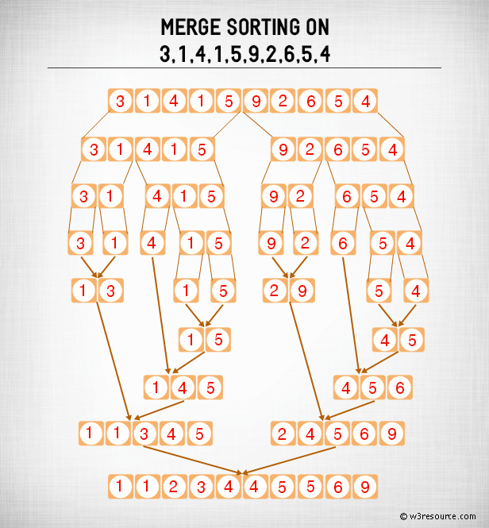
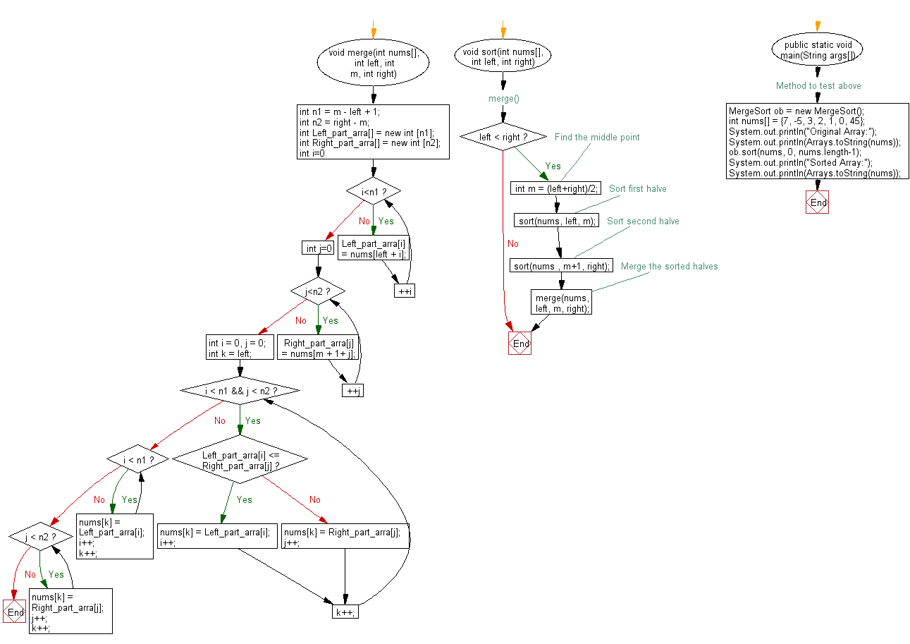

# programming interview java random notes 2018

|||java collections framework |||java collection framework

> References
> <https://www.codejava.net/java-core/collections/overview-of-java-collections-framework-api-uml-diagram>

Overview of Java Collections Framework API (UML diagram)

Last Updated on 15 June 2016

Complete Java Masterclass - updated for Java 10

The Java collections framework has a very complex API hierarchy.

The following class diagram shows a brief overview of the Java Collections Framework which is divided into four groups: List, Set, Map and Queue. Only the principal, commonly-used interfaces and classes are listed.


---

|||merge sort algorithm |||algorithms |||algorithm merge sort |||java merge sort |||java algorithms |||merge sort java

Java Exercises: Merge sort Algorithm

> Reference
> <https://www.w3resource.com/java-exercises/sorting/java-sorting-algorithm-exercise-4.php>

Java Sorting Algorithm: Exercise-4 with Solution
Write a Java program to sort an array of given integers using Merge sort Algorithm.
According to Wikipedia "Merge sort (also commonly spelled mergesort) is an O (n log n) comparison-based sorting algorithm. Most implementations produce a stable sort, which means that the implementation preserves the input order of equal elements in the sorted output."

Algorithm:

Conceptually, a merge sort works as follows :

- Divide the unsorted list into n sublists, each containing 1 element (a list of 1 element is considered sorted).
- Repeatedly merge sublists to produce new sorted sublists until there is only 1 sublist remaining. This will be the sorted list.

Merge Sort: Pictorial Presentation



Sample Solution:

Java Code:

```java
import java.util.Arrays;  
class MergeSort
{
    void merge(int nums[], int left, int m, int right)
    {
        int n1 = m - left + 1;
        int n2 = right - m;
 
        int Left_part_arra[] = new int [n1];
        int Right_part_arra[] = new int [n2];
 
        for (int i=0; i<n1; ++i)
            Left_part_arra[i] = nums[left + i];
        for (int j=0; j<n2; ++j)
            Right_part_arra[j] = nums[m + 1+ j];

        int i = 0, j = 0;
 
        int k = left;
        while (i < n1 && j < n2)
        {
            if (Left_part_arra[i] <= Right_part_arra[j])
            {
                nums[k] = Left_part_arra[i];
                i++;
            }
            else
            {
                nums[k] = Right_part_arra[j];
                j++;
            }
            k++;
        }
 
        while (i < n1)
        {
            nums[k] = Left_part_arra[i];
            i++;
            k++;
        }
 
        while (j < n2)
        {
            nums[k] = Right_part_arra[j];
            j++;
            k++;
        }
    }
 
    // merge()
    void sort(int nums[], int left, int right)
    {
        if (left < right)
        {
            // Find the middle point
            int m = (left+right)/2;
 
            // Sort first halve
            sort(nums, left, m);
            // Sort second halve
            sort(nums , m+1, right);
 
            // Merge the sorted halves
            merge(nums, left, m, right);
        }
    }
 
    // Method to test above
    public static void main(String args[])
    {
        MergeSort ob = new MergeSort();
        int nums[] = {7, -5, 3, 2, 1, 0, 45};
        System.out.println("Original Array:");
        System.out.println(Arrays.toString(nums));
        ob.sort(nums, 0, nums.length-1);
         System.out.println("Sorted Array:");
        System.out.println(Arrays.toString(nums));
        }    
    
}
```

```text
Sample Output:

Original Array:
[7, -5, 3, 2, 1, 0, 45]
Sorted Array:
[-5, 0, 1, 2, 3, 7, 45]
```

Flowchart:



---

|||stack |||java stack |||data structure |||stack data structure

> References
>
> <https://www.geeksforgeeks.org/commonly-asked-data-structure-interview-questions-set-1/amp/>
>
> <https://www.geeksforgeeks.org/stack-data-structure-introduction-program/>

## Stack Data Structure (Introduction and Program)

Stack is a linear data structure which follows a particular order in which the operations are performed. The order may be LIFO(Last In First Out) or FILO(First In Last Out).
Mainly the following three basic operations are performed in the stack:

- Push: Adds an item in the stack. If the stack is full, then it is said to be an Overflow condition.
- Pop: Removes an item from the stack. The items are popped in the reversed order in which they are pushed. If the stack is empty, then it is said to be an Underflow condition.
- Peek or Top: Returns top element of stack.
- isEmpty: Returns true if stack is empty, else false.


## How to understand a stack practically?

There are many real life examples of stack. Consider the simple example of plates stacked over one another in canteen. The plate which is at the top is the first one to be removed, i.e. the plate which has been placed at the bottommost position remains in the stack for the longest period of time. So, it can be simply seen to follow LIFO/FILO order.
Time Complexities of operations on stack:
push(), pop(), isEmpty() and peek() all take O(1) time. We do not run any loop in any of these operations.

## Applications of stack:

- Balancing of symbols
- Infix to Postfix /Prefix conversion
- Redo-undo features at many places like editors, photoshop.
- Forward and backward feature in web browsers
- Used in many algorithms like Tower of Hanoi, tree traversals, stock span problem, histogram problem.
- Other applications can be Backtracking, Knight tour problem, rat in a maze, N queen problem and sudoku solver
- In Graph Algorithms like Topological Sorting and Strongly Connected Components
Implementation:
There are two ways to implement a stack:
- Using array
- Using linked list

## Implementing Stack using Arrays

```java
/* Java program to implement basic stack 
operations */
class Stack 
{ 
    static final int MAX = 1000; 
    int top; 
    int a[] = new int[MAX]; // Maximum size of Stack 
  
    boolean isEmpty() 
    { 
        return (top < 0); 
    } 
    Stack() 
    { 
        top = -1; 
    } 
  
    boolean push(int x) 
    { 
        if (top >= (MAX-1)) 
        { 
            System.out.println("Stack Overflow"); 
            return false; 
        } 
        else
        { 
            a[++top] = x; 
            System.out.println(x + " pushed into stack"); 
            return true; 
        } 
    } 
  
    int pop() 
    { 
        if (top < 0) 
        { 
            System.out.println("Stack Underflow"); 
            return 0; 
        } 
        else
        { 
            int x = a[top--]; 
            return x; 
        } 
    } 
} 
  
// Driver code 
class Main 
{ 
    public static void main(String args[]) 
    { 
        Stack s = new Stack(); 
        s.push(10); 
        s.push(20); 
        s.push(30); 
        System.out.println(s.pop() + " Popped from stack"); 
    } 
} 
```

- Pros: Easy to implement. Memory is saved as pointers are not involved.
- Cons: It is not dynamic. It doesn’t grow and shrink depending on needs at runtime.

```text
Output :
10 pushed into stack
20 pushed into stack
30 pushed into stack
30 popped from stack
```

---
